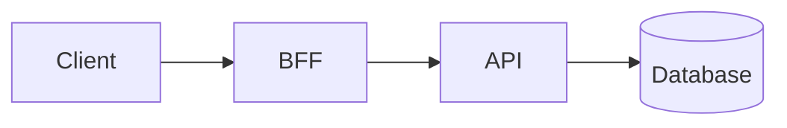

# Contributing to AzureBank

Thank you for your interest in contributing to AzureBank! This document provides guidelines and instructions for contributing.

---

## Table of Contents

- [Code of Conduct](#code-of-conduct)
- [Getting Started](#getting-started)
- [Development Setup](#development-setup)
- [Coding Standards](#coding-standards)
- [Commit Guidelines](#commit-guidelines)
- [Pull Request Process](#pull-request-process)
- [Testing Requirements](#testing-requirements)
- [Documentation](#documentation)

---

## Code of Conduct

Please read and follow our [Code of Conduct](CODE_OF_CONDUCT.md) to maintain a respectful and inclusive community.

---

## Getting Started

### Prerequisites

- [.NET 10 SDK](https://dotnet.microsoft.com/download/dotnet/10.0)
- [Docker Desktop](https://www.docker.com/products/docker-desktop) (for integration tests)
- [SQL Server](https://www.microsoft.com/sql-server) or Docker
- IDE: [Visual Studio 2022](https://visualstudio.microsoft.com/) or [VS Code](https://code.visualstudio.com/)

### Fork and Clone

1. Fork the repository on GitHub
2. Clone your fork:
   ```bash
   git clone https://github.com/YOUR-USERNAME/AzureBank.git
   cd AzureBank/backend
   ```
3. Add upstream remote:
   ```bash
   git remote add upstream https://github.com/ORIGINAL-OWNER/AzureBank.git
   ```

---

## Development Setup

### 1. Restore Dependencies

```bash
dotnet restore
```

### 2. Configure Database

Create `appsettings.Development.json` in each API project:

```json
{
  "ConnectionStrings": {
    "DefaultConnection": "Server=localhost;Database=AzureBank_Dev;Trusted_Connection=True;TrustServerCertificate=True"
  },
  "Jwt": {
    "SecretKey": "your-development-secret-key-min-32-chars"
  }
}
```

### 3. Apply Migrations

```bash
dotnet ef database update --project src/AzureBank.Infrastructure --startup-project src/AzureBank.Api
```

### 4. Run the Application

```bash
# Terminal 1: API
dotnet run --project src/AzureBank.Api

# Terminal 2: BFF
dotnet run --project src/AzureBank.Bff
```

### 5. Verify Setup

- API Docs: https://localhost:7215/scalar/v1
- BFF Health: https://localhost:7216/health

---

## Coding Standards

### General Principles

- Follow [Microsoft C# Coding Conventions](https://docs.microsoft.com/dotnet/csharp/fundamentals/coding-style/coding-conventions)
- Use meaningful, descriptive names
- Keep methods short and focused (single responsibility)
- Prefer composition over inheritance
- Write self-documenting code; add comments only when necessary

### File Organization

```
Feature/
├── Controllers/         # HTTP endpoints
├── Services/
│   ├── Interfaces/     # Service contracts
│   └── Implementations/# Service logic
├── Validators/         # FluentValidation validators
└── Mappers/           # Mapperly mappers
```

### Naming Conventions

| Element | Convention | Example |
|---------|------------|---------|
| Classes | PascalCase | `AccountService` |
| Interfaces | I + PascalCase | `IAccountService` |
| Methods | PascalCase | `GetAccountsAsync` |
| Variables | camelCase | `accountBalance` |
| Constants | PascalCase | `MaxRetryCount` |
| Private fields | _camelCase | `_repository` |

### Async/Await

- Suffix async methods with `Async`
- Use `ConfigureAwait(false)` in library code
- Avoid `async void` except for event handlers

```csharp
// Good
public async Task<Account> GetAccountAsync(Guid id)
{
    return await _context.Accounts
        .FirstOrDefaultAsync(a => a.Id == id);
}

// Bad
public async void ProcessAccount(Guid id) { ... }
```

### Null Handling

- Use nullable reference types (`#nullable enable`)
- Avoid returning `null`; prefer `Option<T>` pattern or exceptions
- Use null-conditional operators (`?.`, `??`)

```csharp
// Good
public Account? FindAccount(Guid id) => _accounts.FirstOrDefault(a => a.Id == id);

// Usage
var name = account?.Name ?? "Unknown";
```

### Exception Handling

- Use custom exceptions from `AzureBank.Shared.Exceptions`
- Don't catch generic `Exception` unless re-throwing
- Include meaningful error messages

```csharp
// Good
throw new NotFoundException($"Account with ID '{id}' not found");

// Bad
throw new Exception("Not found");
```

---

## Commit Guidelines

### Commit Message Format

We follow [Conventional Commits](https://www.conventionalcommits.org/):

```
<type>(<scope>): <description>

[optional body]

[optional footer(s)]
```

### Types

| Type | Description |
|------|-------------|
| `feat` | New feature |
| `fix` | Bug fix |
| `docs` | Documentation only |
| `style` | Code style (formatting, semicolons) |
| `refactor` | Code change that neither fixes nor adds |
| `perf` | Performance improvement |
| `test` | Adding or updating tests |
| `chore` | Build process, dependencies |

### Examples

```bash
feat(auth): add PIN-based step-up authentication

fix(transfer): prevent negative balance on concurrent withdrawals

docs(readme): add architecture diagram

refactor(accounts): extract validation to FluentValidation

test(integration): add transfer endpoint tests
```

### Rules

- Use present tense ("add feature" not "added feature")
- Use imperative mood ("move cursor" not "moves cursor")
- Limit first line to 72 characters
- Reference issues in footer: `Closes #123`

---

## Pull Request Process

### Before Submitting

1. **Update your branch**:
   ```bash
   git fetch upstream
   git rebase upstream/main
   ```

2. **Run all checks**:
   ```bash
   dotnet build
   dotnet test
   dotnet format --verify-no-changes
   ```

3. **Update documentation** if needed

### PR Title Format

Follow the same format as commits:

```
feat(scope): brief description
```

### PR Description Template

```markdown
## Summary
Brief description of changes

## Changes
- Change 1
- Change 2

## Testing
- [ ] Unit tests added/updated
- [ ] Integration tests added/updated
- [ ] Manual testing performed

## Related Issues
Closes #123
```

### Review Process

1. At least one approval required
2. All CI checks must pass
3. No unresolved conversations
4. Branch must be up-to-date with main

### After Merge

- Delete your feature branch
- Update local main:
  ```bash
  git checkout main
  git pull upstream main
  ```

---

## Testing Requirements

### Test Structure

```
tests/AzureBank.Tests/
├── Unit/               # Fast, isolated tests
│   ├── Validators/    # FluentValidation tests
│   ├── Services/      # Service logic tests
│   └── Utilities/     # Helper tests
├── Integration/        # API endpoint tests
└── Architecture/       # Layer dependency tests
```

### Coverage Requirements

- Minimum 80% line coverage for new code
- All public APIs must have tests
- Critical paths require integration tests

### Running Tests

```bash
# All tests
dotnet test

# With coverage
dotnet test --collect:"XPlat Code Coverage"

# Specific category
dotnet test --filter "Category=Unit"
```

### Writing Tests

Use the AAA pattern (Arrange, Act, Assert):

```csharp
[Fact]
public async Task GetAccountAsync_ExistingAccount_ReturnsAccount()
{
    // Arrange
    var accountId = Guid.NewGuid();
    var expected = new Account { Id = accountId, Name = "Test" };
    _mockContext.Setup(c => c.Accounts.FindAsync(accountId))
        .ReturnsAsync(expected);

    // Act
    var result = await _sut.GetAccountAsync(accountId);

    // Assert
    result.Should().NotBeNull();
    result.Name.Should().Be("Test");
}
```

---

## Documentation

### When to Update Docs

- New features: Update relevant README
- API changes: Update endpoint documentation
- Architecture changes: Update ADRs or create new ones
- Breaking changes: Update migration guide

### ADR Process

For significant architectural decisions:

1. Copy `docs/adr/0000-template.md`
2. Number sequentially (e.g., `0009-new-decision.md`)
3. Fill in all sections
4. Submit as part of implementation PR

### Diagrams

Use Mermaid for diagrams in markdown:



---

## Questions?

- Open a [GitHub Discussion](https://github.com/YOUR-ORG/AzureBank/discussions)
- Check existing [Issues](https://github.com/YOUR-ORG/AzureBank/issues)

Thank you for contributing!
