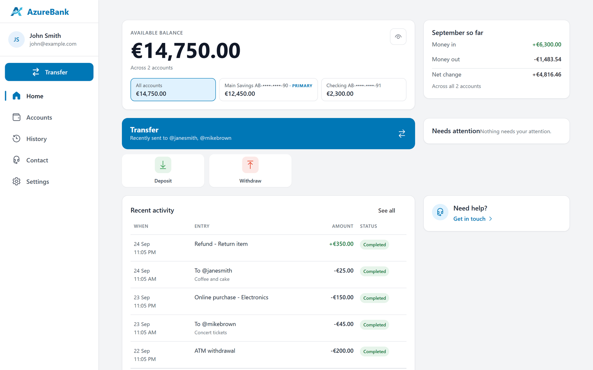
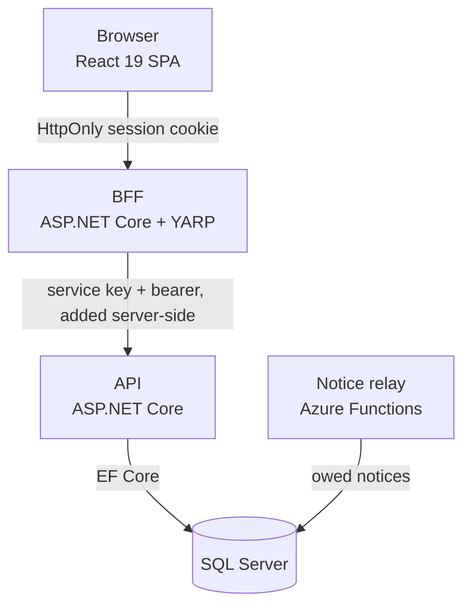

# AzureBank

A personal banking app built as a portfolio project: a .NET 10 API behind an ASP.NET Core BFF, a
React 19 SPA, SQL Server.

[How it works](docs/architecture/overview.md) · [Decisions](docs/adr/README.md) ·
[Security](SECURITY.md) · [Engineering practices](docs/engineering-practices.md)

<picture>
  <source media="(prefers-color-scheme: dark)" srcset="docs/images/dashboard-dark.png">
  
</picture>

## What it is

Accounts, deposits, withdrawals and transfers. Both halves are real and wired to each other.

The interesting part is not the CRUD. It is everything that has to be true **because it moves
money**: an operation that executes exactly once across retries, crashes and concurrent duplicates;
a browser that never sees the JWT; a second factor that survives a replayed request byte for byte.

Designed and built by me, Vladislav Aleshaev, alone.

## What it demonstrates

- **A payment is applied once.** Every money move carries an idempotency key; the server
  fingerprints the raw request with a keyed HMAC and claims the key before it acts, and the client
  keeps the key after any failure the server might have seen, spending it only on a definitive
  answer. Held under 24 concurrent duplicates on a real SQL Server.
  [ADR-0009](docs/adr/0009-idempotency-monetary-operations.md) ·
  [ADR-0022](docs/adr/0022-client-money-mutation-protocol.md) ·
  [the proof](backend/tests/AzureBank.Tests/Integration/IdempotencySqlServerConcurrencyTests.cs)
- **The JWT never reaches the browser.** The BFF keeps it in a server-side session, gives the
  browser an HttpOnly cookie and adds the bearer itself; the API accepts no caller but the BFF.
  [ADR-0001](docs/adr/0001-bff-pattern.md) ·
  [ADR-0038](docs/adr/0038-bff-session-is-the-only-credential.md) ·
  [ADR-0055](docs/adr/0055-the-api-serves-one-client-the-bff.md)
- **One PIN entry authorises one payment.** The PIN becomes a one-shot authorisation bound to the
  account, the amount and, for a transfer, the payee; valid two minutes and spent once. Three wrong
  PINs lock the PIN.
  [ADR-0042](docs/adr/0042-a-transfer-authorisation-is-bound-and-spent-once.md) ·
  [ADR-0056](docs/adr/0056-a-withdrawal-is-authorised-like-a-transfer.md) ·
  [ADR-0010](docs/adr/0010-pin-attempt-limiting.md)
- **An audit trail that can be checked, with its limits written down.** Security events go to an
  append-only, hash-chained table with its own verifier, and what it cannot detect is stated.
  [ADR-0044](docs/adr/0044-the-audit-trail-is-append-only-and-chained.md)
- **The frontend is held to the API's contract.** The committed OpenAPI contract is what the API
  generates, one contract suite runs against the mock and the real stack, Schemathesis probes
  the running API, and Playwright with axe walks the built app under its production CSP.
  [ADR-0053](docs/adr/0053-the-committed-contract-is-what-the-api-generates.md) ·
  [ADR-0029](docs/adr/0029-contract-conformance-gate.md) ·
  [ADR-0054](docs/adr/0054-the-bff-serves-the-built-spa-under-a-csp-measured-against-it.md)
- **One trace per request.** A request through the BFF is one OpenTelemetry trace down to SQL, every
  error carries its trace id, and telemetry is PII-safe by design.
  [ADR-0016](docs/adr/0016-observability-three-pillars.md) ·
  [ADR-0017](docs/adr/0017-pii-redaction-codeql-barrier.md)

## Architecture

The BFF serves the built SPA, holds the session and is the API's only client; the API owns the
money rules. [How AzureBank works](docs/architecture/overview.md) follows one request end to end.

## Stack

| Layer | What it uses |
|---|---|
| Backend | .NET 10, ASP.NET Core, EF Core 10 on SQL Server, YARP, FluentValidation, Serilog, OpenTelemetry, Azure Functions |
| Frontend | React 19, TypeScript, Vite, Fluent UI 9, Redux Toolkit with RTK Query, React Router, react-hook-form with Zod |
| Tests | xUnit, FluentAssertions, NetArchTest; Vitest with MSW; Playwright with axe; Schemathesis; Bruno |
| Delivery | GitHub Actions, CodeQL, an AI reviewer on every pull request |

## Try it

- **The UI alone**, against a mock that runs in the browser — Node only:
  `cd frontend && npm ci && npm run dev:mock`, then sign in as `demo@azurebank.dev` / `Password1!`,
  PIN `123456`.
- **The whole stack** — .NET 10, Node 24 and SQL Server (LocalDB is enough): the
  [local setup](docs/engineering-practices.md#local-setup). The seeded demo user is
  `john@example.com` / `Test123!`, PIN `123456`.

## Tests and CI

Every pull request runs all of these; the two backend jobs are required checks on `main`.

| Job | What it checks |
|---|---|
| Backend build + tests | Formatting, a Release build with warnings as errors, the API's and the BFF's test suites |
| Backend concurrency proofs | Idempotency, balances and the audit chain under concurrent requests on a real SQL Server — and that the proofs ran rather than skipped |
| Frontend build | Lint, formatting, the generated types and schemas against the committed contract, the unit tests, the contract suite against the mock, the build |
| Frontend tests | The unit tests again under two time zones that disagree about "today" |
| Real-stack layers | The contract suite, the data layer and Playwright with axe, against the real BFF, API and SQL Server |
| Runtime conformance | Schemathesis against the running API, every check, with a real sign-in |
| Contract tests | The Bruno collection, request by request, against the running API |

CodeQL analyses the C#, the TypeScript and the workflows on every pull request as well.

## Read deeper

| Document | What it gives you |
|---|---|
| [How AzureBank works](docs/architecture/overview.md) | One document, complete on its own: how the money guarantee works and why the JWT never reaches the browser |
| [ADR-0009](docs/adr/0009-idempotency-monetary-operations.md) and [ADR-0022](docs/adr/0022-client-money-mutation-protocol.md) | The money protocol, server and client halves: when the client keeps the key and when it spends it |
| [Decisions](docs/adr/README.md) | Every decision with its alternatives and what it leaves open; the index names four to start with |
| [Engineering traps](docs/engineering-traps.md) | The things that fail silently; each one cost real time to find |
| [SECURITY.md](SECURITY.md) | The security posture in one place, including what is not done |

## Status and known limits

- It runs locally and in CI; it is not deployed yet.
- axe runs in CI over nine pages and two dialogs and fails on any serious or critical finding
  except colour contrast, which is left to the UI/UX phase; the details are in
  [frontend/README.md](frontend/README.md).
- What the project deliberately does not do yet — anchoring the audit trail outside the database,
  sending the enrolment notice — is in [docs/deferred/](docs/deferred/README.md).

## About this repository

Squash-merged: each pull request lands on `main` as one commit.
Every change goes through a pull request reviewed by CodeQL and an AI reviewer, and I merge it; the
rules are in [engineering practices](docs/engineering-practices.md).

Built in three phases: design documents first (December 2025 to January 2026), then the backend
(January 2026), then the monorepo as it is now, from July 2026. This repository consolidates them;
the earlier history lives in private repositories.

Released under the [MIT License](LICENSE).
