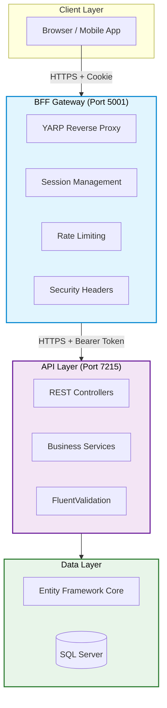
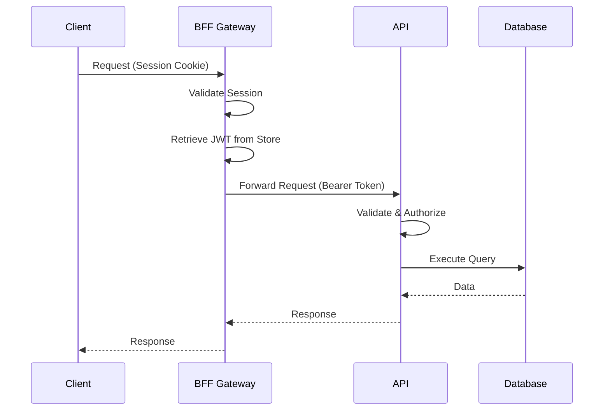
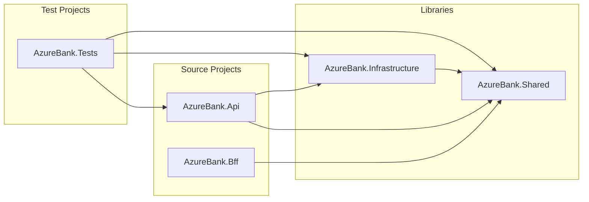

<p align="center">
  <h1 align="center">AzureBank Backend</h1>
  <p align="center">
    A modern, secure banking backend system built with .NET 10
    <br />
    <a href="../docs/architecture/overview.md"><strong>Explore the Architecture »</strong></a>
    <br />
    <br />
    <a href="https://localhost:7215/scalar/v1">API Documentation</a>
    ·
    <a href="../docs/adr/">Architecture Decisions</a>
    ·
    <a href="#getting-started">Getting Started</a>
  </p>
</p>

<p align="center">
  
  
  
  
  
</p>

---

## Table of Contents

- [Overview](#overview)
- [Key Features](#key-features)
- [Architecture](#architecture)
- [Technology Stack](#technology-stack)
- [Solution Structure](#solution-structure)
- [NuGet Packages (CPM)](#nuget-packages-cpm)
- [Getting Started](#getting-started)
- [API Documentation](#api-documentation)
- [Testing](#testing)
- [Configuration](#configuration)
- [Contributing](#contributing)
- [License](#license)

---

## Overview

**AzureBank** is an enterprise-grade banking backend system implementing a secure **Backend-For-Frontend (BFF)** architecture pattern. The system provides comprehensive account management, transaction processing, and money transfer capabilities with defense-in-depth security.

### What This Project Does

- **Account Management**: Create, update, and manage multiple bank accounts per user
- **Transaction Processing**: Handle deposits, withdrawals with full audit trails
- **Money Transfers**: Secure internal transfers with step-up authentication
- **User Authentication**: JWT-based authentication with session management
- **BFF Gateway**: Secure API gateway with rate limiting and security headers

### Why BFF Pattern?

The Backend-For-Frontend pattern provides:

- **Token Security**: JWT tokens stored server-side, never exposed to browser
- **Session Management**: HTTP-only cookies with automatic timeout
- **Rate Limiting**: Protection against abuse at the gateway level
- **Security Headers**: OWASP-recommended headers (CSP, HSTS, etc.)

---

## Key Features

### Authentication & Security

- JWT Bearer token authentication with refresh tokens
- Argon2id password hashing (OWASP recommended)
- Step-up authentication with 6-digit PIN for sensitive operations
- Session management with configurable timeouts
- Rate limiting (100 requests/minute per client)

### Account Management

- Multiple account types (Checking, Savings, Investment)
- Account balance tracking with optimistic concurrency
- Soft-delete support for account closure
- Primary account designation

### Transactions & Transfers

- Deposit and withdrawal processing
- Internal transfers between accounts
- Transaction history with filtering
- Immutable transaction records (audit compliance)

### API Features

- RESTful API design with OpenAPI 3.1 specification
- Scalar API documentation (modern Swagger alternative)
- Comprehensive input validation with FluentValidation
- Structured error responses with problem details

---

## Architecture

### High-Level Architecture



### Request Flow



### Dependency Flow



> **See Also**: [Full Architecture Documentation](../docs/architecture/overview.md)

---

## Technology Stack

### Core Technologies

| Category          | Technology            | Version | Purpose                        |
| ----------------- | --------------------- | ------- | ------------------------------ |
| **Runtime**       | .NET                  | 10.0    | Latest LTS with C# 13 features |
| **Framework**     | ASP.NET Core          | 10.0    | Web API framework              |
| **ORM**           | Entity Framework Core | 10.0.1  | Database access & migrations   |
| **Database**      | SQL Server            | 2022    | Primary data store             |
| **Reverse Proxy** | YARP                  | 2.3.0   | BFF gateway routing            |

### Security & Authentication

| Technology            | Version | Purpose                  |
| --------------------- | ------- | ------------------------ |
| ASP.NET Core Identity | 10.0.1  | User management          |
| JWT Bearer            | 10.0.1  | API authentication       |
| Argon2id              | 1.3.1   | Password hashing (OWASP) |

### Validation & Mapping

| Technology       | Version | Purpose                         |
| ---------------- | ------- | ------------------------------- |
| FluentValidation | 12.1.1  | Request validation              |
| Mapperly         | 4.3.1   | Source-generated object mapping |

### Observability

| Technology | Version | Purpose              |
| ---------- | ------- | -------------------- |
| Serilog    | 10.0.0  | Structured logging   |
| Scalar     | 2.12.4  | API documentation UI |

### Testing

| Technology       | Version | Purpose               |
| ---------------- | ------- | --------------------- |
| xUnit            | 2.9.3   | Test framework        |
| Moq              | 4.20.72 | Mocking library       |
| FluentAssertions | 8.8.0   | Assertion library     |
| Testcontainers   | 4.3.0   | Real database testing |
| NetArchTest      | 1.4.5   | Architecture testing  |

---

## Solution Structure

```
AzureBank.Backend/
│
├── 📁 src/                                    # Source code
│   ├── 📦 AzureBank.Api/                      # REST API project
│   │   ├── Controllers/                       # API endpoints
│   │   ├── Services/                          # Business logic
│   │   ├── Validators/                        # FluentValidation
│   │   ├── Mappers/                           # Mapperly mappings
│   │   ├── Middleware/                        # Custom middleware
│   │   └── README.md                          # Project documentation
│   │
│   ├── 📦 AzureBank.Bff/                      # BFF Gateway project
│   │   ├── Controllers/                       # Gateway endpoints
│   │   ├── Services/                          # Session management
│   │   ├── Middleware/                        # Security middleware
│   │   ├── Transforms/                        # YARP transforms
│   │   └── README.md                          # Project documentation
│   │
│   ├── 📦 AzureBank.Shared/                   # Shared library
│   │   ├── Entities/                          # Domain models
│   │   ├── DTOs/                              # Data transfer objects
│   │   ├── Exceptions/                        # Custom exceptions
│   │   ├── Constants/                         # Error codes, rules
│   │   └── README.md                          # Project documentation
│   │
│   └── 📦 AzureBank.Infrastructure/           # Data access layer
│       ├── Data/                              # DbContext & configs
│       ├── Migrations/                        # EF Core migrations
│       └── README.md                          # Project documentation
│
├── 📁 tests/                                  # Test projects
│   └── 🧪 AzureBank.Tests/                    # All tests
│       ├── Unit/                              # Unit tests
│       ├── Integration/                       # Integration tests
│       ├── Architecture/                      # Architecture tests
│       └── README.md                          # Test documentation
│
├── 📁 docs/                                   # Documentation
│   ├── 📁 architecture/                       # Architecture docs
│   ├── 📁 adr/                                # Decision records
│   └── 📁 diagrams/                           # Mermaid sources
│
├── 📄 Directory.Build.props                   # Shared build config
├── 📄 Directory.Packages.props                # Central Package Management
└── 📄 README.md                               # This file
```

### Project Descriptions

| Project                                                                | Type          | Description                                                        |
| ---------------------------------------------------------------------- | ------------- | ------------------------------------------------------------------ |
| [**AzureBank.Api**](src/AzureBank.Api/README.md)                       | Web API       | REST API with business logic, validation, and authentication       |
| [**AzureBank.Bff**](src/AzureBank.Bff/README.md)                       | Web API       | BFF gateway with session management, rate limiting, and YARP proxy |
| [**AzureBank.Shared**](src/AzureBank.Shared/README.md)                 | Class Library | Domain entities, DTOs, exceptions, and constants                   |
| [**AzureBank.Infrastructure**](src/AzureBank.Infrastructure/README.md) | Class Library | EF Core DbContext, migrations, and data configurations             |
| [**AzureBank.Tests**](tests/AzureBank.Tests/README.md)                 | Test Project  | Unit, integration, and architecture tests                          |

---

## NuGet Packages (CPM)

This solution uses **Central Package Management (CPM)** via `Directory.Packages.props` for consistent versioning across all projects.

### What is Central Package Management?

CPM centralizes all NuGet package versions in a single file, ensuring:

- **Consistency**: All projects use the same package versions
- **Maintainability**: Single location for version updates
- **Auditability**: Easy to review all dependencies

### Package Inventory

#### Core & Framework

| Package                        | Version | What                      | How Used               | Why Chosen              |
| ------------------------------ | ------- | ------------------------- | ---------------------- | ----------------------- |
| `Microsoft.AspNetCore.OpenApi` | 10.0.1  | OpenAPI schema generation | Document API endpoints | Native .NET integration |

#### Authentication & Identity

| Package                                             | Version | What                          | How Used                  | Why Chosen                |
| --------------------------------------------------- | ------- | ----------------------------- | ------------------------- | ------------------------- |
| `Microsoft.Extensions.Identity.Stores`              | 10.0.1  | Identity storage abstractions | User storage interface    | ASP.NET Identity standard |
| `Microsoft.AspNetCore.Identity.EntityFrameworkCore` | 10.0.1  | EF Core identity provider     | Store users in SQL        | Production-ready identity |
| `Microsoft.AspNetCore.Authentication.JwtBearer`     | 10.0.1  | JWT token validation          | Authenticate API requests | Industry standard auth    |

#### Data Access

| Package                                   | Version | What                   | How Used            | Why Chosen           |
| ----------------------------------------- | ------- | ---------------------- | ------------------- | -------------------- |
| `Microsoft.EntityFrameworkCore.SqlServer` | 10.0.1  | SQL Server EF provider | Database access     | Enterprise-grade ORM |
| `Microsoft.EntityFrameworkCore.Tools`     | 10.0.1  | EF CLI tools           | Generate migrations | Development tooling  |
| `Microsoft.EntityFrameworkCore.Design`    | 10.0.1  | Design-time services   | Scaffold DbContext  | Migration support    |

#### Validation

| Package                                          | Version | What               | How Used              | Why Chosen           |
| ------------------------------------------------ | ------- | ------------------ | --------------------- | -------------------- |
| `FluentValidation`                               | 12.1.1  | Validation library | Validate request DTOs | Fluent API, testable |
| `FluentValidation.DependencyInjectionExtensions` | 12.1.1  | DI integration     | Register validators   | Clean DI setup       |

#### Security

| Package                                  | Version | What           | How Used       | Why Chosen        |
| ---------------------------------------- | ------- | -------------- | -------------- | ----------------- |
| `Konscious.Security.Cryptography.Argon2` | 1.3.1   | Argon2 hashing | Hash passwords | OWASP recommended |

#### Gateway & Proxy

| Package             | Version | What                  | How Used         | Why Chosen                 |
| ------------------- | ------- | --------------------- | ---------------- | -------------------------- |
| `Yarp.ReverseProxy` | 2.3.0   | Reverse proxy library | Route BFF to API | Microsoft-backed, flexible |

#### Mapping

| Package         | Version | What              | How Used            | Why Chosen            |
| --------------- | ------- | ----------------- | ------------------- | --------------------- |
| `Riok.Mapperly` | 4.3.1   | Source-gen mapper | Map entities ↔ DTOs | Zero-reflection, fast |

#### API Documentation

| Package             | Version | What           | How Used                  | Why Chosen           |
| ------------------- | ------- | -------------- | ------------------------- | -------------------- |
| `Scalar.AspNetCore` | 2.12.4  | API docs UI    | Interactive documentation | Modern, clean UI     |
| `Microsoft.OpenApi` | 2.0.0   | OpenAPI models | Document transformers     | Schema customization |

#### Logging & Diagnostics

| Package                 | Version | What               | How Used            | Why Chosen             |
| ----------------------- | ------- | ------------------ | ------------------- | ---------------------- |
| `Serilog.AspNetCore`    | 10.0.0  | Structured logging | Log requests/errors | Rich structured logs   |
| `Serilog.Sinks.Console` | 6.1.1   | Console sink       | Output to terminal  | Development visibility |

#### Testing

| Package                                  | Version | What                 | How Used             | Why Chosen              |
| ---------------------------------------- | ------- | -------------------- | -------------------- | ----------------------- |
| `Microsoft.NET.Test.Sdk`                 | 18.0.1  | Test SDK             | Run tests            | .NET test standard      |
| `xunit`                                  | 2.9.3   | Test framework       | Write test cases     | .NET community standard |
| `xunit.runner.visualstudio`              | 3.1.5   | VS test adapter      | IDE integration      | Visual Studio support   |
| `Moq`                                    | 4.20.72 | Mocking library      | Mock dependencies    | Flexible mocking        |
| `FluentAssertions`                       | 8.8.0   | Assertion library    | Readable assertions  | Fluent syntax           |
| `coverlet.collector`                     | 6.0.4   | Code coverage        | Measure coverage     | CI/CD integration       |
| `Microsoft.AspNetCore.Mvc.Testing`       | 10.0.1  | Integration testing  | Test API in-memory   | End-to-end tests        |
| `Microsoft.EntityFrameworkCore.InMemory` | 10.0.1  | In-memory provider   | Fast unit tests      | No database needed      |
| `Testcontainers`                         | 4.3.0   | Container library    | Docker test infra    | Real dependencies       |
| `Testcontainers.MsSql`                   | 4.3.0   | SQL Server container | Real DB testing      | Production parity       |
| `NetArchTest.eNhancedEdition`            | 1.4.5   | Architecture tests   | Enforce design rules | Actively maintained     |

---

## Getting Started

### Prerequisites

| Requirement | Minimum Version | Download                                          | Verify Command               |
| ----------- | --------------- | ------------------------------------------------- | ---------------------------- |
| .NET SDK    | 10.0            | [Download](https://dotnet.microsoft.com/download) | `dotnet --version`           |
| SQL Server  | 2019            | [Download](https://www.microsoft.com/sql-server)  | SQL Server Management Studio |
| Docker      | 24.0            | [Download](https://docker.com)                    | `docker --version`           |
| Git         | 2.40            | [Download](https://git-scm.com)                   | `git --version`              |

### Installation

#### 1. Clone the Repository

```bash
git clone https://github.com/your-org/AzureBank.git
cd AzureBank/backend
```

#### 2. Restore NuGet Packages

```bash
dotnet restore
```

#### 3. Configure the Database

Create a SQL Server database and update the connection string:

```bash
# Copy example settings
cp src/AzureBank.Api/appsettings.Development.json.example src/AzureBank.Api/appsettings.Development.json

# Edit connection string
# "ConnectionStrings": {
#   "DefaultConnection": "Server=localhost;Database=AzureBank;Trusted_Connection=True;TrustServerCertificate=True"
# }
```

#### 4. Apply Database Migrations

```bash
dotnet ef database update \
  --project src/AzureBank.Infrastructure \
  --startup-project src/AzureBank.Api
```

#### 5. Run the Applications

**Terminal 1 - API:**

```bash
dotnet run --project src/AzureBank.Api
# Runs on https://localhost:7215
```

**Terminal 2 - BFF Gateway:**

```bash
dotnet run --project src/AzureBank.Bff
# Runs on https://localhost:5001
```

#### 6. Verify Installation

- **API Documentation**: https://localhost:7215/scalar/v1
- **BFF Session Status**: https://localhost:5001/bff/auth/session-status

---

## API Documentation

### Interactive Documentation

The API is documented using **Scalar**, available at:

- **Development**: https://localhost:7215/scalar/v1

### API Endpoints Overview

| Category         | Endpoint                     | Method | Description         | Auth      |
| ---------------- | ---------------------------- | ------ | ------------------- | --------- |
| **Auth**         | `/api/auth/login`            | POST   | Authenticate user   | No        |
|                  | `/api/auth/register`         | POST   | Register new user   | No        |
|                  | `/api/auth/me`               | GET    | Get current user    | Yes       |
|                  | `/api/auth/logout`           | POST   | Invalidate session  | Yes       |
|                  | `/api/auth/pin`              | POST   | Set/update PIN      | Yes       |
|                  | `/api/auth/pin/verify`       | POST   | Verify PIN          | Yes       |
| **Accounts**     | `/api/accounts`              | GET    | List user accounts  | Yes       |
|                  | `/api/accounts`              | POST   | Create account      | Yes       |
|                  | `/api/accounts/{id}`         | GET    | Get account details | Yes       |
|                  | `/api/accounts/{id}`         | PATCH  | Update account      | Yes       |
|                  | `/api/accounts/{id}`         | DELETE | Close account       | Yes       |
| **Transactions** | `/api/transactions`          | GET    | List transactions   | Yes       |
|                  | `/api/transactions/deposit`  | POST   | Deposit funds       | Yes       |
|                  | `/api/transactions/withdraw` | POST   | Withdraw funds      | Yes       |
| **Transfers**    | `/api/transfers`             | POST   | External transfer   | Yes + PIN |
|                  | `/api/transfers/internal`    | POST   | Internal transfer   | Yes + PIN |
| **Users**        | `/api/users/search`          | GET    | Search users        | Yes       |
|                  | `/api/users/{azureTag}`      | GET    | Get user by tag     | Yes       |

### BFF Gateway Endpoints

| Endpoint                   | Method | Description                            |
| -------------------------- | ------ | -------------------------------------- |
| `/bff/auth/login`          | POST   | Login via BFF (returns session cookie) |
| `/bff/auth/register`       | POST   | Register via BFF                       |
| `/bff/auth/logout`         | POST   | Logout and clear session               |
| `/bff/auth/me`             | GET    | Get user info with session details     |
| `/bff/auth/session-status` | GET    | Check authentication status            |
| `/bff/auth/set-pin`        | POST   | Set PIN via BFF                        |
| `/bff/auth/verify-pin`     | POST   | Verify PIN (upgrade to AuthLevel 2)    |

---

## Testing

### Running Tests

```bash
# Run all tests
dotnet test

# Run with detailed output
dotnet test --logger "console;verbosity=detailed"

# Run specific category
dotnet test --filter "Category=Unit"
dotnet test --filter "Category=Integration"
dotnet test --filter "Category=Architecture"

# Run with code coverage
dotnet test --collect:"XPlat Code Coverage"

# Generate coverage report (requires reportgenerator tool)
dotnet tool install -g dotnet-reportgenerator-globaltool
reportgenerator -reports:"**/coverage.cobertura.xml" -targetdir:"coveragereport"
```

### Test Categories

| Category         | Description                          | Database                  |
| ---------------- | ------------------------------------ | ------------------------- |
| **Unit**         | Service logic, validators, utilities | In-memory/Mocked          |
| **Integration**  | End-to-end API tests                 | Testcontainers (real SQL) |
| **Architecture** | Design & dependency rules            | N/A                       |

### Test Infrastructure

- **Testcontainers**: Spins up real SQL Server in Docker for integration tests
- **CustomWebApplicationFactory**: Creates isolated API instance for each test
- **Architecture Tests**: Enforces layer dependencies and naming conventions

> **See Also**: [Test Project Documentation](tests/AzureBank.Tests/README.md)

---

## Configuration

### API Configuration (appsettings.json)

```json
{
  "ConnectionStrings": {
    "DefaultConnection": "Server=localhost;Database=AzureBank;..."
  },
  "Jwt": {
    "Issuer": "AzureBank.Api",
    "Audience": "AzureBank.Bff",
    "ExpirationMinutes": 15,
    "RefreshTokenExpirationDays": 7
  },
  "Serilog": {
    "MinimumLevel": "Information"
  }
}
```

### BFF Configuration (appsettings.json)

```json
{
  "Session": {
    "CookieName": ".AzureBank.Session",
    "InactivityTimeoutMinutes": 30,
    "AbsoluteTimeoutMinutes": 60
  },
  "Security": {
    "PinValidityMinutes": 5,
    "MaxPinAttempts": 3,
    "LockoutMinutes": 15
  },
  "BackendApi": {
    "BaseUrl": "https://localhost:7215"
  }
}
```

### Environment Variables

| Variable                               | Description         | Default     |
| -------------------------------------- | ------------------- | ----------- |
| `ASPNETCORE_ENVIRONMENT`               | Runtime environment | Development |
| `ConnectionStrings__DefaultConnection` | Database connection | -           |
| `Jwt__SecretKey`                       | JWT signing key     | -           |

---

## Contributing

We welcome contributions! Please see our [Contributing Guidelines](CONTRIBUTING.md) for details.

### Quick Start

1. Fork the repository
2. Create a feature branch (`git checkout -b feature/amazing-feature`)
3. Make your changes
4. Run tests (`dotnet test`)
5. Commit your changes (`git commit -m 'Add amazing feature'`)
6. Push to the branch (`git push origin feature/amazing-feature`)
7. Open a Pull Request

### Development Guidelines

- Follow [C# Coding Conventions](https://docs.microsoft.com/en-us/dotnet/csharp/fundamentals/coding-style/coding-conventions)
- Write unit tests for new features
- Update documentation as needed
- Ensure all tests pass before submitting PR

---

## Architecture Decision Records

Key architectural decisions are documented as ADRs:

| ADR                                                     | Title                        | Status   |
| ------------------------------------------------------- | ---------------------------- | -------- |
| [ADR-0001](../docs/adr/0001-bff-pattern.md)                | Backend-For-Frontend Pattern | Accepted |
| [ADR-0002](../docs/adr/0002-yarp-proxy.md)                 | YARP Reverse Proxy Selection | Accepted |
| [ADR-0003](../docs/adr/0003-argon2id-password-hashing.md)  | Argon2id Password Hashing    | Accepted |
| [ADR-0004](../docs/adr/0004-central-package-management.md) | Central Package Management   | Accepted |
| [ADR-0005](../docs/adr/0005-scalar-api-documentation.md)   | Scalar API Documentation     | Accepted |
| [ADR-0006](../docs/adr/0006-mapperly-object-mapping.md)    | Mapperly Object Mapping      | Accepted |
| [ADR-0007](../docs/adr/0007-fluentvalidation.md)           | FluentValidation Strategy    | Accepted |
| [ADR-0008](../docs/adr/0008-step-up-authentication.md)     | Step-Up Authentication       | Accepted |

---

## License

This project is licensed under the MIT License - see the [LICENSE](LICENSE) file for details.

---

## Acknowledgments

- [ASP.NET Core](https://docs.microsoft.com/aspnet/core) - Web framework
- [Entity Framework Core](https://docs.microsoft.com/ef/core) - ORM
- [YARP](https://microsoft.github.io/reverse-proxy/) - Reverse proxy
- [FluentValidation](https://fluentvalidation.net/) - Validation library
- [Serilog](https://serilog.net/) - Structured logging
- [Scalar](https://github.com/scalar/scalar) - API documentation

---

<p align="center">
  Made with ❤️ by the AzureBank Team
</p>
