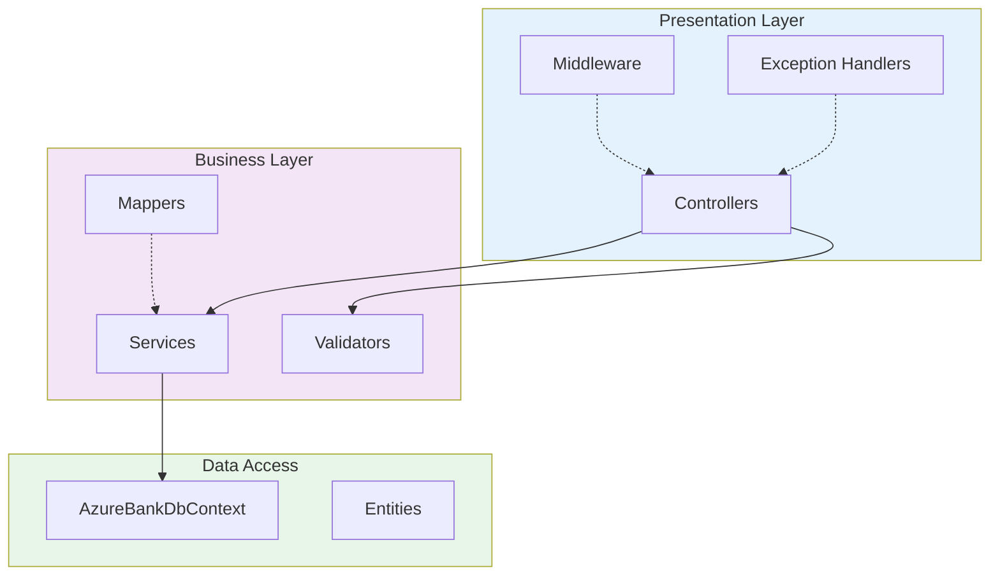
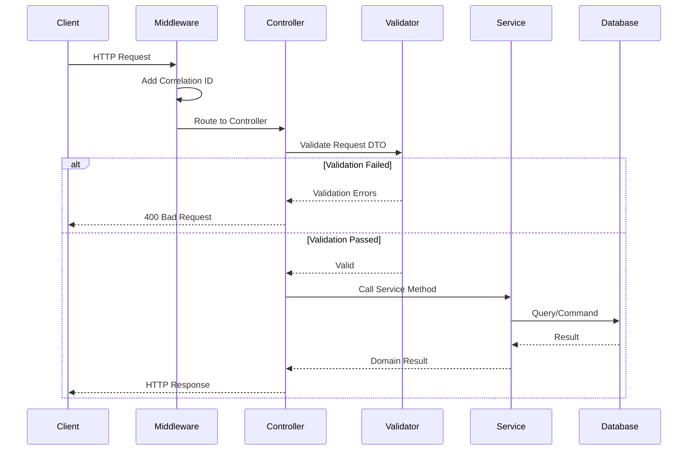

# AzureBank.Api

**REST API** - Core backend service providing business logic and API endpoints

[](https://dotnet.microsoft.com)
[](https://docs.microsoft.com/aspnet/core)

---

## Overview

`AzureBank.Api` is the main REST API backend that handles all business logic, user authentication, account management, and transaction processing. It follows a layered architecture with clear separation of concerns.

**Parent Solution**: [AzureBank Backend](../../README.md)

---

## Architecture

### Layer Diagram



### Request Flow



---

## Project Structure

```
AzureBank.Api/
├── 📁 Controllers/                 # API endpoints
│   ├── AuthController.cs           # Authentication endpoints
│   ├── AccountController.cs        # Account management
│   ├── TransactionController.cs    # Deposits/withdrawals
│   ├── TransferController.cs       # Money transfers
│   └── UserController.cs           # User search
│
├── 📁 Services/
│   ├── 📁 Interfaces/              # Service contracts
│   │   ├── IAuthService.cs
│   │   ├── IAccountService.cs
│   │   └── ...
│   └── 📁 Implementations/         # Service logic
│       ├── AuthService.cs          # Auth & JWT handling
│       ├── AccountService.cs       # Account operations
│       ├── TransactionService.cs   # Transaction processing
│       ├── TransferService.cs      # Transfer logic
│       ├── UserService.cs          # User operations
│       ├── JwtService.cs           # JWT generation
│       ├── PasswordHasher.cs       # Argon2id hashing
│       └── AccountAccessService.cs # Access control
│
├── 📁 Validators/                  # FluentValidation
│   ├── 📁 Auth/
│   │   ├── LoginRequestValidator.cs
│   │   ├── RegisterRequestValidator.cs
│   │   └── ...
│   ├── 📁 Account/
│   ├── 📁 Transaction/
│   └── 📁 Transfer/
│
├── 📁 Mappers/                     # Mapperly mappings
│   ├── AccountMapper.cs
│   ├── TransactionMapper.cs
│   └── UserMapper.cs
│
├── 📁 Middleware/                  # Custom middleware
│   ├── CorrelationIdMiddleware.cs  # Request correlation
│   └── InvalidRequestMiddleware.cs # Malformed request handling
│
├── 📁 Handlers/                    # Exception handlers
│   ├── GlobalExceptionHandler.cs
│   ├── ValidationExceptionHandler.cs
│   └── AppExceptionHandler.cs
│
├── 📁 Transformers/                # OpenAPI customization
│   ├── BearerSecuritySchemeTransformer.cs
│   ├── ValidationResponseTransformer.cs
│   └── ... (11 transformers)
│
├── 📁 Converters/                  # JSON converters
│   ├── Rfc3339DateTimeConverter.cs
│   └── StrictJsonStringEnumConverter.cs
│
├── 📁 Extensions/                  # DI extensions
│   ├── ServiceCollectionExtensions.cs
│   └── WebApplicationExtensions.cs
│
├── 📄 Program.cs                   # Application entry point
├── 📄 appsettings.json             # Configuration
└── 📄 appsettings.Development.json # Dev configuration
```

---

## API Endpoints

### Authentication (`/api/auth`)

| Endpoint | Method | Description | Auth Required |
|----------|--------|-------------|---------------|
| `/api/auth/login` | POST | Authenticate user, receive JWT | No |
| `/api/auth/register` | POST | Register new user with account | No |
| `/api/auth/me` | GET | Get current user info | Yes |
| `/api/auth/logout` | POST | Invalidate session | Yes |
| `/api/auth/pin` | POST | Set or update PIN | Yes |
| `/api/auth/pin/verify` | POST | Verify PIN for step-up auth | Yes |

### Accounts (`/api/accounts`)

| Endpoint | Method | Description | Auth Required |
|----------|--------|-------------|---------------|
| `/api/accounts` | GET | List user's accounts | Yes |
| `/api/accounts` | POST | Create new account | Yes |
| `/api/accounts/{id}` | GET | Get account details | Yes |
| `/api/accounts/{id}` | PATCH | Update account name | Yes |
| `/api/accounts/{id}` | DELETE | Close account (soft delete) | Yes |
| `/api/accounts/{id}/balance` | GET | Get current/historical balance | Yes |
| `/api/accounts/{id}/set-primary` | PATCH | Set as primary account | Yes |

### Transactions (`/api/transactions`)

| Endpoint | Method | Description | Auth Required |
|----------|--------|-------------|---------------|
| `/api/transactions` | GET | List transactions with filters | Yes |
| `/api/transactions/{id}` | GET | Get transaction details | Yes |
| `/api/transactions/deposit` | POST | Deposit funds | Yes |
| `/api/transactions/withdraw` | POST | Withdraw funds | Yes |

### Transfers (`/api/transfers`)

| Endpoint | Method | Description | Auth Required |
|----------|--------|-------------|---------------|
| `/api/transfers` | POST | Transfer to external user | Yes + PIN |
| `/api/transfers/internal` | POST | Transfer between own accounts | Yes + PIN |

### Users (`/api/users`)

| Endpoint | Method | Description | Auth Required |
|----------|--------|-------------|---------------|
| `/api/users/search` | GET | Search users by AzureTag | Yes |
| `/api/users/{azureTag}` | GET | Get user by AzureTag | Yes |

---

## Services

### AuthService

Handles user authentication, registration, and PIN management.

**Key Methods:**
- `LoginAsync(LoginRequest)` - Authenticate and generate JWT
- `RegisterAsync(RegisterRequest)` - Create user with initial account
- `SetPinAsync(userId, pin)` - Set/update user PIN
- `VerifyPinAsync(userId, pin)` - Verify PIN for step-up auth

### AccountService

Manages bank account CRUD operations.

**Key Methods:**
- `GetAccountsAsync(userId)` - List user's accounts
- `CreateAccountAsync(userId, request)` - Create new account
- `UpdateAccountAsync(accountId, request)` - Update account name
- `DeleteAccountAsync(accountId)` - Soft delete account
- `SetPrimaryAsync(accountId)` - Set as primary

### TransactionService

Processes deposits and withdrawals.

**Key Methods:**
- `DepositAsync(accountId, amount)` - Add funds to account
- `WithdrawAsync(accountId, amount)` - Remove funds from account
- `GetTransactionsAsync(filter)` - Query transaction history

### TransferService

Handles money transfers between accounts.

**Key Methods:**
- `TransferAsync(request)` - Transfer to external user
- `InternalTransferAsync(request)` - Transfer between own accounts

---

## Validation

All request DTOs are validated using **FluentValidation**. Validators are automatically registered via DI.

### Example Validator

```csharp
public class LoginRequestValidator : AbstractValidator<LoginRequest>
{
    public LoginRequestValidator()
    {
        RuleFor(x => x.Email)
            .NotEmpty()
            .EmailAddress()
            .MaximumLength(255);

        RuleFor(x => x.Password)
            .NotEmpty()
            .MinimumLength(8)
            .MaximumLength(128);
    }
}
```

### Validation Rules

| Field | Rules |
|-------|-------|
| **Email** | Required, valid email format, max 255 chars |
| **Password** | Required, 8-128 chars, uppercase, lowercase, digit, special char |
| **PIN** | Exactly 6 digits |
| **AzureTag** | 3-20 chars, lowercase, starts with letter |
| **Account Name** | 2-100 chars |
| **Amount** | Positive, max 2 decimal places |

---

## Configuration

### appsettings.json

```json
{
  "ConnectionStrings": {
    "DefaultConnection": "Server=localhost;Database=AzureBank;Trusted_Connection=True;TrustServerCertificate=True"
  },
  "Jwt": {
    "Issuer": "AzureBank.Api",
    "Audience": "AzureBank.Bff",
    "SecretKey": "your-secret-key-here-min-32-chars",
    "ExpirationMinutes": 15,
    "RefreshTokenExpirationDays": 7
  },
  "Serilog": {
    "MinimumLevel": {
      "Default": "Information",
      "Override": {
        "Microsoft.AspNetCore": "Warning",
        "Microsoft.EntityFrameworkCore": "Warning"
      }
    },
    "WriteTo": [
      { "Name": "Console" }
    ],
    "Enrich": ["FromLogContext", "WithMachineName"]
  }
}
```

### Environment Variables

| Variable | Description |
|----------|-------------|
| `ASPNETCORE_ENVIRONMENT` | Runtime environment (Development/Production) |
| `ConnectionStrings__DefaultConnection` | Database connection string |
| `Jwt__SecretKey` | JWT signing key (min 32 chars) |

---

## Dependencies

This project uses packages from the central `Directory.Packages.props`:

| Package | Purpose |
|---------|---------|
| `Microsoft.AspNetCore.OpenApi` | OpenAPI schema generation |
| `Microsoft.AspNetCore.Authentication.JwtBearer` | JWT authentication |
| `FluentValidation.DependencyInjectionExtensions` | Validation |
| `Konscious.Security.Cryptography.Argon2` | Password hashing |
| `Riok.Mapperly` | Object mapping |
| `Scalar.AspNetCore` | API documentation |
| `Serilog.AspNetCore` | Structured logging |

**Project References:**
- `AzureBank.Shared` - Entities, DTOs, exceptions
- `AzureBank.Infrastructure` - DbContext, migrations

---

## Running Locally

```bash
# From solution root
dotnet run --project src/AzureBank.Api

# With specific environment
ASPNETCORE_ENVIRONMENT=Development dotnet run --project src/AzureBank.Api

# Access API docs
# https://localhost:7215/scalar/v1
```

---

## API Documentation

Interactive API documentation is available via **Scalar** at:

**Development**: https://localhost:7215/scalar/v1

Features:
- Try out endpoints interactively
- View request/response schemas
- Authentication support (Bearer token)
- Code samples in multiple languages

---

## Error Handling

The API uses **Problem Details** (RFC 7807) for error responses.

### Response Structure

```json
{
  "type": "https://tools.ietf.org/html/rfc9110#section-15.5.5",
  "title": "Not Found",
  "status": 404,
  "detail": "Account with ID 'xxx' was not found",
  "instance": "/api/accounts/xxx",
  "traceId": "00-abc123..."
}
```

### Exception Types

| Exception | HTTP Status | Use Case |
|-----------|-------------|----------|
| `NotFoundException` | 404 | Resource not found |
| `UnauthorizedException` | 401 | Authentication required |
| `ForbiddenException` | 403 | Access denied |
| `BusinessRuleException` | 422 | Domain rule violation |
| `InsufficientFundsException` | 422 | Not enough balance |
| `ValidationException` | 400 | Input validation failed |

---

## See Also

- [Root README](../../README.md) - Solution overview
- [AzureBank.Shared](../AzureBank.Shared/README.md) - DTOs and entities
- [AzureBank.Infrastructure](../AzureBank.Infrastructure/README.md) - Data layer
- [Architecture Overview](../../docs/architecture/overview.md) - System design
