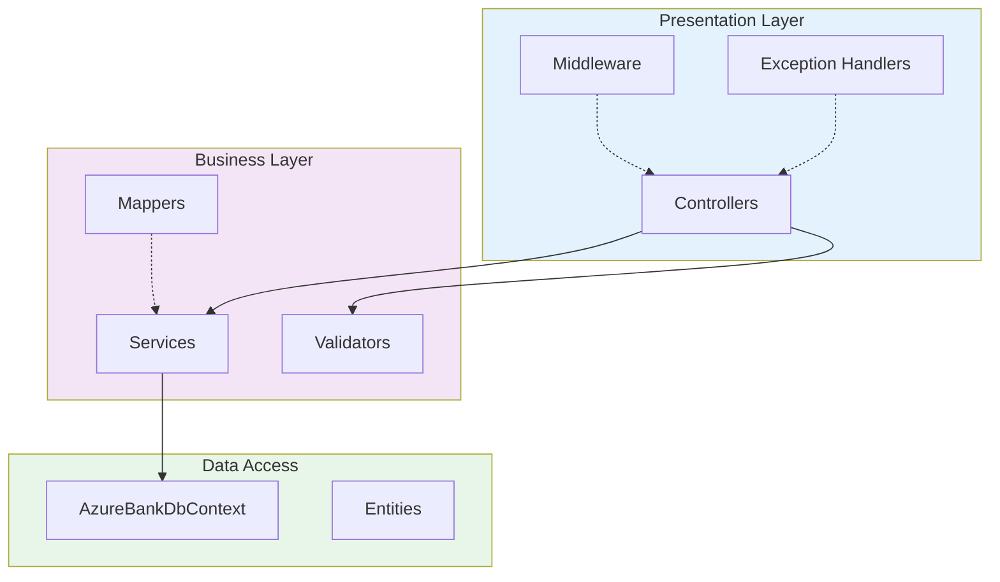
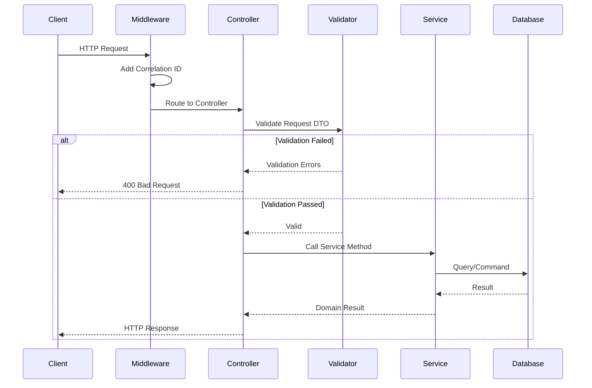

# AzureBank.Api

**REST API** - Core backend service providing business logic and API endpoints

[](https://dotnet.microsoft.com)
[](https://docs.microsoft.com/aspnet/core)

---

## Overview

`AzureBank.Api` is the main REST API backend that handles all business logic, user authentication, account management, and transaction processing. It follows a layered architecture with clear separation of concerns.

**Parent Solution**: [AzureBank Backend](../../README.md)

---

## Architecture

### Layer Diagram


```mermaid
flowchart TB
    subgraph Presentation["Presentation Layer"]
        Controllers["Controllers"]
        Middleware["Middleware"]
        Handlers["Exception Handlers"]
    end

    subgraph Business["Business Layer"]
        Services["Services"]
        Validators["Validators"]
        Mappers["Mappers"]
    end

    subgraph Data["Data Access"]
        DbContext["AzureBankDbContext"]
        Entities["Entities"]
    end

    Controllers --> Services
    Controllers --> Validators
    Services --> DbContext
    Mappers -.-> Services
    Handlers -.-> Controllers
    Middleware -.-> Controllers

    style Presentation fill:#e3f2fd
    style Business fill:#f3e5f5
    style Data fill:#e8f5e9
```

### Request Flow


```mermaid
sequenceDiagram
    participant C as Client
    participant M as Middleware
    participant Ctrl as Controller
    participant V as Validator
    participant S as Service
    participant DB as Database

    C->>M: HTTP Request
    M->>M: Add Correlation ID
    M->>Ctrl: Route to Controller
    Ctrl->>V: Validate Request DTO

    alt Validation Failed
        V-->>Ctrl: Validation Errors
        Ctrl-->>C: 400 Bad Request
    else Validation Passed
        V-->>Ctrl: Valid
        Ctrl->>S: Call Service Method
        S->>DB: Query/Command
        DB-->>S: Result
        S-->>Ctrl: Domain Result
        Ctrl-->>C: HTTP Response
    end
```

---

## Project Structure

```
AzureBank.Api/
├── 📁 Controllers/                 # API endpoints
│   ├── AuthController.cs           # Authentication endpoints
│   ├── AccountController.cs        # Account management
│   ├── TransactionController.cs    # Deposits/withdrawals
│   ├── TransferController.cs       # Money transfers
│   └── UserController.cs           # User search
│
├── 📁 Services/
│   ├── 📁 Interfaces/              # Service contracts
│   │   ├── IAuthService.cs
│   │   ├── IAccountService.cs
│   │   └── ...
│   └── 📁 Implementations/         # Service logic
│       ├── AuthService.cs          # Auth & JWT handling
│       ├── AccountService.cs       # Account operations
│       ├── TransactionService.cs   # Transaction processing
│       ├── TransferService.cs      # Transfer logic
│       ├── UserService.cs          # User operations
│       ├── JwtService.cs           # JWT generation
│       ├── PasswordHasher.cs       # Argon2id hashing, used for PINs
│       └── AccountAccessService.cs # Access control
│
├── 📁 Validators/                  # FluentValidation
│   ├── 📁 Auth/
│   │   ├── LoginRequestValidator.cs
│   │   ├── RegisterRequestValidator.cs
│   │   └── ...
│   ├── 📁 Account/
│   ├── 📁 Transaction/
│   └── 📁 Transfer/
│
├── 📁 Mappers/                     # Mapperly mappings
│   ├── AccountMapper.cs
│   ├── TransactionMapper.cs
│   └── UserMapper.cs
│
├── 📁 Middleware/                  # Custom middleware
│   ├── CorrelationIdMiddleware.cs  # Request correlation
│   └── InvalidRequestMiddleware.cs # Malformed request handling
│
├── 📁 Handlers/                    # Exception handlers
│   ├── GlobalExceptionHandler.cs
│   ├── ValidationExceptionHandler.cs
│   └── AppExceptionHandler.cs
│
├── 📁 Transformers/                # OpenAPI customization
│   ├── BearerSecuritySchemeTransformer.cs
│   ├── ValidationResponseTransformer.cs
│   └── ... (11 transformers)
│
├── 📁 Converters/                  # JSON converters
│   ├── Rfc3339DateTimeConverter.cs
│   └── StrictJsonStringEnumConverter.cs
│
├── 📁 Extensions/                  # DI extensions
│   ├── ServiceCollectionExtensions.cs
│   └── WebApplicationExtensions.cs
│
├── 📄 Program.cs                   # Application entry point
├── 📄 appsettings.json             # Configuration
└── 📄 appsettings.Development.json # Dev configuration
```

---

## API Endpoints

### Authentication (`/api/auth`)

| Endpoint | Method | Description | Auth Required |
|----------|--------|-------------|---------------|
| `/api/auth/login` | POST | Authenticate user, receive JWT | No |
| `/api/auth/register` | POST | Register new user with account. On the public demo (`Demo:Enabled`): 403 `REGISTRATION_CLOSED`, whatever the body | No |
| `/api/auth/demo/claim` | POST | On the public demo only: take a free demo copy for a visitor, give its owner a password and sign in as that owner; answers the tokens, the user and what signs in to the copy again. 404 while `Demo:Enabled` is false (ADR-0063) | No (the BFF names the visitor's address) |
| `/api/auth/refresh` | POST | Renew the access token with the session's grant; the grant is not rotated | No (the grant is the credential) |
| `/api/auth/revoke` | POST | Revoke the grants of ended sessions; 200 for unknown grants too | No (the grant is the credential) |
| `/api/auth/me` | GET | Get current user info | Yes |
| `/api/auth/logout` | POST | Revoke every grant of the user (every session) and raise the user's session stamp | Yes |
| `/api/auth/session-stamps` | POST | Read the session stamps of the listed users (the BFF's watcher) | No (the BFF's own client) |
| `/api/auth/pin` | POST | Set or update PIN | Yes |
| `/api/auth/pin/verify` | POST | Verify PIN for step-up auth | Yes |

The six token endpoints (login, register, refresh, revoke, logout and the demo's claim) and the
stamp feed, session-stamps, answer only the BFF's own client: a request from loopback carrying
exactly one `X-AzureBank-Token-Road` header, besides the service key. Anything else gets 404, as an
unknown path would.

On the public demo two more things hold, both in the API (ADR-0063): sign-in lets in only the
owner of a claimed demo copy whose time is not over, and answers everybody else as an email nobody
has; and each request of a signed-in user that could change something, and each reveal of an
account number, is counted on that user's copy, the one past `Demo:Copy:MaxWrites` being 429
`DEMO_COPY_LIMIT`. A token endpoint is never counted: of the six, only signing out everywhere
asks for a signed-in user, and it is answered the same whatever the copy has spent.

### Accounts (`/api/accounts`)

| Endpoint | Method | Description | Auth Required |
|----------|--------|-------------|---------------|
| `/api/accounts` | GET | List user's accounts | Yes |
| `/api/accounts` | POST | Create new account | Yes |
| `/api/accounts/{id}` | GET | Get account details | Yes |
| `/api/accounts/{id}` | PATCH | Update account name | Yes |
| `/api/accounts/{id}/deletion-authorizations` | POST | Mint a one-shot deletion authorisation from the PIN (ADR-0049); 201 `{authorizationId, expiresAt}`; the balance and primary guards answer 422 before the PIN is consulted | Yes + PIN |
| `/api/accounts/{id}` | DELETE | Close account (soft delete); requires a live `Step-Up-Authorization` header minted above, else 401 `AUTHORIZATION_REQUIRED` (ADR-0042/0049) | Yes + Step-Up-Authorization |
| `/api/accounts/{id}/balance` | GET | Get current/historical balance | Yes |
| `/api/accounts/{id}/full-number` | GET | Reveal the full account number (level 2, ADR-0038) | Yes |
| `/api/accounts/{id}/set-primary` | PATCH | Set as primary account | Yes |

### Transactions (`/api/transactions`)

| Endpoint | Method | Description | Auth Required |
|----------|--------|-------------|---------------|
| `/api/transactions` | GET | List transactions with filters | Yes |
| `/api/transactions/{id}` | GET | Get transaction details | Yes |
| `/api/transactions/deposit` | POST | Deposit funds | Yes |
| `/api/transactions/withdraw` | POST | Withdraw funds | Yes + Step-Up-Authorization |
| `/api/transactions/withdraw/authorizations` | POST | Authorise a withdrawal (proves the PIN) | Yes + PIN |

### Transfers (`/api/transfers`)

| Endpoint | Method | Description | Auth Required |
|----------|--------|-------------|---------------|
| `/api/transfers/authorizations` | POST | Mint a one-shot transfer authorisation from the PIN (ADR-0042) | Yes + PIN |
| `/api/transfers/internal/authorizations` | POST | Mint a one-shot internal-transfer authorisation from the PIN (ADR-0042) | Yes + PIN |
| `/api/transfers` | POST | Transfer to external user; presents the authorisation minted above | Yes + Step-Up-Authorization |
| `/api/transfers/internal` | POST | Transfer between own accounts; presents the authorisation minted above | Yes + Step-Up-Authorization |

### Users (`/api/users`)

| Endpoint | Method | Description | Auth Required |
|----------|--------|-------------|---------------|
| `/api/users/{azureTag}` | GET | Get user by AzureTag | Yes |

---

## Services

### AuthService

Handles user authentication, registration, and PIN management.

**Key Methods:**
- `LoginAsync(LoginRequest)` - Authenticate and generate JWT
- `RegisterAsync(RegisterRequest)` - Create user with initial account
- `SetPinAsync(userId, pin)` - Set/update user PIN
- `VerifyPinAsync(userId, pin)` - Verify PIN for step-up auth

### AccountService

Manages bank account CRUD operations.

**Key Methods** (the `IAccountService` names):
- `GetUserAccountsAsync(userId)` - List user's accounts
- `GetAccountByIdAsync(accountId, userId)` - One account, ownership-checked
- `CreateAccountAsync(userId, request)` - Create new account
- `UpdateAccountAsync(accountId, userId, request)` - Update account name
- `SetPrimaryAccountAsync(userId, accountId)` - Set as primary
- `AuthoriseDeletionAsync(userId, accountId, pin)` - Mint the closure authorisation (ADR-0049)
- `DeleteAccountAsync(accountId, userId, stepUpAuthorizationId)` - Soft delete; spends the
  authorisation in the same transaction
- `GetBalanceAsync(accountId, userId, atTime)` - Current or historical balance
- `GetFullAccountNumberAsync(accountId, userId)` - The unmasked number (ADR-0038)

### TransactionService

Processes deposits and withdrawals.

**Key Methods:**
- `DepositAsync(accountId, amount)` - Add funds to account
- `WithdrawAsync(accountId, amount)` - Remove funds from account
- `GetTransactionsAsync(filter)` - Query transaction history

### TransferService

Handles money transfers between accounts.

**Key Methods:**
- `TransferAsync(request)` - Transfer to external user
- `InternalTransferAsync(request)` - Transfer between own accounts

---

## Validation

Requests pass through **two** validation layers, and it matters which one answers.

1. **DataAnnotations on the DTO**, run by `[ApiController]` model-state validation **before the
   action body**. If any annotation fails, the framework replies immediately — title
   `"One or more validation errors occurred."`, keyed by the binding name — and the FluentValidation
   call below never executes.
2. **FluentValidation**, invoked by hand inside the action (`ValidateAndThrowAsync`);
   `ValidationExceptionHandler` turns the throw into title `"Validation Failed"` with camelCased
   keys. Validators are registered via DI (`AddValidatorsFromAssemblyContaining<Program>`), but
   auto-validation is deliberately **not** wired — `FluentValidation.AspNetCore` is deprecated.

So layer 2 is reached only where a validator is stricter than every annotation on that property
(today: the unannotated `CreateAccountRequest.Type`, money **scale** which `[MoneyRange]` does not
check, and the cross-field same-account transfer rule). Note also that **3 of the 13 request DTOs
have no validator at all** — `SetPrimaryAccountRequest`, `RefreshRequest`, `UpdateAzureTagRequest` —
so those can only ever produce the layer-1 envelope.

### Example Validator

```csharp
public class LoginRequestValidator : AbstractValidator<LoginRequest>
{
    public LoginRequestValidator()
    {
        RuleFor(x => x.Email)
            .NotEmpty()
            .EmailAddress()
            .MaximumLength(255);

        RuleFor(x => x.Password)
            .NotEmpty()
            .MinimumLength(8)
            .MaximumLength(128);
    }
}
```

### Validation Rules

| Field | Rules |
|-------|-------|
| **Email** | Required, valid email format, max 255 chars |
| **Password** | Required, 8-128 chars, uppercase, lowercase, digit, special char |
| **PIN** | Exactly 6 digits |
| **AzureTag** | 3-20 chars, lowercase, starts with letter |
| **Account Name** | 2-100 chars |
| **Amount** | Positive, max 2 decimal places |

---

## Configuration

### appsettings.json

```json
{
  "ConnectionStrings": {
    "DefaultConnection": "Server=localhost;Database=AzureBank;Trusted_Connection=True;TrustServerCertificate=True"
  },
  "Database": {
    "MaxRetryCount": 4,
    "MaxRetryDelay": "00:00:10"
  },
  "RequestDeadline": {
    "Seconds": 40
  },
  "Jwt": {
    "Issuer": "AzureBank.Api",
    "Audience": "AzureBank.Bff",
    "ExpirationMinutes": 15,
    "RefreshTokenLifetimeMinutes": 60
  },
  "Serilog": {
    "MinimumLevel": {
      "Default": "Information",
      "Override": {
        "Microsoft.AspNetCore": "Warning",
        "Microsoft.EntityFrameworkCore": "Warning"
      }
    },
    "Enrich": ["FromLogContext"]
  }
}
```

The console is not configured here: the code writes it, one JSON object per line in Production and
text everywhere else (`ConsoleLogFormat`), and a `WriteTo` in configuration takes its place: in
Production such a console should use `RenderedCompactJsonFormatter`, to match the bootstrap lines.

### Database limits and the request deadline

How long the API waits on the database, how often it tries again, and when it gives up on a
request (ADR-0058). Each is checked at start, and the API logs the limits it opened with once it
has started (`Database limits: …`).

| Setting | Default | In `appsettings.json` | What it bounds |
|---------|---------|-----------------------|----------------|
| `Database:MaxRetryCount` | 4 | yes | EF's retries of a transient failure (0 to 20; 0 turns retrying off). A command timeout, −2, is never retried |
| `Database:MaxRetryDelay` | `00:00:10` | yes | The cap on EF's back-off between two retries (above zero, at most a minute) |
| `Database:ConnectTimeoutSeconds` | 10 | no | Opening a connection, and every BEGIN, COMMIT and ROLLBACK (1 to 60). Not an open to a name that does not resolve: on the compose stack those took 11.81 to 23.75 s (ADR-0058) |
| `Database:ConnectRetryCount` | 0 | no | SqlClient's own retries of an open (0 to 255): 0 leaves EF the only retry layer |
| `Database:MaxPoolSize` | 12 | no | Connections one process keeps open (1 to 200) |
| `RequestDeadline:Seconds` | 40 | yes | A request still running after it answers 503 `SERVICE_UNAVAILABLE` (1 to 600). Refresh, revoke and logout have none |

The three connection limits, and `Pool Blocking Period=NeverBlock`, are written into the
connection string only where the string leaves them unset (`SqlConnectionDefaults`), so a value the
string sets wins, under any of its names. A commit that has started is never cancelled by the
deadline, and none starts after it has fired.

### Environment Variables

| Variable | Description |
|----------|-------------|
| `ASPNETCORE_ENVIRONMENT` | Runtime environment (Development/Production) |
| `ConnectionStrings__DefaultConnection` | Database connection string; it must be there, parse and name a server, checked at startup |
| `Jwt__Secret` | JWT signing key — the local setup's recipe; 32+ bytes as UTF-8, checked at startup |
| `Idempotency__HashKey` | Request-fingerprint HMAC key (32+ chars, ADR-0009) |
| `StepUp__BindingKey` | Step-up binding HMAC key (32+ chars, ADR-0042) |
| `Audit__ChainKey` | Audit hash-chain HMAC key (32+ chars, ADR-0044) |
| `Audit__AnchorKey` | Audit anchor-record HMAC key (32+ chars, ADR-0044) |
| `Security__PinPepper` | PIN-hash pepper (32+ chars, ADR-0011); the Seeder needs the same value |
| `ServiceCredential__BffKey` | The key the BFF presents in `X-AzureBank-Service-Key` (32+ chars, ADR-0055); the BFF needs the same value |

In development every value above but `ASPNETCORE_ENVIRONMENT` comes from `dotnet user-secrets`
(`:` instead of `__`) — see the [local setup](../../../docs/engineering-practices.md#local-setup),
the one copy of the recipe.

---

## Dependencies

This project uses packages from the central `Directory.Packages.props`:

| Package | Purpose |
|---------|---------|
| `Microsoft.AspNetCore.OpenApi` | OpenAPI schema generation |
| `Microsoft.AspNetCore.Authentication.JwtBearer` | JWT authentication |
| `FluentValidation.DependencyInjectionExtensions` | Validation |
| `Konscious.Security.Cryptography.Argon2` | PIN hashing (passwords use Identity's PBKDF2) |
| `Riok.Mapperly` | Object mapping |
| `Scalar.AspNetCore` | API documentation |
| `Serilog.AspNetCore` | Structured logging |

**Project References:**
- `AzureBank.Shared` - Entities, DTOs, exceptions
- `AzureBank.Infrastructure` - DbContext, migrations

---

## Running Locally

```bash
# From solution root
dotnet run --project src/AzureBank.Api

# With specific environment
ASPNETCORE_ENVIRONMENT=Development dotnet run --project src/AzureBank.Api

# Access API docs
# https://localhost:7215/scalar/v1
```

---

## API Documentation

Interactive API documentation is available via **Scalar** at:

**Development**: https://localhost:7215/scalar/v1

Features:
- Try out endpoints interactively
- View request/response schemas
- Authentication support (Bearer token)
- Code samples in multiple languages

---

## Error Handling

The API uses **Problem Details** (RFC 7807) for error responses.

### Response Structure

```json
{
  "type": "https://tools.ietf.org/html/rfc9110#section-15.5.5",
  "title": "Not Found",
  "status": 404,
  "detail": "Account with ID 'xxx' was not found",
  "instance": "/api/accounts/xxx",
  "traceId": "00-abc123..."
}
```

### Exception Types

| Exception | HTTP Status | Use Case |
|-----------|-------------|----------|
| `NotFoundException` | 404 | Resource not found |
| `UnauthorizedException` | 401 | Authentication required |
| `ForbiddenException` | 403 | Access denied |
| `BusinessRuleException` | 422 | Domain rule violation |
| `InsufficientFundsException` | 422 | Not enough balance |
| `ValidationException` | 400 | Input validation failed |
| `ServiceUnavailableException` | 503 | The request cannot be served now; send it again after `retryAfterSeconds` (revoke, when its database write fails) |

A database that cannot be reached, a command timeout, an exhausted pool, EF's retries spent, or a
request past its deadline also answers **503** `SERVICE_UNAVAILABLE`, with `retryAfterSeconds` 10,
`Retry-After` and a `Cache-Control` that includes `no-store` (on the wire `no-cache,no-store`, with
`Pragma: no-cache` and `Expires: -1`), from `ServiceUnavailableExceptionHandler` (ADR-0058); on the
four money endpoints it adds `applied: false` when the request is known to have changed nothing.
A client that hung up gets no body at all. Anything else unexpected is the 500.

---

## See Also

- [Root README](../../README.md) - Solution overview
- [AzureBank.Shared](../AzureBank.Shared/README.md) - DTOs and entities
- [AzureBank.Infrastructure](../AzureBank.Infrastructure/README.md) - Data layer
- [Architecture Overview](../../../docs/architecture/overview.md) - System design
