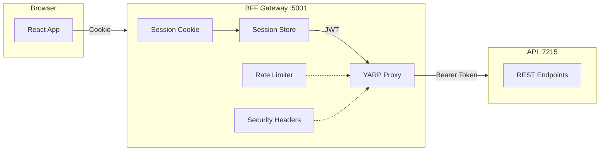
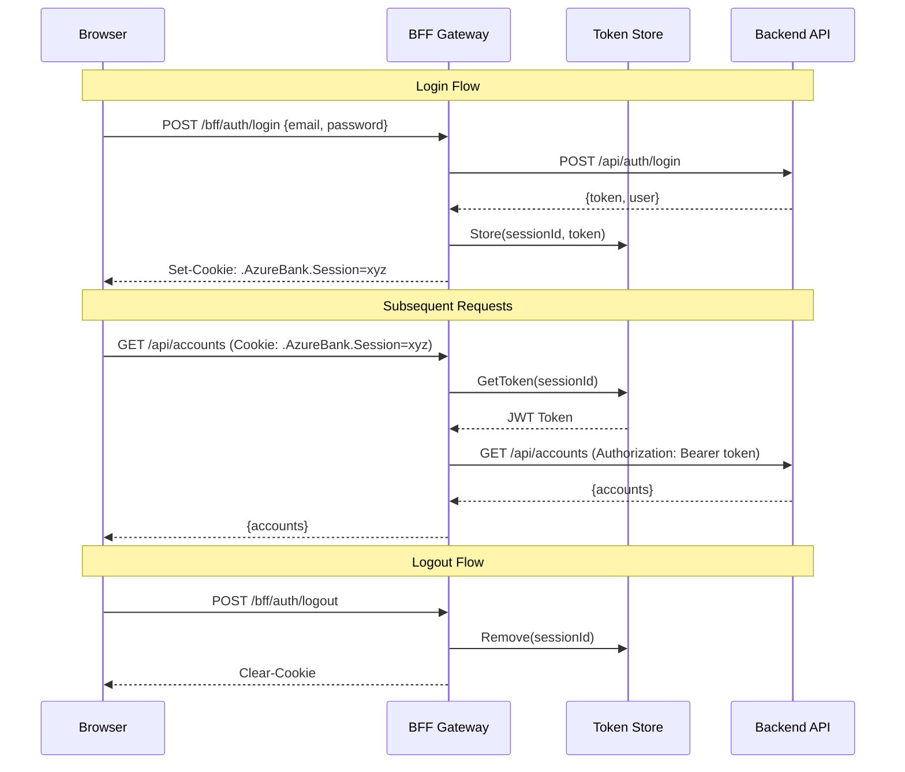
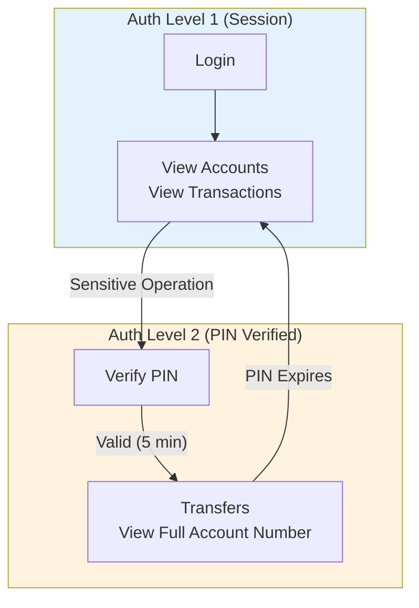

# AzureBank.Bff

**Backend-For-Frontend Gateway** - Secure API gateway with session management and reverse proxy

[](https://dotnet.microsoft.com)
[](https://microsoft.github.io/reverse-proxy/)

---

## Overview

`AzureBank.Bff` is the Backend-For-Frontend gateway that sits between the client (browser/mobile) and the API. It provides session management, rate limiting, security headers, and reverse proxy functionality using YARP.

**Parent Solution**: [AzureBank Backend](../../README.md)

---

## Why BFF Pattern?

The Backend-For-Frontend pattern provides several security benefits:

| Concern | Traditional API | BFF Pattern |
|---------|-----------------|-------------|
| **Token Storage** | Browser localStorage | Server-side (HTTP-only cookie) |
| **Token Exposure** | Accessible to JavaScript | Never exposed to client |
| **XSS Risk** | High (token theft) | Mitigated (no token access) |
| **CSRF Protection** | Manual implementation | Built-in with cookies |
| **Rate Limiting** | Per-endpoint | Centralized gateway |
| **Security Headers** | Per-endpoint | Centralized middleware |

---

## Architecture

### BFF Gateway Flow



### Session Management Flow



### Step-Up Authentication



---

## Project Structure

```
AzureBank.Bff/
├── 📁 Controllers/
│   └── BffAuthController.cs        # Session management endpoints
│
├── 📁 Services/
│   ├── 📁 Interfaces/
│   │   ├── ISessionService.cs      # Session operations
│   │   └── ITokenStoreService.cs   # Token storage
│   └── 📁 Implementations/
│       ├── SessionService.cs       # Session management logic
│       ├── InMemoryTokenStore.cs   # In-memory token storage
│       └── SessionCleanupService.cs # Background cleanup
│
├── 📁 Middleware/
│   ├── SecurityHeadersMiddleware.cs    # OWASP security headers
│   ├── SessionActivityMiddleware.cs    # Update last activity
│   └── AuthLevelMiddleware.cs          # Enforce step-up auth
│
├── 📁 Options/
│   ├── BffSessionOptions.cs        # Session configuration
│   └── SecurityOptions.cs          # Security settings
│
├── 📁 Models/
│   └── UserSession.cs              # Session data model
│
├── 📁 DTOs/
│   └── BffResponses.cs             # BFF response models
│
├── 📁 Attributes/
│   └── RequireAuthLevelAttribute.cs # Auth level enforcement
│
├── 📁 Transforms/
│   └── BearerTokenTransformProvider.cs # YARP JWT injection
│
├── 📄 Program.cs                   # Application setup
├── 📄 appsettings.json             # Configuration
└── 📄 appsettings.Development.json # Dev configuration
```

---

## BFF Endpoints

### Session Management

| Endpoint | Method | Description | Auth |
|----------|--------|-------------|------|
| `/bff/auth/login` | POST | Login, create session, return cookie | No |
| `/bff/auth/register` | POST | Register user, create session | No |
| `/bff/auth/logout` | POST | Destroy session, clear cookie | Yes |
| `/bff/auth/me` | GET | Get user info with session details | Yes |
| `/bff/auth/session-status` | GET | Check if authenticated | No |
| `/bff/auth/set-pin` | POST | Set/update PIN | Yes |
| `/bff/auth/verify-pin` | POST | Verify PIN, upgrade to AuthLevel 2 | Yes |

### Proxied Routes

All `/api/*` routes are proxied to the backend API with JWT injection:

| BFF Route | Backend Route | Auth Level Required |
|-----------|---------------|---------------------|
| `/api/accounts` | `/api/accounts` | 1 |
| `/api/transactions` | `/api/transactions` | 1 |
| `/api/transfers` | `/api/transfers` | 2 (PIN required) |
| `/api/accounts/*/full-number` | `/api/accounts/*/full-number` | 2 (PIN required) |

---

## Middleware Pipeline

### Security Headers Middleware

Adds OWASP-recommended security headers to all responses:

| Header | Value | Purpose |
|--------|-------|---------|
| `X-Content-Type-Options` | `nosniff` | Prevent MIME sniffing |
| `X-Frame-Options` | `DENY` | Prevent clickjacking |
| `X-XSS-Protection` | `1; mode=block` | XSS filtering |
| `Referrer-Policy` | `strict-origin-when-cross-origin` | Control referrer |
| `Content-Security-Policy` | `default-src 'self'` | Content restrictions |
| `Strict-Transport-Security` | `max-age=31536000` | HTTPS enforcement |

### Session Activity Middleware

Updates `LastActivity` timestamp on every authenticated request for timeout tracking.

### Auth Level Middleware

Enforces step-up authentication for sensitive routes:

```csharp
// Routes requiring PIN verification (AuthLevel 2)
private static readonly HashSet<string> PinRequiredPaths = new()
{
    "/api/transfers",
    "/api/transfers/internal"
};

// Patterns for dynamic routes
private static readonly string[] PinRequiredSuffixes = { "/full-number" };
```

---

## Session Management

### Session Model

```csharp
public class UserSession
{
    public required string SessionId { get; init; }
    public required Guid UserId { get; init; }
    public required string AccessToken { get; set; }
    public required DateTime TokenExpiry { get; set; }
    public required DateTime SessionCreated { get; init; }
    public DateTime LastActivity { get; set; }
    public int AuthLevel { get; set; } = 1;  // 1=Session, 2=PIN Verified
    public DateTime? PinVerifiedAt { get; set; }
    public required UserSessionInfo UserInfo { get; init; }
}
```

### Session Lifecycle

1. **Creation**: On login/register, generate cryptographic session ID
2. **Storage**: Store JWT + session data in memory (swappable to Redis)
3. **Cookie**: Return HTTP-only, Secure, SameSite=Strict cookie
4. **Activity**: Update `LastActivity` on each request
5. **Timeout**: Inactivity (30 min) or absolute (60 min) expiration
6. **Cleanup**: Background service removes expired sessions every 5 min
7. **Logout**: Immediately remove session and clear cookie

### Session Security

| Feature | Configuration |
|---------|---------------|
| Cookie Name | `__Host-AzureBank.Session` (Production); `.AzureBank.Session` in Development — the `__Host-` prefix is applied at runtime over the configured name (ADR-0018) |
| Lifetime | Session cookie — no `Expires`/`Max-Age`; bounded server-side by the inactivity + absolute timeouts |
| HTTP-Only | Yes (no JavaScript access) |
| Secure | Production (required by `__Host-`); off in Development — the dev loop runs on `http://localhost` |
| SameSite | Strict (CSRF protection, backed by the Fetch-Metadata middleware) |
| Session ID | 32 bytes cryptographic random |

---

## YARP Configuration

### Route Configuration

```json
{
  "ReverseProxy": {
    "Routes": {
      "api-route": {
        "ClusterId": "backend-api",
        "Match": {
          "Path": "/api/{**catch-all}"
        }
      }
    },
    "Clusters": {
      "backend-api": {
        "Destinations": {
          "api": {
            "Address": "https://localhost:7215"
          }
        }
      }
    }
  }
}
```

### Bearer Token Transform

The `BearerTokenTransformProvider` injects JWT into proxied requests:

```csharp
public void Apply(TransformBuilderContext context)
{
    context.AddRequestTransform(async transformContext =>
    {
        var sessionService = transformContext.HttpContext.RequestServices
            .GetRequiredService<ISessionService>();
        var sessionOptions = transformContext.HttpContext.RequestServices
            .GetRequiredService<IOptions<BffSessionOptions>>();

        var cookieName = sessionOptions.Value.CookieName;

        if (transformContext.HttpContext.Request.Cookies.TryGetValue(cookieName, out var sessionId))
        {
            if (sessionService.TryGetToken(sessionId, out var token) && token != null)
            {
                transformContext.ProxyRequest.Headers.Authorization =
                    new AuthenticationHeaderValue("Bearer", token);
            }
        }
    });
}
```

---

## Rate Limiting

Fixed window rate limiting is configured at the gateway level:

```csharp
builder.Services.AddRateLimiter(options =>
{
    options.AddFixedWindowLimiter("fixed", config =>
    {
        config.Window = TimeSpan.FromMinutes(1);
        config.PermitLimit = 100;
        config.QueueLimit = 0;
        config.QueueProcessingOrder = QueueProcessingOrder.OldestFirst;
    });
});
```

| Setting | Value | Description |
|---------|-------|-------------|
| Window | 1 minute | Time window |
| Permit Limit | 100 | Max requests per window |
| Queue Limit | 0 | No queuing (immediate reject) |

---

## Configuration

### appsettings.json

```json
{
  "Session": {
    "CookieName": ".AzureBank.Session",
    "InactivityTimeoutMinutes": 30,
    "AbsoluteTimeoutMinutes": 60
  },
  "Security": {
    "PinValidityMinutes": 5,
    "MaxPinAttempts": 3,
    "LockoutMinutes": 15
  },
  "BackendApi": {
    "BaseUrl": "https://localhost:7215"
  },
  "ReverseProxy": {
    "Routes": {
      "api-route": {
        "ClusterId": "backend-api",
        "Match": { "Path": "/api/{**catch-all}" }
      }
    },
    "Clusters": {
      "backend-api": {
        "Destinations": {
          "api": { "Address": "https://localhost:7215" }
        }
      }
    }
  }
}
```

### Configuration Classes

**BffSessionOptions:**
```csharp
public class BffSessionOptions
{
    public string CookieName { get; set; } = ".AzureBank.Session";
    public int InactivityTimeoutMinutes { get; set; } = 30;
    public int AbsoluteTimeoutMinutes { get; set; } = 60;
}
```

**SecurityOptions:**
```csharp
public class SecurityOptions
{
    public int PinValidityMinutes { get; set; } = 5;
    public int MaxPinAttempts { get; set; } = 3;
    public int LockoutMinutes { get; set; } = 15;
}
```

---

## Dependencies

| Package | Purpose |
|---------|---------|
| `Yarp.ReverseProxy` | Reverse proxy to backend API |
| `Microsoft.AspNetCore.RateLimiting` | Request rate limiting |

**Project References:**
- `AzureBank.Shared` - Shared DTOs for API communication

---

## Running Locally

```bash
# Requires API to be running first
dotnet run --project src/AzureBank.Api &

# Start BFF
dotnet run --project src/AzureBank.Bff

# Test session status
curl -k https://localhost:5001/bff/auth/session-status
# {"isAuthenticated":false,"authLevel":null,"isPinVerified":null}
```

---

## Production Considerations

### Token Store

The default `InMemoryTokenStore` is suitable for development. For production:

**Option 1: Redis**
```csharp
services.AddSingleton<ITokenStoreService, RedisTokenStore>();
```

**Option 2: Distributed Cache**
```csharp
services.AddStackExchangeRedisCache(options =>
{
    options.Configuration = "localhost:6379";
});
services.AddSingleton<ITokenStoreService, DistributedCacheTokenStore>();
```

### Horizontal Scaling

For multiple BFF instances:
1. Use Redis for session storage (not in-memory)
2. Configure sticky sessions or share session state
3. Ensure all instances have same JWT secret

### CORS

The BFF registers **no CORS, by design** (ADR-0018). The browser only ever reaches it
same-origin: in development Vite's `server.proxy` forwards `/api` and `/bff`, and in
production the BFF serves the SPA bundle itself. A credentialed cross-origin allowance
here would be pure attack surface; cross-site state-changing requests are additionally
rejected by the Fetch-Metadata middleware.

---

## See Also

- [Root README](../../README.md) - Solution overview
- [AzureBank.Api](../AzureBank.Api/README.md) - Backend API
- [ADR-0001: BFF Pattern](../../docs/adr/0001-bff-pattern.md) - Architecture decision
- [ADR-0002: YARP Selection](../../docs/adr/0002-yarp-proxy.md) - Proxy choice
