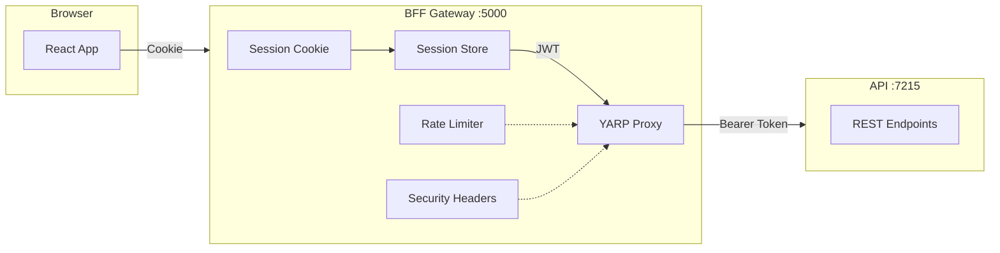
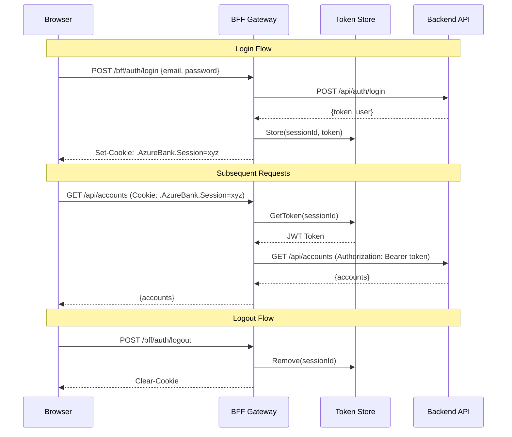
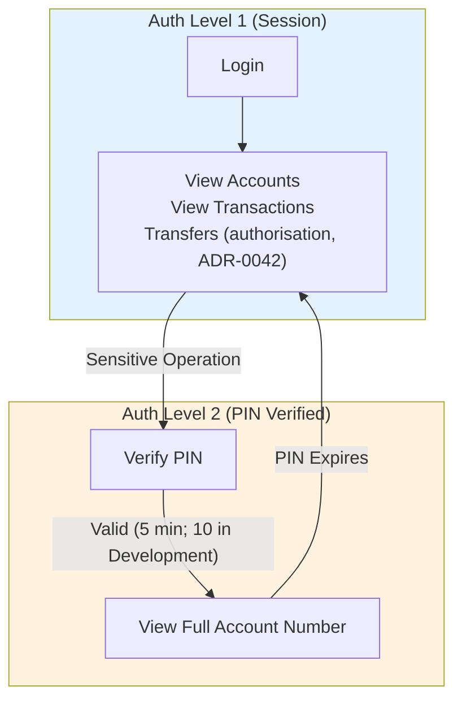

# AzureBank.Bff

**Backend-For-Frontend Gateway** - Secure API gateway with session management and reverse proxy

[](https://dotnet.microsoft.com)
[](https://microsoft.github.io/reverse-proxy/)

---

## Overview

`AzureBank.Bff` is the Backend-For-Frontend gateway that sits between the client (browser/mobile) and the API. It provides session management, rate limiting, security headers, and reverse proxy functionality using YARP.

**Parent Solution**: [AzureBank Backend](../../README.md)

---

## Why BFF Pattern?

The Backend-For-Frontend pattern provides several security benefits:

| Concern | Traditional API | BFF Pattern |
|---------|-----------------|-------------|
| **Token Storage** | Browser localStorage | Server-side (HTTP-only cookie) |
| **Token Exposure** | Accessible to JavaScript | Never exposed to client |
| **XSS Risk** | High (token theft) | Mitigated (no token access) |
| **CSRF Protection** | Manual implementation | Built-in with cookies |
| **Rate Limiting** | Per-endpoint | Centralized gateway |
| **Security Headers** | Per-endpoint | Centralized middleware |

---

## Architecture

### BFF Gateway Flow


```mermaid
flowchart LR
    subgraph Client["Browser"]
        App["React App"]
    end

    subgraph BFF["BFF Gateway :5000"]
        Cookie["Session Cookie"]
        Session["Session Store"]
        YARP["YARP Proxy"]
        RateLimit["Rate Limiter"]
        SecHeaders["Security Headers"]
    end

    subgraph API["API :7215"]
        Endpoints["REST Endpoints"]
    end

    App -->|"Cookie"| BFF
    Cookie --> Session
    Session -->|"JWT"| YARP
    YARP -->|"Bearer Token"| API
    RateLimit -.-> YARP
    SecHeaders -.-> YARP
```

### Session Management Flow


```mermaid
sequenceDiagram
    participant B as Browser
    participant BFF as BFF Gateway
    participant Store as Token Store
    participant API as Backend API

    Note over B,API: Login Flow
    B->>BFF: POST /bff/auth/login {email, password}
    BFF->>API: POST /api/auth/login
    API-->>BFF: {token, user}
    BFF->>Store: Store(sessionId, token)
    BFF-->>B: Set-Cookie: .AzureBank.Session=xyz

    Note over B,API: Subsequent Requests
    B->>BFF: GET /api/accounts (Cookie: .AzureBank.Session=xyz)
    BFF->>Store: GetToken(sessionId)
    Store-->>BFF: JWT Token
    BFF->>API: GET /api/accounts (Authorization: Bearer token)
    API-->>BFF: {accounts}
    BFF-->>B: {accounts}

    Note over B,API: Logout Flow
    B->>BFF: POST /bff/auth/logout
    BFF->>Store: Remove(sessionId)
    BFF-->>B: Clear-Cookie
```

### Step-Up Authentication


```mermaid
flowchart TB
    subgraph AuthLevel1["Auth Level 1 (Session)"]
        Login["Login"]
        BasicOps["View Accounts<br/>View Transactions<br/>Transfers (authorisation, ADR-0042)"]
    end

    subgraph AuthLevel2["Auth Level 2 (PIN Verified)"]
        PIN["Verify PIN"]
        SensitiveOps["View Full Account Number"]
    end

    Login --> BasicOps
    BasicOps -->|"Sensitive Operation"| PIN
    PIN -->|"Valid (5 min; 10 in Development)"| SensitiveOps
    SensitiveOps -->|"PIN Expires"| BasicOps

    style AuthLevel1 fill:#e3f2fd
    style AuthLevel2 fill:#fff3e0
```

---

## Project Structure

```
AzureBank.Bff/
├── 📁 Controllers/
│   └── BffAuthController.cs            # /bff/auth/* session endpoints
│
├── 📁 Services/
│   ├── 📁 Interfaces/
│   │   ├── ISessionService.cs          # Session operations
│   │   ├── ITokenRefresher.cs          # Silent access-token re-mint (ADR-0021)
│   │   └── ITokenStoreService.cs       # Token storage
│   ├── 📁 Implementations/
│   │   ├── SessionService.cs           # Session management logic
│   │   ├── TokenRefresher.cs           # Refresh-token rotation, single-flight per session
│   │   └── InMemoryTokenStore.cs       # In-memory token storage
│   └── SessionCleanupService.cs        # Background cleanup (every 5 min)
│
├── 📁 Middleware/
│   ├── CorrelationIdMiddleware.cs      # Correlation id, first in the pipeline
│   ├── SecurityHeadersMiddleware.cs    # OWASP security headers
│   ├── FetchMetadataMiddleware.cs      # Sec-Fetch-* cross-site isolation (ADR-0018)
│   ├── SessionActivityMiddleware.cs    # Update last activity
│   └── AuthLevelMiddleware.cs          # 404 the proxied auth paths, 401 no session, 403 step-up
│
├── 📁 Options/
│   ├── SessionOptions.cs               # BffSessionOptions (+ BffSessionOptionsValidator.cs)
│   ├── SecurityOptions.cs              # PinValidityMinutes
│   ├── RateLimitingOptions.cs          # (+ RateLimitingOptionsValidator.cs)
│   └── ProxyOptions.cs                 # KnownProxies / ForwardLimit (+ ProxyOptionsValidator.cs)
│
├── 📁 Models/
│   └── UserSession.cs                  # Session data model
│
├── 📁 DTOs/
│   ├── BffRequests.cs                  # BFF request models
│   └── BffResponses.cs                 # BFF response models
│
├── 📁 Transforms/
│   └── BearerTokenTransformProvider.cs # Clear inbound Authorization, inject the session JWT
│
├── 📁 Health/
│   └── BackendApiHealthCheck.cs        # /health/ready probe
├── 📁 Extensions/
│   └── ObservabilityServiceCollectionExtensions.cs # OpenTelemetry traces/metrics
│
├── 📄 RateLimitPolicies.cs             # "auth" / "lookup" policy names
├── 📄 Program.cs                       # Application setup
├── 📄 appsettings.json                 # Configuration
└── 📄 appsettings.Development.json     # Dev overrides (session 10/20, PIN 10)
```

---

## BFF Endpoints

### Session Management

| Endpoint | Method | Description | Auth |
|----------|--------|-------------|------|
| `/bff/auth/login` | POST | Login, create session, return cookie | No |
| `/bff/auth/register` | POST | Register user, create session | No |
| `/bff/auth/reauthenticate` | POST | Prove the password BEFORE the absolute cap and take a new session: `IsSessionValid` fails at the cap, so this answers 401 after it. Mints a NEW session at level 1, no PIN elevation carried over | Yes (401 with no resolvable session) |
| `/bff/auth/logout` | POST | Destroy session, clear cookie | Yes |
| `/bff/auth/me` | GET | User info (read through to the API, cache as fallback — ADR-0039) + session details | Yes |
| `/bff/auth/session-status` | GET | Check if authenticated | No |
| `/bff/auth/set-pin` | POST | Set/update PIN | Yes |
| `/bff/auth/verify-pin` | POST | Verify PIN, upgrade to AuthLevel 2 | Yes |
| `/bff/auth/azuretag` | PATCH | Rename the public handle, writing it back to the session | Yes |

### Proxied Routes

`/api/*` is proxied to the backend API with the session's JWT injected — once the request has passed
`AuthLevelMiddleware`, which refuses three things locally (see Middleware Pipeline below):

| BFF Route | Backend Route | What the BFF requires |
|-----------|---------------|-----------------------|
| `/api/auth/login`, `/api/auth/register`, `/api/auth/refresh` | — never proxied | answered `404` whatever the session |
| `/api/accounts` | `/api/accounts` | session (level 1) |
| `/api/transactions` | `/api/transactions` | session (level 1) |
| `/api/transfers` | `/api/transfers` | session (level 1) — **PIN NOT checked here** |
| `/api/accounts/*/full-number` | `/api/accounts/*/full-number` | level 2 (PIN verified in this session) |
| every other `/api/*` route, any method | same path | session (level 1) |

Since [ADR-0041](../../../docs/adr/0041-the-api-verifies-the-transfer-pin.md) the **API** verifies
a transfer's PIN rather than the BFF, and since
[ADR-0042](../../../docs/adr/0042-a-transfer-authorisation-is-bound-and-spent-once.md) the PIN does
not travel with the transfer at all: it is presented to the authorisation mint
(`POST /api/transfers[/internal]/authorizations`), which returns a one-shot id the transfer carries
in the `Step-Up-Authorization` header for the API to bind and spend. A withdrawal is the one money
move that still sends its PIN in the body. The BFF no longer gates a transfer at level 2, because
double-gating would leave the weaker of the two checks in the path and keep the five-minute session
window alive for money movement. `/full-number` is the only route behind the level-2 gate. The
no-session refusal is not transfer-specific either: since `d74603c` (2026-08-20) every `/api/*`
request that is not one of the three 404'd auth paths above, any method, is refused at the BFF with
the API's own 401 shape unless a live session resolves.

---

## Middleware Pipeline

### Security Headers Middleware

Adds OWASP-recommended security headers to all responses:

| Header | Value | Purpose |
|--------|-------|---------|
| `X-Content-Type-Options` | `nosniff` | Prevent MIME sniffing |
| `X-Frame-Options` | `DENY` | Prevent clickjacking |
| `X-XSS-Protection` | `1; mode=block` | XSS filtering |
| `Referrer-Policy` | `strict-origin-when-cross-origin` | Control referrer |
| `Permissions-Policy` | `accelerometer=(), camera=(), geolocation=(), gyroscope=(), magnetometer=(), microphone=(), payment=(), usb=()` | Disable sensitive browser features |
| `Content-Security-Policy` | `default-src 'self'; script-src 'self'; style-src 'self' 'unsafe-inline'; img-src 'self' data:; font-src 'self'; connect-src 'self'; frame-ancestors 'none';` | Content restrictions |

### Session Activity Middleware

Updates `LastActivity` timestamp on every authenticated request for timeout tracking.

### Auth Level Middleware

Three refusals, in this order, all decided in the BFF before the request reaches YARP — the BFF
tests pin the forwarded-path list empty for each (`AuthLevelMiddlewareTests`):

```csharp
// The two proxied auth entry points are answered 404 — as if the routes did not exist — before the
// session is read, so they answer 404 even to a valid session. The SPA signs in through the BFF's
// own /bff/auth/* controller; a raw proxied login had no legitimate caller and handed out the very
// JWT the BFF exists to withhold (measured 2026-08-19, ADR-0041 amendment). /api/auth/refresh is
// answered 404 by the branch just above this one (ADR-0021).
private static readonly HashSet<string> BlockedProxiedAuthPaths =
    new(StringComparer.OrdinalIgnoreCase) { "/api/auth/login", "/api/auth/register" };

// EVERY proxied request — any method — needs a live session, decided HERE rather than delegated to
// the API. There is no exception list: the set that used to hold one is deleted, not emptied.
private static bool RequiresSession(string path) =>
    path.StartsWith("/api/", StringComparison.OrdinalIgnoreCase);

// Level 2 has two branches. The exact-path set is EMPTY since ADR-0041 — transfers carry their PIN
// in-band and the API verifies it — and is kept only as the place a future exact-path route would
// go. The prefix x suffix pair, checked for ANY method, is the only level-2 enforcement left.
private static readonly HashSet<string> PinRequiredPaths = new(StringComparer.OrdinalIgnoreCase);
private static readonly string[] PinRequiredPrefixes = { "/api/accounts/" };
private static readonly string[] PinRequiredSuffixes = { "/full-number" };
```

What a caller observes, measured through the BFF (:5000 → API :7215, Development) — rows 2–4 on
2026-09-03 (`070803f`) for GET and POST, row 1 on 2026-08-19 (ADR-0041 amendment), and the PATCH and
DELETE verbs of row 2 on 2026-08-20 (`d74603c`):

| Request | Session cookie | Answer |
|---|---|---|
| `/api/auth/login`, `/api/auth/register`, `/api/auth/refresh` | any, even a live one | `404` |
| any other `/api/*` route, any method | none, never issued, or replayed after logout | `401` — the API's own `AUTH_TOKEN_MISSING` body, no `X-Auth-Level-*` header |
| `GET /api/accounts/{id}/full-number` | live, level 1 | `403 STEP_UP_REQUIRED`, `X-Auth-Level-Required: 2`, `X-Auth-Level-Current: 1` |
| `POST /api/transfers` | live, level 1 | proxied — `400` model-state from the API on `{}`; its proof is the one-shot authorisation in the `Step-Up-Authorization` header, which the API binds and spends (ADR-0042) |

The 401 carries the API's own members (apart from `traceId`), on purpose: a caller probing for the
step-up gate learns nothing from the answer, and the SPA already knows the shape. 401 and 403 are
different states — no session routes to login, level 1 opens the PIN modal — so a cookie the store
cannot resolve is a 401, never a level-0 step-up (ADR-0038).

---

## Session Management

### Session Model

```csharp
public class UserSession
{
    public required string SessionId { get; init; }
    public required Guid UserId { get; init; }
    public required string AccessToken { get; set; }
    public required DateTime TokenExpiry { get; set; }
    public string? RefreshToken { get; set; }   // rotated on every re-mint; browser never sees it
    public required DateTime SessionCreated { get; init; }
    public DateTime LastActivity { get; set; }
    public int AuthLevel { get; set; } = 1;  // 1=Session, 2=PIN Verified
    public DateTime? PinVerifiedAt { get; set; }
    public required UserSessionInfo UserInfo { get; init; }
}
```

### Session Lifecycle

1. **Creation**: On login/register, generate cryptographic session ID
2. **Storage**: Store JWT + session data in memory (swappable to Redis)
3. **Cookie**: Return HTTP-only, Secure, SameSite=Strict cookie
4. **Activity**: Update `LastActivity` on each request
5. **Timeout**: Inactivity (30 min; 10 in Development) or absolute (60 min; 20 in Development)
   expiration — `Session` section of `appsettings.json` / `appsettings.Development.json`
6. **Cleanup**: Background service removes expired sessions every 5 min
7. **Logout**: Immediately remove session and clear cookie

### Session Security

| Feature | Configuration |
|---------|---------------|
| Cookie Name | `__Host-AzureBank.Session` (Production); `.AzureBank.Session` in Development — the `__Host-` prefix is applied at runtime over the configured name (ADR-0018) |
| Lifetime | Session cookie — no `Expires`/`Max-Age`; bounded server-side by the inactivity + absolute timeouts |
| HTTP-Only | Yes (no JavaScript access) |
| Secure | Production (required by `__Host-`); off in Development — the dev loop runs on `http://localhost` |
| SameSite | Strict (CSRF protection, backed by the Fetch-Metadata middleware) |
| Session ID | 32 bytes cryptographic random |

---

## YARP Configuration

### Route Configuration

```json
{
  "ReverseProxy": {
    "Routes": {
      "api-route": {
        "ClusterId": "backend-api",
        "Match": {
          "Path": "/api/{**catch-all}"
        }
      }
    },
    "Clusters": {
      "backend-api": {
        "Destinations": {
          "primary": {
            "Address": "https://localhost:7215"
          }
        }
      }
    }
  }
}
```

### Bearer Token Transform

The `BearerTokenTransformProvider` first clears any inbound `Authorization` header, then injects the
session's JWT (re-minted through `ITokenRefresher` when it is near expiry):

```csharp
public void Apply(TransformBuilderContext context)
{
    context.AddRequestTransform(async transformContext =>
    {
        var httpContext = transformContext.HttpContext;
        var cookieName = httpContext.RequestServices
            .GetRequiredService<IOptions<BffSessionOptions>>().Value.CookieName;

        // DROP whatever the caller sent, ALWAYS, before deciding what to inject. YARP copies
        // inbound headers by default, so without this a caller's own bearer rode through to the
        // API whenever no session resolved (ADR-0038). The session is the only credential.
        transformContext.ProxyRequest.Headers.Authorization = null;

        if (httpContext.Request.Cookies.TryGetValue(cookieName, out var sessionId)
            && !string.IsNullOrEmpty(sessionId))
        {
            // Silent re-mint inside the refresh skew window (ADR-0021); null = inject nothing, the
            // API 401s and the SPA's session-expired path fires.
            var refresher = httpContext.RequestServices.GetRequiredService<ITokenRefresher>();
            var token = await refresher.GetFreshAccessTokenAsync(
                sessionId, httpContext.RequestAborted);
            if (!string.IsNullOrEmpty(token))
            {
                transformContext.ProxyRequest.Headers.Authorization =
                    new AuthenticationHeaderValue("Bearer", token);
            }
        }
    });
}
```

---

## Rate Limiting

Three limiters, all driven by the `RateLimiting` section of `appsettings.json` — no limit is
hard-coded. The global limiter and `auth` are keyed by client IP (IPv6 on its /64 prefix); `lookup`
is keyed by the AUTHENTICATED USER and falls back to the IP only with no session (ADR-0014). A
global fixed window catches everything; the two named policies are SLIDING windows. `auth` is
attached in two places: `[EnableRateLimiting(RateLimitPolicies.Auth)]` on the BFF's own
`/bff/auth/login`, `/bff/auth/register`, `/bff/auth/reauthenticate` and `PATCH /bff/auth/azuretag`,
and `RateLimiterPolicy` on the proxied `/api/auth/login|register` routes in the `ReverseProxy`
config; `lookup` is attached to the proxied `/api/users/{**catch-all}` route the same way.

```csharp
builder.Services.AddRateLimiter(options =>
{
    // Global: every request, fixed window.
    options.GlobalLimiter = /* fixed window, keyed by IP */;

    // Named policies, attached by RateLimiterPolicy on the routes that need them.
    options.AddPolicy(RateLimitPolicies.Auth, /* sliding window, keyed by IP */);
    options.AddPolicy(RateLimitPolicies.Lookup, /* sliding window, keyed by authenticated user */);
});
```

| Limiter | Applies to | Permits | Window | Shape |
|---------|-----------|---------|--------|-------|
| Global | every request except `/health/live` and `/health/ready` | 300 | 60 s | fixed, per IP |
| `auth` | `/bff/auth/login`, `/bff/auth/register`, `/bff/auth/reauthenticate`, `PATCH /bff/auth/azuretag`; also the proxied `/api/auth/login` and `/api/auth/register` routes | 10 | 60 s | sliding, 6 segments, per IP |
| `lookup` | `/api/users/{**catch-all}` | 20 | 60 s | sliding, 6 segments, per authenticated user |

The proxied `/api/auth/login|register` routes keep their `RateLimiterPolicy` even though
`AuthLevelMiddleware` answers them 404 — the limiter runs first (`Program.cs` pipeline step 5, the
gate is step 6). Delete them and the path falls to the `/api/{**catch-all}` route, which carries no
policy, so any future weakening of the middleware would proxy login unrate-limited.

Rejections answer **429** with `Retry-After`, `Cache-Control: no-store` and the API's
ProblemDetails shape (`errorCode: RATE_LIMIT_EXCEEDED`); the sliding policies do not advertise a
retry time of their own, so `RateLimiting:AuthWindowSeconds` is used as a conservative floor.
Nothing queues — a request over the limit is refused immediately.

---

## Configuration

### appsettings.json

```json
{
  "Session": {
    "CookieName": ".AzureBank.Session",
    "InactivityTimeoutMinutes": 30,
    "AbsoluteTimeoutMinutes": 60
  },
  "Security": {
    "PinValidityMinutes": 5
  },
  "RateLimiting": {
    "GlobalPermitLimit": 300,
    "GlobalWindowSeconds": 60,
    "AuthPermitLimit": 10,
    "AuthWindowSeconds": 60,
    "AuthSegmentsPerWindow": 6,
    "LookupPermitLimit": 20,
    "LookupWindowSeconds": 60
  },
  "BackendApi": {
    "BaseUrl": "https://localhost:7215"
  },
  "ReverseProxy": {
    "Routes": {
      "api-auth-login-route": {
        "ClusterId": "backend-api",
        "Match": { "Path": "/api/auth/login" },
        "RateLimiterPolicy": "auth"
      },
      "api-auth-register-route": {
        "ClusterId": "backend-api",
        "Match": { "Path": "/api/auth/register" },
        "RateLimiterPolicy": "auth"
      },
      "api-users-route": {
        "ClusterId": "backend-api",
        "Match": { "Path": "/api/users/{**catch-all}" },
        "RateLimiterPolicy": "lookup"
      },
      "api-route": {
        "ClusterId": "backend-api",
        "Match": { "Path": "/api/{**catch-all}" }
      }
    },
    "Clusters": {
      "backend-api": {
        "Destinations": {
          "primary": { "Address": "https://localhost:7215" }
        }
      }
    }
  }
}
```

### Configuration Classes

**BffSessionOptions:**
```csharp
public class BffSessionOptions
{
    public string CookieName { get; set; } = ".AzureBank.Session";
    public int InactivityTimeoutMinutes { get; set; } = 30;
    public int AbsoluteTimeoutMinutes { get; set; } = 60;
}
```

**SecurityOptions:**
```csharp
public class SecurityOptions
{
    public int PinValidityMinutes { get; set; } = 5;
}
```

---

## Dependencies

| Package | Purpose |
|---------|---------|
| `Yarp.ReverseProxy` | Reverse proxy to backend API |
| `Microsoft.AspNetCore.RateLimiting` | Request rate limiting |

**Project References:**
- `AzureBank.Shared` - Shared DTOs for API communication

---

## Running Locally

```bash
# Requires API to be running first
dotnet run --project src/AzureBank.Api &

# Start BFF
dotnet run --project src/AzureBank.Bff

# Test session status
curl http://localhost:5000/bff/auth/session-status
# {"isAuthenticated":false,"authLevel":null,"isPinVerified":null}
```

---

## Production Considerations

### Token Store

The default `InMemoryTokenStore` is suitable for development. For production:

**Option 1: Redis**
```csharp
services.AddSingleton<ITokenStoreService, RedisTokenStore>();
```

**Option 2: Distributed Cache**
```csharp
services.AddStackExchangeRedisCache(options =>
{
    options.Configuration = "localhost:6379";
});
services.AddSingleton<ITokenStoreService, DistributedCacheTokenStore>();
```

### Horizontal Scaling

For multiple BFF instances:
1. Use Redis for session storage (not in-memory)
2. Configure sticky sessions or share session state
3. Ensure all instances have same JWT secret

### CORS

The BFF registers **no CORS, by design** (ADR-0018). The browser only ever reaches it
same-origin: in development Vite's `server.proxy` forwards `/api` and `/bff`, and in
production the BFF serves the SPA bundle itself. A credentialed cross-origin allowance
here would be pure attack surface; cross-site state-changing requests are additionally
rejected by the Fetch-Metadata middleware.

---

## See Also

- [Root README](../../README.md) - Solution overview
- [AzureBank.Api](../AzureBank.Api/README.md) - Backend API
- [ADR-0001: BFF Pattern](../../../docs/adr/0001-bff-pattern.md) - Architecture decision
- [ADR-0002: YARP Selection](../../../docs/adr/0002-yarp-proxy.md) - Proxy choice
