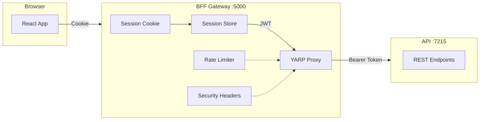
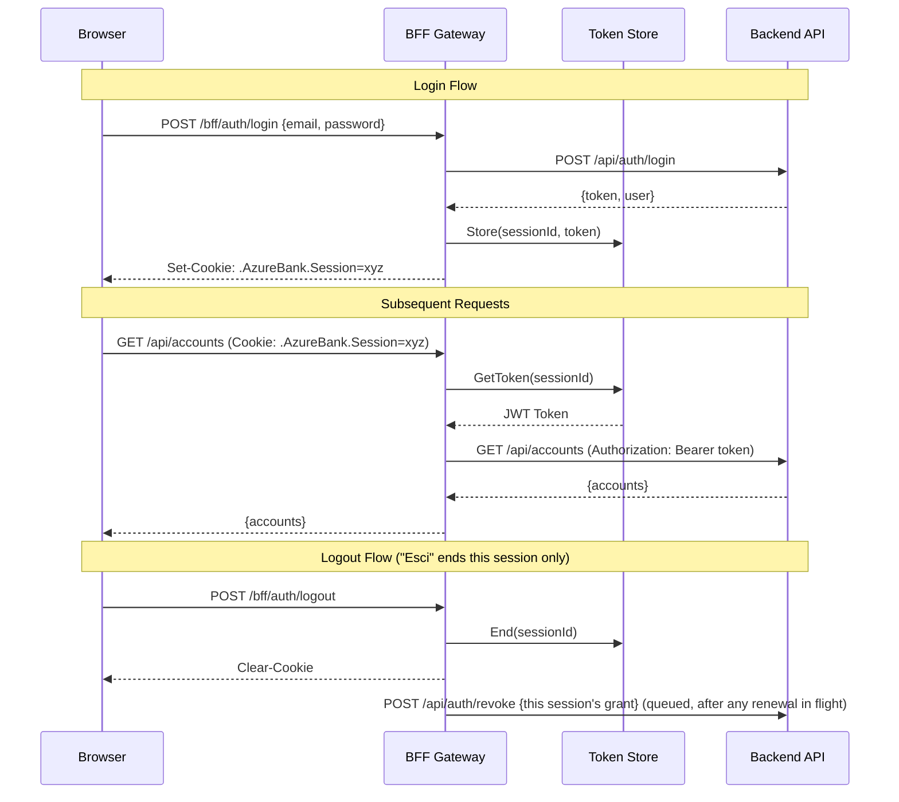
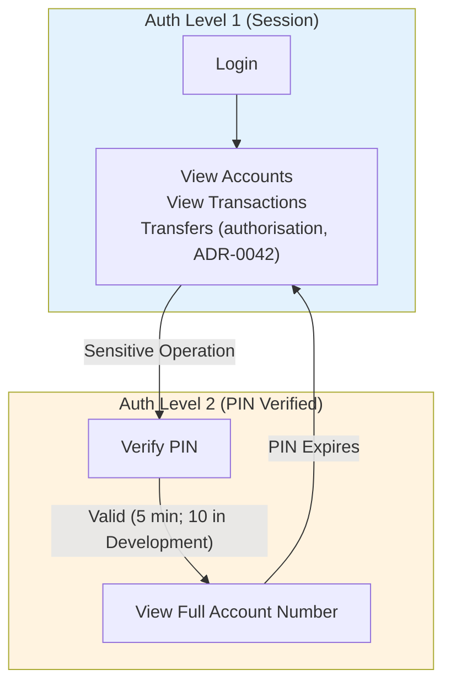

# AzureBank.Bff

**Backend-For-Frontend Gateway** - Secure API gateway with session management and reverse proxy

[](https://dotnet.microsoft.com)
[](https://microsoft.github.io/reverse-proxy/)

---

## Overview

`AzureBank.Bff` is the Backend-For-Frontend gateway that sits between the client (browser/mobile) and the API. It provides session management, rate limiting, security headers, and reverse proxy functionality using YARP.

**Parent Solution**: [AzureBank Backend](../../README.md)

---

## Why BFF Pattern?

The Backend-For-Frontend pattern provides several security benefits:

| Concern | Traditional API | BFF Pattern |
|---------|-----------------|-------------|
| **Token Storage** | Browser localStorage | Server-side (HTTP-only cookie) |
| **Token Exposure** | Accessible to JavaScript | Never exposed to client |
| **XSS Risk** | High (token theft) | Mitigated (no token access) |
| **CSRF Protection** | Manual implementation | Built-in with cookies |
| **Rate Limiting** | Per-endpoint | Centralized gateway |
| **Security Headers** | Per-endpoint | Centralized middleware |

---

## Architecture

### BFF Gateway Flow


```mermaid
flowchart LR
    subgraph Client["Browser"]
        App["React App"]
    end

    subgraph BFF["BFF Gateway :5000"]
        Cookie["Session Cookie"]
        Session["Session Store"]
        YARP["YARP Proxy"]
        RateLimit["Rate Limiter"]
        SecHeaders["Security Headers"]
    end

    subgraph API["API :7215"]
        Endpoints["REST Endpoints"]
    end

    App -->|"Cookie"| BFF
    Cookie --> Session
    Session -->|"JWT"| YARP
    YARP -->|"Bearer Token"| API
    RateLimit -.-> YARP
    SecHeaders -.-> YARP
```

### Session Management Flow


```mermaid
sequenceDiagram
    participant B as Browser
    participant BFF as BFF Gateway
    participant Store as Token Store
    participant API as Backend API

    Note over B,API: Login Flow
    B->>BFF: POST /bff/auth/login {email, password}
    BFF->>API: POST /api/auth/login
    API-->>BFF: {token, user}
    BFF->>Store: Store(sessionId, token)
    BFF-->>B: Set-Cookie: .AzureBank.Session=xyz

    Note over B,API: Subsequent Requests
    B->>BFF: GET /api/accounts (Cookie: .AzureBank.Session=xyz)
    BFF->>Store: GetToken(sessionId)
    Store-->>BFF: JWT Token
    BFF->>API: GET /api/accounts (Authorization: Bearer token)
    API-->>BFF: {accounts}
    BFF-->>B: {accounts}

    Note over B,API: Logout Flow ("Esci" ends this session only)
    B->>BFF: POST /bff/auth/logout
    BFF->>Store: End(sessionId)
    BFF-->>B: Clear-Cookie
    BFF->>API: POST /api/auth/revoke {this session's grant} (queued, after any renewal in flight)
```

### Step-Up Authentication


```mermaid
flowchart TB
    subgraph AuthLevel1["Auth Level 1 (Session)"]
        Login["Login"]
        BasicOps["View Accounts<br/>View Transactions<br/>Transfers (authorisation, ADR-0042)"]
    end

    subgraph AuthLevel2["Auth Level 2 (PIN Verified)"]
        PIN["Verify PIN"]
        SensitiveOps["View Full Account Number"]
    end

    Login --> BasicOps
    BasicOps -->|"Sensitive Operation"| PIN
    PIN -->|"Valid (5 min; 10 in Development)"| SensitiveOps
    SensitiveOps -->|"PIN Expires"| BasicOps

    style AuthLevel1 fill:#e3f2fd
    style AuthLevel2 fill:#fff3e0
```

---

## Project Structure

```
AzureBank.Bff/
├── 📁 Controllers/
│   └── BffAuthController.cs            # /bff/auth/* session endpoints
│
├── 📁 Services/
│   ├── 📁 Interfaces/
│   │   ├── ISessionService.cs          # Session operations
│   │   ├── ITokenRefresher.cs          # Access-token renewal (ADR-0021, ADR-0057 §4.5)
│   │   └── ITokenStoreService.cs       # Token storage
│   ├── 📁 Implementations/
│   │   ├── SessionService.cs           # Session management logic
│   │   ├── TokenRefresher.cs           # Renewal with a non-rotating grant, single flight per session
│   │   └── InMemoryTokenStore.cs       # In-memory token storage; every session ending goes through it
│   ├── GrantRevoker.cs                 # Revokes ended sessions' grants; drains them on a graceful stop
│   ├── SessionStamps.cs                # Latest session stamp known per signed-in user (ADR-0057 §5.3)
│   ├── SessionStampWatcher.cs          # Reads those stamps every 15 s while anyone is signed in
│   └── SessionCleanupService.cs        # Background cleanup (every 5 min)
│
├── 📁 Middleware/
│   ├── CorrelationIdMiddleware.cs      # Correlation id, first in the pipeline
│   ├── SecurityHeadersMiddleware.cs    # OWASP security headers
│   ├── FetchMetadataMiddleware.cs      # Sec-Fetch-* cross-site isolation (ADR-0018)
│   ├── SessionActivityMiddleware.cs    # Update last activity
│   ├── DemoModeMiddleware.cs           # Public demo: 404 the claim while it is off, 403 registration while it is on (ADR-0063)
│   └── AuthLevelMiddleware.cs          # 404 the proxied auth paths, 401 no session, 403 step-up
│
├── 📁 Options/
│   ├── SessionOptions.cs               # BffSessionOptions (+ BffSessionOptionsValidator.cs)
│   ├── SecurityOptions.cs              # PinValidityMinutes
│   ├── RateLimitingOptions.cs          # (+ RateLimitingOptionsValidator.cs)
│   └── ProxyOptions.cs                 # KnownProxies / ForwardLimit (+ ProxyOptionsValidator.cs)
│
├── 📁 Models/
│   └── UserSession.cs                  # Session data model
│
├── 📁 DTOs/
│   ├── BffRequests.cs                  # BFF request models
│   └── BffResponses.cs                 # BFF response models
│
├── 📁 Transforms/
│   └── BearerTokenTransformProvider.cs # Clear inbound Authorization, inject the session JWT
│
├── 📁 Health/
│   └── BackendApiHealthCheck.cs        # /health/ready probe
├── 📁 Extensions/
│   └── ObservabilityServiceCollectionExtensions.cs # OpenTelemetry traces/metrics
│
├── 📄 RateLimitPolicies.cs             # "auth" / "lookup" policy names
├── 📄 ClientAddress.cs                 # The client a request comes from: the limiters' key, and what the demo claim tells the API
├── 📄 Program.cs                       # Application setup
├── 📄 appsettings.json                 # Configuration
└── 📄 appsettings.Development.json     # Dev overrides (session 10/20, PIN 10)
```

---

## BFF Endpoints

### Session Management

| Endpoint | Method | Description | Auth |
|----------|--------|-------------|------|
| `/bff/auth/login` | POST | Login, create session, return cookie | No |
| `/bff/auth/register` | POST | Register user, create session. On the public demo (`Demo:Enabled`): 403 `REGISTRATION_CLOSED`, whatever the body, and the API is not called | No |
| `/bff/auth/demo/claim` | POST | On the public demo only: claim a private demo copy and open a session on it. Body `{}` as JSON. Answers `{ data: { user, expiresAt, copy }, message }`, where `copy` holds the email, the password, the PIN, the two contacts' handles and the copy's end; `no-store`. 404 while `Demo:Enabled` is false, as a path the BFF does not have (ADR-0063) | No |
| `/bff/auth/reauthenticate` | POST | Prove the password BEFORE the absolute cap and take a new session: `IsSessionValid` fails at the cap, so this answers 401 after it. Mints a NEW session at level 1, no PIN elevation carried over | Yes (401 with no resolvable session) |
| `/bff/auth/logout` | POST | Destroy session, clear cookie | Yes |
| `/bff/auth/me` | GET | User info (read through to the API, cache as fallback — ADR-0039) + session details | Yes |
| `/bff/auth/session-status` | GET | Check if authenticated | No |
| `/bff/auth/set-pin` | POST | Set/update PIN | Yes |
| `/bff/auth/verify-pin` | POST | Verify PIN, upgrade to AuthLevel 2 | Yes |
| `/bff/auth/azuretag` | PATCH | Rename the public handle, writing it back to the session | Yes |

### Proxied Routes

The bare `/api` path and `/api/*` are proxied to the backend API with the session's JWT injected —
once the request has passed `AuthLevelMiddleware`, which refuses three things locally (see
Middleware Pipeline below):

| BFF Route | Backend Route | What the BFF requires |
|-----------|---------------|-----------------------|
| `/api/auth/login`, `/api/auth/register`, `/api/auth/refresh`, `/api/auth/revoke`, `/api/auth/logout`, `/api/auth/session-stamps`, `/api/auth/demo/claim` | — never proxied | answered `404` whatever the session |
| `/api/accounts` | `/api/accounts` | session (level 1) |
| `/api/transactions` | `/api/transactions` | session (level 1) |
| `/api/transfers` | `/api/transfers` | session (level 1) — **PIN NOT checked here** |
| `/api/accounts/*/full-number` | `/api/accounts/*/full-number` | level 2 (PIN verified in this session) |
| the bare `/api` path and every other `/api/*` route, any method | same path | session (level 1) |

Since [ADR-0041](../../../docs/adr/0041-the-api-verifies-the-transfer-pin.md) the **API** verifies
a transfer's PIN rather than the BFF, and since
[ADR-0042](../../../docs/adr/0042-a-transfer-authorisation-is-bound-and-spent-once.md) the PIN does
not travel with the transfer at all: it is presented to the authorisation mint
(`POST /api/transfers[/internal]/authorizations`), which returns a one-shot id the transfer carries
in the `Step-Up-Authorization` header for the API to bind and spend. Since
[ADR-0056](../../../docs/adr/0056-a-withdrawal-is-authorised-like-a-transfer.md) a withdrawal sends
no PIN either: its PIN is presented to its own mint
(`POST /api/transactions/withdraw/authorizations`), and the withdrawal carries the one-shot
authorisation in the `Step-Up-Authorization` header, as a transfer does; no money move sends its PIN
in its own body any more. The BFF no longer gates a transfer at level 2, because double-gating would
leave the weaker of the two checks in the path and keep the five-minute session window alive for
money movement. `/full-number` is the only route behind the level-2 gate. The no-session refusal is
not transfer-specific either: since `d74603c` (2026-08-20) every `/api/*` request that is not one of
the seven 404'd auth paths above, and since 2026-10-05 the bare `/api` path too, any method, is
refused at the BFF with the API's own 401 shape unless a live session resolves.
*(Until 2026-10-05 this paragraph said a withdrawal was the one money move that still sends its PIN
in the body; that had been false since ADR-0056, `267d33e` (2026-09-22). Until the same day it did
not name the bare `/api` path, which the proxy's catch-all route takes too: with no session a
request for that path was forwarded.)*

---

## Middleware Pipeline

### Security Headers Middleware

Adds OWASP-recommended security headers to all responses:

| Header | Value | Purpose |
|--------|-------|---------|
| `X-Content-Type-Options` | `nosniff` | Prevent MIME sniffing |
| `X-Frame-Options` | `DENY` | Prevent clickjacking |
| `X-XSS-Protection` | `0` | Off, as OWASP recommends: the old filter could create XSS (ADR-0054) |
| `Referrer-Policy` | `strict-origin-when-cross-origin` | Control referrer |
| `Permissions-Policy` | `accelerometer=(), camera=(), geolocation=(), gyroscope=(), magnetometer=(), microphone=(), payment=(), usb=()` | Disable sensitive browser features |
| `Content-Security-Policy` | `default-src 'self'; script-src 'self'; style-src 'self' 'sha256-47DEQpj8HBSa+/TImW+5JCeuQeRkm5NMpJWZG3hSuFU='; img-src 'self' data:; font-src 'self'; connect-src 'self'; object-src 'none'; base-uri 'none'; form-action 'self'; frame-ancestors 'none';` | Content restrictions, measured against the served SPA; the hash is the empty string's, for Griffel's empty `<style>` elements (ADR-0054) |
| `Strict-Transport-Security` | `max-age=31536000`, in every environment but Development | Hold the browser to https for a year. Sent over plain http too: behind an edge that terminates TLS every request arrives as http, and `UseHsts` would send nothing (ADR-0054) |

### The built SPA (`Spa:RootPath`)

When `Spa:RootPath` names a Vite build (`frontend/dist`), the BFF serves it: fingerprinted files
under `/assets` as `immutable`, everything else revalidated, and the page shell for any GET
navigation no endpoint claimed. Never under `/api`, `/bff` or `/health`, whatever run of slashes
and backslashes the path begins with (`//api/accounts`, `/%5Capi/accounts`), and never for a file
name, so an unknown API route stays a 404 and a POST-only route stays a 405. An encoded slash is
not a separator: `/%2Fapi/accounts` still gets the shell. Unset, the BFF serves no pages and vite
does, as in the dev loop; set to a directory with no `index.html`, the host refuses to start.
ADR-0054.
*(Until 2026-10-05 this said only "Never under `/api`, `/bff` or `/health`", and a server path
behind a leading backslash was answered with the shell.)*

On the public demo (`Demo:Enabled`) the page carries one tag,
`<meta name="azurebank-demo" content="true">`, put right before its `</head>` when the host
starts: for a navigation, and for `index.html` asked for by its name. A build whose `index.html`
has no `</head>` stops the host. With the demo off the page is the file, byte for byte. In the
dev loop the BFF serves no page, so nothing carries the tag there. ADR-0063.

### Session Activity Middleware

Updates `LastActivity` timestamp on every authenticated request for timeout tracking.

### Demo Mode Middleware

After the rate limiter and before the controllers bind anything, two answers that depend on
`Demo:Enabled` and on nothing the request carries (ADR-0063). While it is false,
`POST /bff/auth/demo/claim` is 404 with no body, as a path the BFF does not have. While it is
true, `POST /bff/auth/register` is 403 `REGISTRATION_CLOSED`, in the API's words and without
calling it. Another method on either path is 405 with `Allow: POST`, whatever the flag, as on
sign-in's path.

### Auth Level Middleware

Three refusals, in this order, all decided in the BFF before the request reaches YARP — the BFF
tests pin the forwarded-path list empty for each (`AuthLevelMiddlewareTests`):

```csharp
// These six auth paths are answered 404 — as if the routes did not exist — before the session is
// read, so they answer 404 even to a valid session. /api/auth/refresh is the seventh of the table
// above: the middleware answers it 404 in a branch of its own, before it looks at this set. The
// SPA signs in through the BFF's own /bff/auth/* controller; a raw proxied login had no legitimate
// caller and handed out the very JWT the BFF exists to withhold (measured 2026-08-19, ADR-0041
// amendment). Revoke, logout and the session-stamp feed are token endpoints the API answers only
// to the BFF's own client (ADR-0057 §4.2, §5.3). The demo's claim joined them (ADR-0063): its
// answer carries the tokens, and the API counts a client's copies by the address its caller
// names, which must be this host.
private static readonly HashSet<string> BlockedProxiedAuthPaths =
    new(StringComparer.OrdinalIgnoreCase)
    {
        "/api/auth/login", "/api/auth/register", "/api/auth/revoke", "/api/auth/logout",
        "/api/auth/session-stamps", "/api/auth/demo/claim"
    };

// EVERY proxied request — any method — needs a live session, decided HERE rather than delegated to
// the API. There is no exception list: the set that used to hold one is deleted, not emptied.
// (Until 2026-10-05 this tested only the "/api/" prefix, missing the bare "/api" path.)
private static bool RequiresSession(string path) =>
    path.StartsWith("/api/", StringComparison.OrdinalIgnoreCase)
    || path.Equals("/api", StringComparison.OrdinalIgnoreCase);

// Level 2 has two branches. The exact-path set is EMPTY since ADR-0041 — a transfer is authorised
// at the API (since ADR-0042 by a one-shot authorisation the API binds and spends) and is not
// gated here — and is kept only as the place a future exact-path route would go. The prefix x
// suffix pair, checked for ANY method, is the only level-2 enforcement left.
// (Until 2026-10-05 this comment said transfers carry their PIN in-band and the API verifies it;
// since ADR-0042 a transfer carries no PIN.)
private static readonly HashSet<string> PinRequiredPaths = new(StringComparer.OrdinalIgnoreCase);
private static readonly string[] PinRequiredPrefixes = { "/api/accounts/" };
private static readonly string[] PinRequiredSuffixes = { "/full-number" };
```

What a caller observes, measured through the BFF (:5000 → API :7215, Development) — rows 3–5 on
2026-09-03 (`070803f`) for GET and POST, row 1's login, register and refresh on 2026-08-19
(ADR-0041 amendment), and the PATCH and DELETE verbs of row 3 on 2026-08-20 (`d74603c`):
*(Until 2026-10-05 this sentence said rows 2–4 and row 2, the table's numbers until `e5107f0`
(2026-10-04) put the demo claim's row second; and it dated all of row 1 2026-08-19, whose last
three paths joined it with `bd4fa39` (2026-09-29).)*

| Request | Session cookie | Answer |
|---|---|---|
| `/api/auth/login`, `/api/auth/register`, `/api/auth/refresh`, `/api/auth/revoke`, `/api/auth/logout`, `/api/auth/session-stamps` | any, even a live one | `404` |
| `/api/auth/demo/claim` (not in the measurements above: on the compose stack, Production, the demo on, 2026-10-04) | live | `404`, no body. With no session it is `404` too, where a path under `/api` that names nothing is `401` (`AuthLevelMiddlewareTests`) |
| `/api` itself (not in the measurements above: on the test host, 2026-10-05) and any other `/api/*` route, any method | none, never issued, or replayed after logout | `401` — the API's own `AUTH_TOKEN_MISSING` body, no `X-Auth-Level-*` header |
| `GET /api/accounts/{id}/full-number` | live, level 1 | `403 STEP_UP_REQUIRED`, `X-Auth-Level-Required: 2`, `X-Auth-Level-Current: 1` |
| `POST /api/transfers` | live, level 1 | proxied — `400` model-state from the API on `{}`; its proof is the one-shot authorisation in the `Step-Up-Authorization` header, which the API binds and spends (ADR-0042) |

The 401 carries the API's own members, with a `traceId` of its own, on purpose: a caller probing
for the step-up gate learns nothing from the answer, and the SPA already knows the shape. 401 and
403 are different states — no session routes to login, level 1 opens the PIN modal — so a cookie
the store cannot resolve is a 401, never a level-0 step-up (ADR-0038).
*(Until 2026-10-05 this said "(apart from `traceId`)", which read as if the 401 had none.)*

---

## Session Management

### Session Model

```csharp
public class UserSession
{
    public required string SessionId { get; init; }
    public required Guid UserId { get; init; }
    public required string AccessToken { get; set; }
    public required DateTime TokenExpiry { get; set; }
    public string? RefreshToken { get; init; }  // the grant: never rotated, never in the browser
    public DateTime? GrantExpiresAt { get; init; }
    public required DateTime AbsoluteExpiresAt { get; init; } // min(created + cap, grant expiry)
    public required DateTime SessionCreated { get; init; }
    public DateTime LastActivity { get; set; }
    public int AuthLevel { get; set; } = 1;  // 1=Session, 2=PIN Verified
    public DateTime? PinVerifiedAt { get; set; }
    public required UserSessionInfo UserInfo { get; init; }
}
```

### Session Lifecycle

1. **Creation**: On login/register, generate cryptographic session ID
2. **Storage**: Store JWT + session data in memory (swappable to Redis)
3. **Cookie**: Return HTTP-only, Secure, SameSite=Strict cookie
4. **Activity**: Update `LastActivity` on each request
5. **Timeout**: Inactivity (15 min; 10 in Development) or absolute (60 min; 20 in Development)
   expiration — `Session` section of `appsettings.json` / `appsettings.Development.json`. The
   absolute limit is also never later than the grant's own expiry (ADR-0057 §4.1)
6. **Cleanup**: Background service ends expired sessions every 5 min
7. **Logout**: Immediately end this session and clear the cookie; the user's other sessions are
   untouched. Every ending — logout, expiry, re-authentication, a new sign-in over an old cookie, a
   raised session stamp, a graceful stop — queues the session's grant on `GrantRevoker`, which
   revokes it with `POST /api/auth/revoke`
8. **Sign-out everywhere**: each session keeps the user's session stamp from sign-in. When a user is
   signed out of every session at the API (`POST /api/auth/logout`, or a runbook's SQL), the stamp
   goes up; `SessionStampWatcher` reads the stamps of the signed-in users every 15 s through
   `POST /api/auth/session-stamps` (and makes no call when nobody is signed in), and a session whose
   stamp is below the one read is refused at its next request. A failed read keeps the last values
   (ADR-0057 §5.3)

### Session Security

| Feature | Configuration |
|---------|---------------|
| Cookie Name | `__Host-AzureBank.Session` (Production); `.AzureBank.Session` in Development — the `__Host-` prefix is applied at runtime over the configured name (ADR-0018) |
| Lifetime | Session cookie — no `Expires`/`Max-Age`; bounded server-side by the inactivity + absolute timeouts |
| HTTP-Only | Yes (no JavaScript access) |
| Secure | Production (required by `__Host-`); off in Development — the dev loop runs on `http://localhost` |
| SameSite | Strict (CSRF protection, backed by the Fetch-Metadata middleware) |
| Session ID | 32 bytes cryptographic random |

---

## YARP Configuration

### Route Configuration

```json
{
  "ReverseProxy": {
    "Routes": {
      "api-route": {
        "ClusterId": "backend-api",
        "Match": {
          "Path": "/api/{**catch-all}"
        }
      }
    },
    "Clusters": {
      "backend-api": {
        "Destinations": {
          "primary": {
            "Address": "https://localhost:7215"
          }
        }
      }
    }
  }
}
```

### Bearer Token Transform

The `BearerTokenTransformProvider` first clears any inbound `Authorization` header, then injects the
session's JWT (renewed through `ITokenRefresher` when it runs short). A renewal that cannot be had while
the token has 5 s or less left is answered here with a 503 and `Retry-After`, never forwarded; the
source also strips the token-road marker and turns the API's refusal of the service key into a 503
(ADR-0057 §4.2, §4.7). When the API does not answer within `BackendApi:TimeoutSeconds`, cannot be
reached, or the connection breaks while a proxied body is sent, the response transform answers the
API's own outage 503 (`SERVICE_UNAVAILABLE`, `Retry-After: 10`, `no-store`) in place of YARP's
empty 504 or 502, and the BFF never sends the request again (ADR-0058). Abridged:

```csharp
public void Apply(TransformBuilderContext context)
{
    context.AddRequestTransform(async transformContext =>
    {
        var httpContext = transformContext.HttpContext;
        var cookieName = httpContext.RequestServices
            .GetRequiredService<IOptions<BffSessionOptions>>().Value.CookieName;

        // DROP whatever the caller sent, ALWAYS, before deciding what to inject. YARP copies
        // inbound headers by default, so without this a caller's own bearer rode through to the
        // API whenever no session resolved (ADR-0038). The session is the only credential.
        transformContext.ProxyRequest.Headers.Authorization = null;

        if (httpContext.Request.Cookies.TryGetValue(cookieName, out var sessionId)
            && !string.IsNullOrEmpty(sessionId))
        {
            // Renewed first when it runs short (ADR-0057 §4.5). SessionEnded = inject nothing, the
            // API 401s and the SPA's session-expired path fires; Unavailable = answer 503 here.
            var refresher = httpContext.RequestServices.GetRequiredService<ITokenRefresher>();
            var result = await refresher.GetAccessTokenAsync(sessionId, httpContext.RequestAborted);
            if (result.Outcome == AccessTokenOutcome.Token)
            {
                transformContext.ProxyRequest.Headers.Authorization =
                    new AuthenticationHeaderValue("Bearer", result.AccessToken);
            }
        }
    });
}
```

---

## Rate Limiting

Three limiters, all driven by the `RateLimiting` section of `appsettings.json` — no limit is
hard-coded. The global limiter and `auth` are keyed by client IP (IPv6 on its /64 prefix); `lookup`
is keyed by the AUTHENTICATED USER and falls back to the IP only with no session (ADR-0014). A
global fixed window catches everything; the two named policies are SLIDING windows. `auth` is
attached in two places: `[EnableRateLimiting(RateLimitPolicies.Auth)]` on the BFF's own
`/bff/auth/login`, `/bff/auth/register`, `/bff/auth/demo/claim`, `/bff/auth/reauthenticate` and
`PATCH /bff/auth/azuretag`,
and `RateLimiterPolicy` on the proxied `/api/auth/login|register` routes in the `ReverseProxy`
config; `lookup` is attached to the proxied `/api/users/{**catch-all}` route the same way.

```csharp
builder.Services.AddRateLimiter(options =>
{
    // Global: every request, fixed window.
    options.GlobalLimiter = /* fixed window, keyed by IP */;

    // Named policies, attached by RateLimiterPolicy on the routes that need them.
    options.AddPolicy(RateLimitPolicies.Auth, /* sliding window, keyed by IP */);
    options.AddPolicy(RateLimitPolicies.Lookup, /* sliding window, keyed by authenticated user */);
});
```

| Limiter | Applies to | Permits | Window | Shape |
|---------|-----------|---------|--------|-------|
| Global | every request except `/health/live` and `/health/ready` | 300 | 60 s | fixed, per IP |
| `auth` | `/bff/auth/login`, `/bff/auth/register`, `/bff/auth/demo/claim`, `/bff/auth/reauthenticate`, `PATCH /bff/auth/azuretag`; also the proxied `/api/auth/login` and `/api/auth/register` routes | 10 | 60 s | sliding, 6 segments, per IP |
| `lookup` | `/api/users/{**catch-all}` | 20 | 60 s | sliding, 6 segments, per authenticated user |

The proxied `/api/auth/login|register` routes keep their `RateLimiterPolicy` even though
`AuthLevelMiddleware` answers them 404 — the limiter runs first (`Program.cs` pipeline step 5, the
gate is step 6). Delete them and the path falls to the `/api/{**catch-all}` route, which carries no
policy, so any future weakening of the middleware would proxy login unrate-limited.

Rejections answer **429** with `Retry-After`, `Cache-Control: no-store` and the API's
ProblemDetails shape (`errorCode: RATE_LIMIT_EXCEEDED`); the sliding policies do not advertise a
retry time of their own, so `RateLimiting:AuthWindowSeconds` is used as a conservative floor.
Nothing queues — a request over the limit is refused immediately.

The `auth` policy counts a request before the public demo's middleware looks at it (ADR-0063): a
registration the demo refuses with 403 spends one of the ten, and so does a claim on a
deployment with the demo off, which is answered 404 and, past the limit, 429
(`DemoClaimTests`). The key the limiters count a client by is `ClientAddress.Of`, and it is the
address the claim tells the API, so the ten claims a client may make in a day
(`Demo:Claim:MaxPerClientPerDay`, counted by the API) are counted for the same client.

---

## Configuration

### appsettings.json

```json
{
  "Session": {
    "CookieName": ".AzureBank.Session",
    "InactivityTimeoutMinutes": 15,
    "AbsoluteTimeoutMinutes": 60
  },
  "Security": {
    "PinValidityMinutes": 5
  },
  "RateLimiting": {
    "GlobalPermitLimit": 300,
    "GlobalWindowSeconds": 60,
    "AuthPermitLimit": 10,
    "AuthWindowSeconds": 60,
    "AuthSegmentsPerWindow": 6,
    "LookupPermitLimit": 20,
    "LookupWindowSeconds": 60
  },
  "BackendApi": {
    "BaseUrl": "https://localhost:7215",
    "TimeoutSeconds": 55
  },
  "ReverseProxy": {
    "Routes": {
      "api-auth-login-route": {
        "ClusterId": "backend-api",
        "Match": { "Path": "/api/auth/login" },
        "RateLimiterPolicy": "auth"
      },
      "api-auth-register-route": {
        "ClusterId": "backend-api",
        "Match": { "Path": "/api/auth/register" },
        "RateLimiterPolicy": "auth"
      },
      "api-users-route": {
        "ClusterId": "backend-api",
        "Match": { "Path": "/api/users/{**catch-all}" },
        "RateLimiterPolicy": "lookup"
      },
      "api-route": {
        "ClusterId": "backend-api",
        "Match": { "Path": "/api/{**catch-all}" }
      }
    },
    "Clusters": {
      "backend-api": {
        "Destinations": {
          "primary": { "Address": "https://localhost:7215" }
        }
      }
    }
  }
}
```

`BackendApi:TimeoutSeconds` is how long the BFF waits on the API: its own client's
`HttpClient.Timeout` and, through `BackendTimeoutConfigFilter`, every proxy cluster's activity
timeout unless the cluster sets its own. 55 s, above the API's 40 s request deadline plus what the
API may still need after it, so any answer the API gives before a commit arrives first (ADR-0058,
`TimeoutChainTests`).
*(Until 2026-09-30 this sample said 100, `HttpClient`'s default, and the proxy waited YARP's own
100 s whatever it said.)*

### Configuration Classes

**BffSessionOptions:**
```csharp
public class BffSessionOptions
{
    public string CookieName { get; set; } = ".AzureBank.Session";
    public int InactivityTimeoutMinutes { get; set; } = 15;
    public int AbsoluteTimeoutMinutes { get; set; } = 60;
}
```

**SecurityOptions:**
```csharp
public class SecurityOptions
{
    public int PinValidityMinutes { get; set; } = 5;
}
```

---

## Dependencies

| Package | Purpose |
|---------|---------|
| `Yarp.ReverseProxy` | Reverse proxy to backend API |
| `Microsoft.AspNetCore.RateLimiting` | Request rate limiting |

**Project References:**
- `AzureBank.Shared` - Shared DTOs for API communication

---

## Running Locally

```bash
# Requires API to be running first
dotnet run --project src/AzureBank.Api &

# Start BFF
dotnet run --project src/AzureBank.Bff

# Test session status
curl http://localhost:5000/bff/auth/session-status
# {"isAuthenticated":false,"authLevel":null,"isPinVerified":null}
```

---

## Production Considerations

### Token Store

The default `InMemoryTokenStore` is suitable for development. For production:

**Option 1: Redis**
```csharp
services.AddSingleton<ITokenStoreService, RedisTokenStore>();
```

**Option 2: Distributed Cache**
```csharp
services.AddStackExchangeRedisCache(options =>
{
    options.Configuration = "localhost:6379";
});
services.AddSingleton<ITokenStoreService, DistributedCacheTokenStore>();
```

### Horizontal Scaling

For multiple BFF instances:
1. Use Redis for session storage (not in-memory)
2. Configure sticky sessions or share session state
3. Ensure all instances have same JWT secret

### CORS

The BFF registers **no CORS, by design** (ADR-0018). The browser only ever reaches it
same-origin: in development Vite's `server.proxy` forwards `/api` and `/bff`, and in
production the BFF serves the SPA bundle itself. A credentialed cross-origin allowance
here would be pure attack surface; cross-site state-changing requests are additionally
rejected by the Fetch-Metadata middleware.

---

## See Also

- [Root README](../../README.md) - Solution overview
- [AzureBank.Api](../AzureBank.Api/README.md) - Backend API
- [ADR-0001: BFF Pattern](../../../docs/adr/0001-bff-pattern.md) - Architecture decision
- [ADR-0002: YARP Selection](../../../docs/adr/0002-yarp-proxy.md) - Proxy choice
