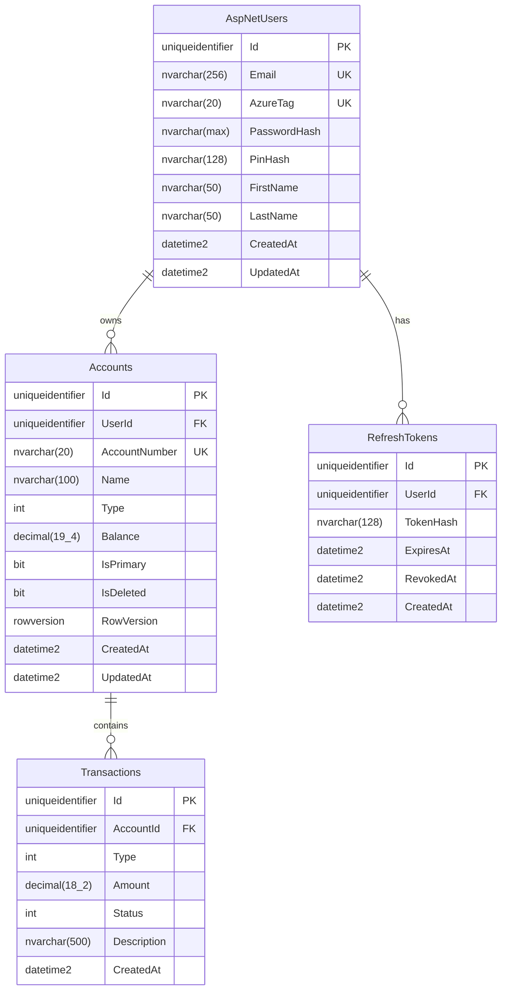

# AzureBank.Infrastructure

**Data Access Layer** - Entity Framework Core DbContext, migrations, and data configurations

[](https://dotnet.microsoft.com)
[](https://docs.microsoft.com/ef/core)
[](https://www.microsoft.com/sql-server)

---

## Overview

`AzureBank.Infrastructure` is the data access layer responsible for database operations using Entity Framework Core. It contains the DbContext, entity configurations, migrations, and seeding logic.

**Parent Solution**: [AzureBank Backend](../../README.md)

**Consumers:**
- `AzureBank.Api` - Uses DbContext for data operations

---

## Project Structure

```
AzureBank.Infrastructure/
├── 📁 Data/
│   ├── AzureBankDbContext.cs           # EF Core DbContext
│   ├── DesignTimeDbContextFactory.cs   # Design-time factory for CLI
│   ├── 📁 Configurations/              # Entity type configurations
│   │   ├── ApplicationUserConfiguration.cs
│   │   ├── AccountConfiguration.cs
│   │   ├── TransactionConfiguration.cs
│   │   └── RefreshTokenConfiguration.cs
│   ├── 📁 ValueGenerators/             # Custom value generators
│   │   └── GuidVersion7ValueGenerator.cs
│   └── 📁 Seed/                        # Database seeding
│       └── DatabaseSeeder.cs
│
├── 📁 Migrations/                      # EF Core migrations
│   ├── 20260112054539_InitialCreate.cs
│   └── AzureBankDbContextModelSnapshot.cs
│
├── 📁 Extensions/
│   └── ServiceCollectionExtensions.cs  # DI registration
│
└── 📄 GlobalUsings.cs                  # Global using statements
```

---

## Database Schema

### Entity Relationship Diagram



### Tables Overview

| Table | Description | Key Features |
|-------|-------------|--------------|
| `AspNetUsers` | User accounts | Identity integration, AzureTag unique |
| `Accounts` | Bank accounts | Soft delete, optimistic concurrency |
| `Transactions` | Transaction history | Immutable records |
| `RefreshTokens` | JWT refresh tokens | Token rotation support |

---

## DbContext

### AzureBankDbContext

```csharp
public class AzureBankDbContext : IdentityDbContext<ApplicationUser, IdentityRole<Guid>, Guid>
{
    public DbSet<Account> Accounts => Set<Account>();
    public DbSet<Transaction> Transactions => Set<Transaction>();
    public DbSet<RefreshToken> RefreshTokens => Set<RefreshToken>();

    protected override void OnModelCreating(ModelBuilder builder)
    {
        base.OnModelCreating(builder);

        // Apply all configurations from assembly
        builder.ApplyConfigurationsFromAssembly(typeof(AzureBankDbContext).Assembly);

        // Global query filter for soft delete
        builder.Entity<Account>().HasQueryFilter(a => !a.IsDeleted);
    }

    public override int SaveChanges() { ... }
    public override Task<int> SaveChangesAsync(...) { ... }
}
```

### Key Features

#### 1. Soft Delete Query Filter

Accounts with `IsDeleted = true` are automatically excluded from queries:

```csharp
builder.Entity<Account>().HasQueryFilter(a => !a.IsDeleted);

// To include deleted accounts:
dbContext.Accounts.IgnoreQueryFilters().Where(...)
```

#### 2. Automatic Timestamps

`CreatedAt` and `UpdatedAt` are automatically set on `SaveChanges`:

```csharp
public override async Task<int> SaveChangesAsync(...)
{
    foreach (var entry in ChangeTracker.Entries<BaseEntity>())
    {
        switch (entry.State)
        {
            case EntityState.Added:
                entry.Entity.CreatedAt = DateTime.UtcNow;
                entry.Entity.UpdatedAt = DateTime.UtcNow;
                break;
            case EntityState.Modified:
                entry.Entity.UpdatedAt = DateTime.UtcNow;
                break;
        }
    }
    return await base.SaveChangesAsync(cancellationToken);
}
```

#### 3. Transaction Immutability

Transactions cannot be modified or deleted:

```csharp
foreach (var entry in ChangeTracker.Entries<Transaction>())
{
    if (entry.State == EntityState.Modified || entry.State == EntityState.Deleted)
    {
        throw new InvalidOperationException("Transactions are immutable");
    }
}
```

#### 4. UUID v7 Value Generator

Entity IDs use UUID v7 for time-ordered uniqueness:

```csharp
public class GuidVersion7ValueGenerator : ValueGenerator<Guid>
{
    public override Guid Next(EntityEntry entry) => Guid.CreateVersion7();
    public override bool GeneratesTemporaryValues => false;
}
```

---

## Entity Configurations

### AccountConfiguration

```csharp
public class AccountConfiguration : IEntityTypeConfiguration<Account>
{
    public void Configure(EntityTypeBuilder<Account> builder)
    {
        builder.HasKey(a => a.Id);

        builder.Property(a => a.Id)
            .HasValueGenerator<GuidVersion7ValueGenerator>();

        builder.Property(a => a.AccountNumber)
            .IsRequired()
            .HasMaxLength(20);

        builder.HasIndex(a => a.AccountNumber)
            .IsUnique();

        builder.Property(a => a.Balance)
            .HasPrecision(19, 4);

        builder.Property(a => a.RowVersion)
            .IsRowVersion();

        builder.HasOne(a => a.User)
            .WithMany(u => u.Accounts)
            .HasForeignKey(a => a.UserId)
            .OnDelete(DeleteBehavior.Restrict);

        builder.HasMany(a => a.Transactions)
            .WithOne(t => t.Account)
            .HasForeignKey(t => t.AccountId)
            .OnDelete(DeleteBehavior.Restrict);
    }
}
```

### TransactionConfiguration

```csharp
public class TransactionConfiguration : IEntityTypeConfiguration<Transaction>
{
    public void Configure(EntityTypeBuilder<Transaction> builder)
    {
        builder.HasKey(t => t.Id);

        builder.Property(t => t.Id)
            .HasValueGenerator<GuidVersion7ValueGenerator>();

        builder.Property(t => t.Amount)
            .HasPrecision(18, 2);

        builder.Property(t => t.Description)
            .HasMaxLength(500);

        // Index for account-based queries
        builder.HasIndex(t => t.AccountId);

        // Index for date-based queries
        builder.HasIndex(t => t.CreatedAt);
    }
}
```

---

## Migrations

### Commands

```bash
# Add a new migration
dotnet ef migrations add MigrationName \
  --project src/AzureBank.Infrastructure \
  --startup-project src/AzureBank.Api

# Apply migrations
dotnet ef database update \
  --project src/AzureBank.Infrastructure \
  --startup-project src/AzureBank.Api

# Generate SQL script
dotnet ef migrations script \
  --project src/AzureBank.Infrastructure \
  --startup-project src/AzureBank.Api \
  --output migration.sql

# Remove last migration (if not applied)
dotnet ef migrations remove \
  --project src/AzureBank.Infrastructure \
  --startup-project src/AzureBank.Api
```

### Migration History

| Migration | Date | Description |
|-----------|------|-------------|
| `InitialCreate` | 2026-01-12 | Initial schema with Identity tables, Accounts, Transactions |

### Rollback Procedure

```bash
# Rollback to specific migration
dotnet ef database update PreviousMigrationName \
  --project src/AzureBank.Infrastructure \
  --startup-project src/AzureBank.Api

# Rollback all migrations
dotnet ef database update 0 \
  --project src/AzureBank.Infrastructure \
  --startup-project src/AzureBank.Api
```

---

## Configuration

### Connection String

```json
{
  "ConnectionStrings": {
    "DefaultConnection": "Server=localhost;Database=AzureBank;Trusted_Connection=True;TrustServerCertificate=True"
  }
}
```

### DbContext Options

The DbContext is configured with:

```csharp
services.AddDbContext<AzureBankDbContext>(options =>
{
    options.UseSqlServer(connectionString, sqlOptions =>
    {
        sqlOptions.EnableRetryOnFailure(
            maxRetryCount: 3,
            maxRetryDelay: TimeSpan.FromSeconds(30),
            errorNumbersToAdd: null);

        sqlOptions.CommandTimeout(30);

        sqlOptions.MigrationsAssembly(typeof(AzureBankDbContext).Assembly.FullName);
    });

    if (environment.IsDevelopment())
    {
        options.EnableSensitiveDataLogging();
        options.EnableDetailedErrors();
    }
});
```

---

## Design-Time Factory

For EF Core CLI tools to work without running the application:

```csharp
public class DesignTimeDbContextFactory : IDesignTimeDbContextFactory<AzureBankDbContext>
{
    public AzureBankDbContext CreateDbContext(string[] args)
    {
        var configuration = new ConfigurationBuilder()
            .SetBasePath(Directory.GetCurrentDirectory())
            .AddJsonFile("appsettings.json")
            .AddJsonFile("appsettings.Development.json", optional: true)
            .Build();

        var optionsBuilder = new DbContextOptionsBuilder<AzureBankDbContext>();
        optionsBuilder.UseSqlServer(configuration.GetConnectionString("DefaultConnection"));

        return new AzureBankDbContext(optionsBuilder.Options);
    }
}
```

---

## Database Seeding

### Development Seeder

For development environments, a seeder creates test data:

```csharp
public class DatabaseSeeder
{
    public async Task SeedAsync(AzureBankDbContext context, UserManager<ApplicationUser> userManager)
    {
        if (await userManager.Users.AnyAsync())
            return;

        // Create test user
        var user = new ApplicationUser
        {
            Email = "test@example.com",
            UserName = "test@example.com",
            AzureTag = "testuser",
            FirstName = "Test",
            LastName = "User",
            EmailConfirmed = true
        };

        await userManager.CreateAsync(user, "TestPass123!");

        // Create test account
        var account = new Account
        {
            UserId = user.Id,
            AccountNumber = "AB-1234-5678-90",
            Name = "Primary Checking",
            Type = AccountType.Checking,
            Balance = 1000.00m,
            IsPrimary = true
        };

        context.Accounts.Add(account);
        await context.SaveChangesAsync();
    }
}
```

---

## Performance Considerations

### Indexes

| Table | Index | Columns | Purpose |
|-------|-------|---------|---------|
| Accounts | `IX_Accounts_AccountNumber` | AccountNumber | Unique constraint |
| Accounts | `IX_Accounts_UserId` | UserId | User's accounts lookup |
| Transactions | `IX_Transactions_AccountId` | AccountId | Account transactions |
| Transactions | `IX_Transactions_CreatedAt` | CreatedAt | Date range queries |

### Query Optimization

```csharp
// Use AsNoTracking for read-only queries
var accounts = await dbContext.Accounts
    .AsNoTracking()
    .Where(a => a.UserId == userId)
    .ToListAsync();

// Use explicit loading when needed
await dbContext.Entry(account)
    .Collection(a => a.Transactions)
    .LoadAsync();

// Use split queries for large collections
var accounts = await dbContext.Accounts
    .AsSplitQuery()
    .Include(a => a.Transactions)
    .ToListAsync();
```

---

## Dependencies

| Package | Purpose |
|---------|---------|
| `Microsoft.EntityFrameworkCore.SqlServer` | SQL Server provider |
| `Microsoft.EntityFrameworkCore.Tools` | CLI tools (PrivateAssets) |
| `Microsoft.EntityFrameworkCore.Design` | Design-time services (PrivateAssets) |
| `Microsoft.AspNetCore.Identity.EntityFrameworkCore` | Identity integration |

**Project References:**
- `AzureBank.Shared` - Entity classes

---

## Troubleshooting

### Migration Issues

**"Could not find DbContext"**
```bash
# Specify startup project explicitly
dotnet ef migrations add Name \
  --project src/AzureBank.Infrastructure \
  --startup-project src/AzureBank.Api
```

**"Unable to connect to database"**
- Check connection string in appsettings.json
- Ensure SQL Server is running
- Verify firewall allows connections

### Concurrency Conflicts

When `DbUpdateConcurrencyException` occurs:

```csharp
catch (DbUpdateConcurrencyException ex)
{
    // Reload entity and retry
    await ex.Entries.Single().ReloadAsync();
    // Re-apply changes and save again
}
```

---

## See Also

- [Root README](../../README.md) - Solution overview
- [AzureBank.Shared](../AzureBank.Shared/README.md) - Entity definitions
- [AzureBank.Api](../AzureBank.Api/README.md) - Uses DbContext
