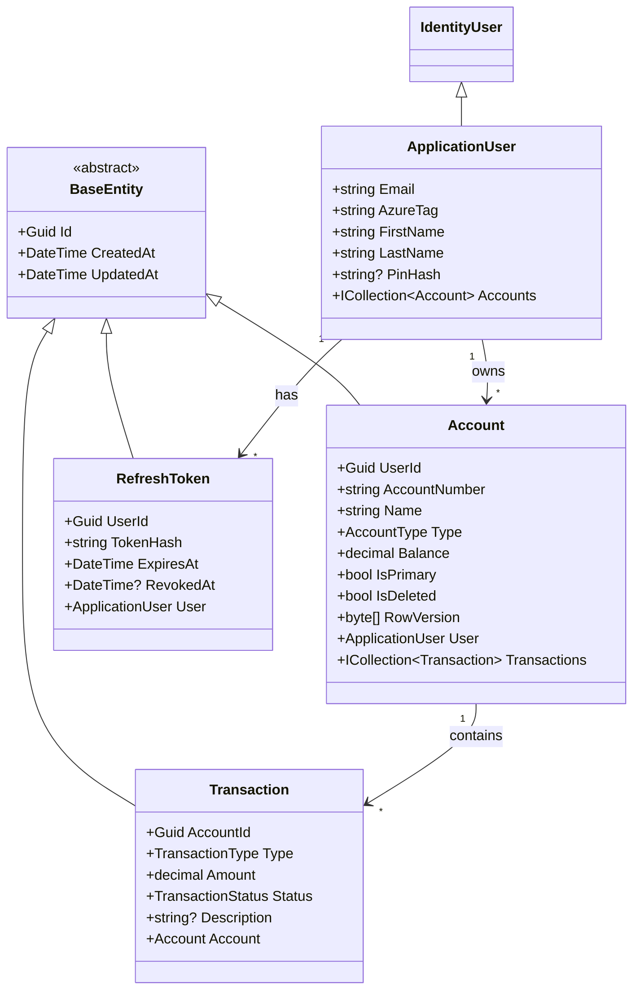
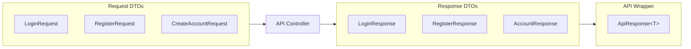
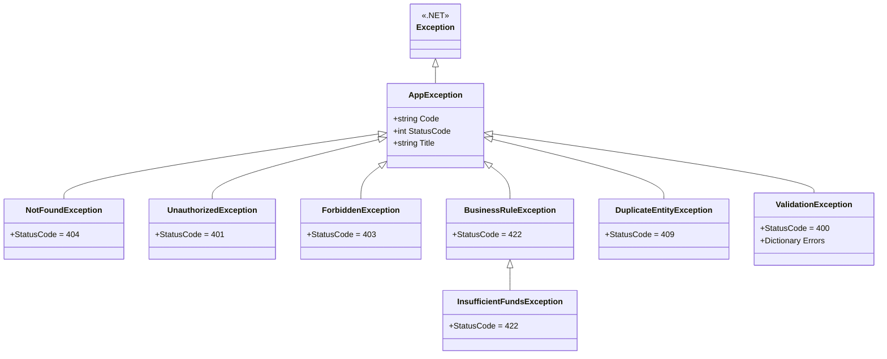

# AzureBank.Shared

**Shared Library** - Domain entities, DTOs, exceptions, and constants

[](https://dotnet.microsoft.com)
[](https://docs.microsoft.com/dotnet/core/project-sdk)

---

## Overview

`AzureBank.Shared` contains all shared types used across the solution including domain entities, DTOs (Data Transfer Objects), custom exceptions, validation attributes, and constants.

**Parent Solution**: [AzureBank Backend](../../README.md)

**Consumers:**
- `AzureBank.Api` - Uses entities, DTOs, exceptions
- `AzureBank.Bff` - Uses DTOs for API communication
- `AzureBank.Infrastructure` - Uses entities for EF Core
- `AzureBank.Tests` - Uses all types for testing

---

## Project Structure

```
AzureBank.Shared/
├── 📁 Entities/                    # Domain models
│   ├── BaseEntity.cs               # Base class with Id, timestamps
│   ├── ApplicationUser.cs          # User entity (extends IdentityUser)
│   ├── Account.cs                  # Bank account entity
│   ├── Transaction.cs              # Transaction entity (immutable)
│   └── RefreshToken.cs             # JWT refresh token entity
│
├── 📁 DTOs/                        # Data Transfer Objects
│   ├── 📁 Auth/                    # Authentication DTOs
│   │   ├── LoginRequest.cs
│   │   ├── LoginResponse.cs
│   │   ├── RegisterRequest.cs
│   │   ├── RegisterResponse.cs
│   │   ├── TokenResponse.cs
│   │   ├── SetPinRequest.cs
│   │   └── VerifyPinRequest.cs
│   ├── 📁 Account/                 # Account DTOs
│   │   ├── CreateAccountRequest.cs
│   │   ├── UpdateAccountRequest.cs
│   │   ├── AccountResponse.cs
│   │   ├── AccountSummaryResponse.cs
│   │   └── BalanceResponse.cs
│   ├── 📁 Transaction/             # Transaction DTOs
│   │   ├── DepositRequest.cs
│   │   ├── WithdrawRequest.cs
│   │   ├── TransactionResponse.cs
│   │   └── TransactionFilter.cs
│   ├── 📁 Transfer/                # Transfer DTOs
│   │   ├── TransferRequest.cs
│   │   ├── InternalTransferRequest.cs
│   │   └── TransferResponse.cs
│   ├── 📁 User/                    # User DTOs
│   │   ├── UserResponse.cs
│   │   └── RecipientSearchResult.cs
│   └── 📁 Common/                  # Shared DTOs
│       ├── ApiResponse.cs          # Wrapper response
│       └── PaginatedResponse.cs    # Pagination wrapper
│
├── 📁 Exceptions/                  # Custom exceptions
│   ├── AppException.cs             # Base exception
│   ├── NotFoundException.cs        # 404 Not Found
│   ├── UnauthorizedException.cs    # 401 Unauthorized
│   ├── ForbiddenException.cs       # 403 Forbidden
│   ├── BusinessRuleException.cs    # 422 Business rule violation
│   ├── InsufficientFundsException.cs # 422 Not enough balance
│   ├── DuplicateEntityException.cs # 409 Conflict
│   └── ValidationException.cs      # 400 Validation failed
│
├── 📁 Enums/                       # Enumeration types
│   ├── AccountType.cs              # Checking, Savings, Investment
│   ├── TransactionType.cs          # Deposit, Withdrawal, Transfer
│   └── TransactionStatus.cs        # Pending, Completed, Failed
│
├── 📁 Constants/                   # Static values
│   ├── ErrorCodes.cs               # Error code constants
│   └── ValidationRules.cs          # Validation rule constants
│
├── 📁 Validation/                  # Custom validation attributes
│   ├── NotEmptyGuidAttribute.cs    # Non-empty GUID validation
│   ├── MoneyRangeAttribute.cs      # Currency amount validation
│   ├── PasswordAttribute.cs        # Password policy validation
│   ├── PinAttribute.cs             # 6-digit PIN validation
│   └── AzureTagAttribute.cs        # AzureTag format validation
│
├── 📁 Options/                     # Configuration classes
│   ├── JwtOptions.cs               # JWT configuration
│   └── SeedDataOptions.cs          # Seeding configuration
│
└── 📁 Utilities/                   # Helper classes
    └── IdGenerator.cs              # UUID v7 generation
```

---

## Domain Entities

### Entity Class Diagram



### ApplicationUser

Extends ASP.NET Core Identity's `IdentityUser<Guid>`:

```csharp
public class ApplicationUser : IdentityUser<Guid>
{
    [StringLength(20)]
    public required string AzureTag { get; set; }  // Public username

    [StringLength(50)]
    public required string FirstName { get; set; }

    [StringLength(50)]
    public required string LastName { get; set; }

    [StringLength(128)]
    public string? PinHash { get; set; }  // Step-up auth PIN

    public DateTime CreatedAt { get; set; }
    public DateTime UpdatedAt { get; set; }

    public virtual ICollection<Account> Accounts { get; set; } = [];
}
```

**Key Properties:**
- `AzureTag`: Unique public username (3-20 chars, lowercase)
- `PinHash`: Optional 6-digit PIN for step-up authentication
- `Accounts`: Navigation to user's bank accounts

### Account

Bank account entity with soft-delete support:

```csharp
public class Account : BaseEntity
{
    public Guid UserId { get; set; }

    [StringLength(20)]
    public required string AccountNumber { get; set; }

    [StringLength(100)]
    public required string Name { get; set; }

    public AccountType Type { get; set; }

    [Precision(19, 4)]
    public decimal Balance { get; set; }

    public bool IsPrimary { get; set; }
    public bool IsDeleted { get; set; }  // Soft delete

    [Timestamp]
    public byte[] RowVersion { get; set; } = [];  // Optimistic concurrency

    public virtual ApplicationUser User { get; set; } = null!;
    public virtual ICollection<Transaction> Transactions { get; set; } = [];
}
```

**Key Features:**
- `Balance`: Precision 19,4 for currency calculations
- `RowVersion`: Optimistic concurrency control
- `IsDeleted`: Soft delete (query filter applied in DbContext)

### Transaction

Immutable transaction record:

```csharp
public class Transaction : BaseEntity
{
    public Guid AccountId { get; set; }
    public TransactionType Type { get; set; }

    [Precision(18, 2)]
    public decimal Amount { get; set; }

    public TransactionStatus Status { get; set; }

    [StringLength(500)]
    public string? Description { get; set; }

    public virtual Account Account { get; set; } = null!;
}
```

**Immutability:**
- Transactions cannot be modified or deleted
- Enforced at DbContext level
- Ensures audit trail integrity

---

## DTOs (Data Transfer Objects)

### Request/Response Pattern

All API operations use dedicated request and response DTOs:



### ApiResponse Wrapper

All API responses are wrapped in `ApiResponse<T>`:

```csharp
public class ApiResponse<T>
{
    public T? Data { get; set; }
    public string? Message { get; set; }
}
```

**Usage:**
```json
{
  "data": { ... },
  "message": "Operation successful"
}
```

### Key DTOs

#### LoginRequest
```csharp
public class LoginRequest
{
    [Required, EmailAddress, MaxLength(255)]
    public required string Email { get; set; }

    [Required, MinLength(8), MaxLength(128)]
    public required string Password { get; set; }
}
```

#### RegisterRequest
```csharp
public class RegisterRequest
{
    [Required, EmailAddress, MaxLength(255)]
    public required string Email { get; set; }

    [Required, MinLength(8), MaxLength(128)]
    public required string Password { get; set; }

    [Required, MinLength(2), MaxLength(50)]
    public required string FirstName { get; set; }

    [Required, MinLength(2), MaxLength(50)]
    public required string LastName { get; set; }

    [Required, MinLength(3), MaxLength(20)]
    public required string AzureTag { get; set; }
}
```

#### AccountResponse
```csharp
public class AccountResponse
{
    public Guid Id { get; set; }
    public string AccountNumber { get; set; } = string.Empty;  // Masked
    public string Name { get; set; } = string.Empty;           // Masked
    public AccountType Type { get; set; }
    public decimal Balance { get; set; }
    public bool IsPrimary { get; set; }
    public DateTime CreatedAt { get; set; }
}
```

---

## Exceptions

### Exception Hierarchy



### AppException Base Class

```csharp
public class AppException : Exception
{
    public string Code { get; }
    public int StatusCode { get; }
    public string Title { get; }

    public AppException(string code, string message, int statusCode = 500, string title = "Error")
        : base(message)
    {
        Code = code;
        StatusCode = statusCode;
        Title = title;
    }
}
```

### Exception Types

| Exception | HTTP Status | Use Case |
|-----------|-------------|----------|
| `NotFoundException` | 404 | Resource not found |
| `UnauthorizedException` | 401 | Authentication required |
| `ForbiddenException` | 403 | Access denied |
| `BusinessRuleException` | 422 | Domain rule violation |
| `InsufficientFundsException` | 422 | Not enough balance |
| `DuplicateEntityException` | 409 | Unique constraint violation |
| `ValidationException` | 400 | Input validation failed |

---

## Enums

### AccountType

```csharp
public enum AccountType
{
    Checking = 0,
    Savings = 1,
    Investment = 2
}
```

### TransactionType

```csharp
public enum TransactionType
{
    Deposit = 0,
    Withdrawal = 1,
    TransferIn = 2,
    TransferOut = 3
}
```

### TransactionStatus

```csharp
public enum TransactionStatus
{
    Pending = 0,
    Completed = 1,
    Failed = 2
}
```

---

## Constants

### ErrorCodes

```csharp
public static class ErrorCodes
{
    // Authentication
    public const string InvalidCredentials = "AUTH_INVALID_CREDENTIALS";
    public const string EmailAlreadyExists = "AUTH_EMAIL_EXISTS";
    public const string AzureTagAlreadyExists = "AUTH_AZURE_TAG_EXISTS";
    public const string InvalidPin = "AUTH_INVALID_PIN";

    // Account
    public const string AccountNotFound = "ACCOUNT_NOT_FOUND";
    public const string AccountAccessDenied = "ACCOUNT_ACCESS_DENIED";

    // Transaction
    public const string InsufficientFunds = "TRANSACTION_INSUFFICIENT_FUNDS";
    public const string InvalidAmount = "TRANSACTION_INVALID_AMOUNT";

    // Transfer
    public const string SameAccountTransfer = "TRANSFER_SAME_ACCOUNT";
    public const string RecipientNotFound = "TRANSFER_RECIPIENT_NOT_FOUND";
}
```

### ValidationRules

```csharp
public static class ValidationRules
{
    public const int PasswordMinLength = 8;
    public const int PasswordMaxLength = 128;
    public const int PinLength = 6;
    public const int AzureTagMinLength = 3;
    public const int AzureTagMaxLength = 20;
    public const decimal MinTransactionAmount = 0.01m;
    public const decimal MaxTransactionAmount = 1_000_000_000m;
}
```

---

## Validation Attributes

### MoneyRangeAttribute

Validates currency amounts:

```csharp
[MoneyRange(0.01, 1000000000)]
public decimal Amount { get; set; }
```

### PinAttribute

Validates 6-digit PINs:

```csharp
[Pin]
public string Pin { get; set; }  // Must be exactly 6 digits
```

### AzureTagAttribute

Validates AzureTag format:

```csharp
[AzureTag]
public string AzureTag { get; set; }  // 3-20 chars, lowercase, starts with letter
```

### NotEmptyGuidAttribute

Validates non-empty GUIDs:

```csharp
[NotEmptyGuid]
public Guid AccountId { get; set; }  // Cannot be Guid.Empty
```

---

## Utilities

### IdGenerator

Generates UUIDs for entities:

```csharp
public static class IdGenerator
{
    public static Guid NewId() => Guid.CreateVersion7();  // UUID v7 (time-ordered)
}
```

**Why UUID v7?**
- Time-ordered for database index efficiency
- No coordination required (unlike sequences)
- Globally unique

---

## Dependencies

This is a **dependency-free** library with no external NuGet packages.

**Framework Dependencies:**
- `Microsoft.AspNetCore.Identity` (for IdentityUser)
- `System.ComponentModel.DataAnnotations` (for validation attributes)

---

## See Also

- [Root README](../../README.md) - Solution overview
- [AzureBank.Api](../AzureBank.Api/README.md) - Uses DTOs and entities
- [AzureBank.Infrastructure](../AzureBank.Infrastructure/README.md) - EF Core mappings
