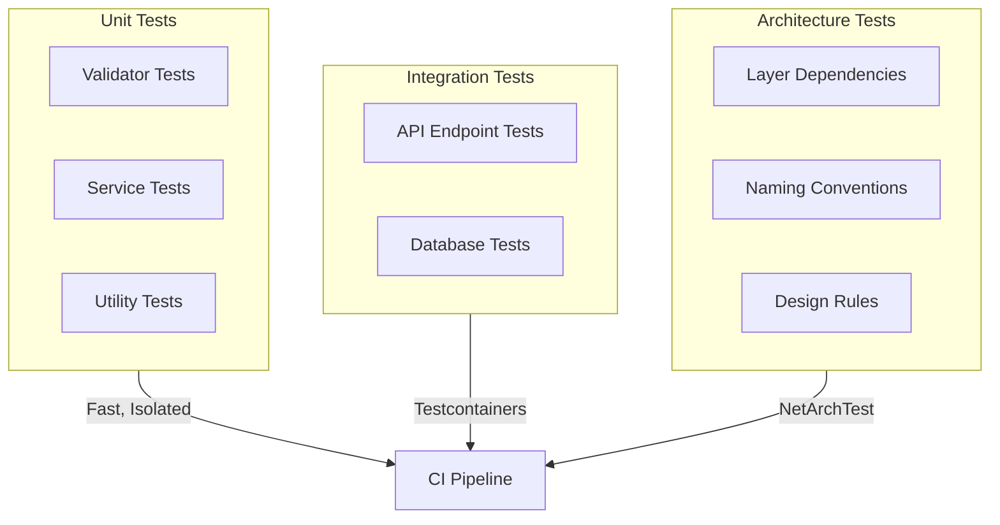

# AzureBank.Tests

**Test Project** - Unit tests, integration tests, and architecture tests

[](https://dotnet.microsoft.com)
[](https://xunit.net)
[](https://dotnet.testcontainers.org/)

---

## Overview

`AzureBank.Tests` contains all automated tests for the solution including unit tests, integration tests, and architecture tests. The project uses xUnit as the test framework with Testcontainers for real database testing.

**Parent Solution**: [AzureBank Backend](../../README.md)

---

## Test Categories



---

## Project Structure

```
AzureBank.Tests/
├── 📁 Unit/                           # Unit tests
│   ├── 📁 Validators/                 # FluentValidation tests
│   │   ├── Auth/
│   │   │   ├── LoginRequestValidatorTests.cs
│   │   │   ├── RegisterRequestValidatorTests.cs
│   │   │   └── ...
│   │   ├── Account/
│   │   │   └── CreateAccountRequestValidatorTests.cs
│   │   ├── Transaction/
│   │   │   ├── DepositRequestValidatorTests.cs
│   │   │   └── WithdrawRequestValidatorTests.cs
│   │   └── Transfer/
│   │       └── TransferRequestValidatorTests.cs
│   │
│   ├── 📁 Services/                   # Service logic tests
│   │   ├── AuthServiceTests.cs
│   │   ├── AccountServiceTests.cs
│   │   ├── TransactionServiceTests.cs
│   │   └── TransferServiceTests.cs
│   │
│   └── 📁 Utilities/                  # Utility tests
│       └── IdGeneratorTests.cs
│
├── 📁 Integration/                    # Integration tests
│   ├── AuthEndpointTests.cs
│   ├── AccountEndpointTests.cs
│   ├── TransactionEndpointTests.cs
│   └── TransferEndpointTests.cs
│
├── 📁 Architecture/                   # Architecture tests
│   ├── LayerDependencyTests.cs
│   ├── DesignRuleTests.cs
│   └── NamingConventionTests.cs
│
├── 📁 Fixtures/                       # Test infrastructure
│   ├── CustomWebApplicationFactory.cs
│   └── SqlServerContainerFixture.cs
│
└── 📄 GlobalUsings.cs                 # Global using statements
```

---

## Running Tests

### All Tests

```bash
# Run all tests
dotnet test

# Run with verbose output
dotnet test --logger "console;verbosity=detailed"

# Run with test output
dotnet test --logger "trx;LogFileName=results.trx"
```

### Filtered Tests

```bash
# Run unit tests only
dotnet test --filter "Category=Unit"

# Run integration tests only
dotnet test --filter "Category=Integration"

# Run architecture tests only
dotnet test --filter "Category=Architecture"

# Run specific test class
dotnet test --filter "FullyQualifiedName~AuthServiceTests"

# Run tests matching pattern
dotnet test --filter "Name~Login"
```

### Code Coverage

```bash
# Run with coverage collection
dotnet test --collect:"XPlat Code Coverage"

# Generate HTML report (requires reportgenerator)
dotnet tool install -g dotnet-reportgenerator-globaltool

reportgenerator \
  -reports:"**/coverage.cobertura.xml" \
  -targetdir:"coveragereport" \
  -reporttypes:Html

# Open report
open coveragereport/index.html
```

---

## Unit Tests

### Validator Tests

Test FluentValidation validators with various input scenarios:

```csharp
public class LoginRequestValidatorTests
{
    private readonly LoginRequestValidator _validator = new();

    [Fact]
    public void Validate_ValidRequest_ShouldPass()
    {
        // Arrange
        var request = new LoginRequest
        {
            Email = "test@example.com",
            Password = "ValidPass123!"
        };

        // Act
        var result = _validator.Validate(request);

        // Assert
        result.IsValid.Should().BeTrue();
    }

    [Theory]
    [InlineData("")]
    [InlineData("invalid-email")]
    [InlineData("@example.com")]
    public void Validate_InvalidEmail_ShouldFail(string email)
    {
        // Arrange
        var request = new LoginRequest
        {
            Email = email,
            Password = "ValidPass123!"
        };

        // Act
        var result = _validator.Validate(request);

        // Assert
        result.IsValid.Should().BeFalse();
        result.Errors.Should().Contain(e => e.PropertyName == "Email");
    }
}
```

### Service Tests

Test business logic with mocked dependencies:

```csharp
public class AccountServiceTests
{
    private readonly Mock<AzureBankDbContext> _mockContext;
    private readonly Mock<IAccountAccessService> _mockAccessService;
    private readonly AccountService _sut;

    public AccountServiceTests()
    {
        _mockContext = new Mock<AzureBankDbContext>();
        _mockAccessService = new Mock<IAccountAccessService>();
        _sut = new AccountService(_mockContext.Object, _mockAccessService.Object);
    }

    [Fact]
    public async Task GetAccountsAsync_UserHasAccounts_ReturnsAccounts()
    {
        // Arrange
        var userId = Guid.NewGuid();
        var accounts = new List<Account>
        {
            new Account { Id = Guid.NewGuid(), UserId = userId, Name = "Checking" }
        };

        _mockContext.Setup(c => c.Accounts).Returns(accounts.AsQueryable().BuildMockDbSet());

        // Act
        var result = await _sut.GetAccountsAsync(userId);

        // Assert
        result.Should().HaveCount(1);
        result.First().Name.Should().Be("Checking");
    }
}
```

---

## Integration Tests

### Test Infrastructure

#### CustomWebApplicationFactory

Creates an isolated API instance for testing:

```csharp
public class CustomWebApplicationFactory : WebApplicationFactory<Program>
{
    private readonly SqlServerContainerFixture _dbFixture;

    public CustomWebApplicationFactory(SqlServerContainerFixture dbFixture)
    {
        _dbFixture = dbFixture;
    }

    protected override void ConfigureWebHost(IWebHostBuilder builder)
    {
        builder.ConfigureServices(services =>
        {
            // Remove existing DbContext
            var descriptor = services.SingleOrDefault(
                d => d.ServiceType == typeof(DbContextOptions<AzureBankDbContext>));
            if (descriptor != null)
                services.Remove(descriptor);

            // Add test DbContext with Testcontainers connection
            services.AddDbContext<AzureBankDbContext>(options =>
            {
                options.UseSqlServer(_dbFixture.ConnectionString);
            });
        });
    }
}
```

#### SqlServerContainerFixture

Spins up a real SQL Server container for tests:

```csharp
public class SqlServerContainerFixture : IAsyncLifetime
{
    private readonly MsSqlContainer _container = new MsSqlBuilder()
        .WithImage("mcr.microsoft.com/mssql/server:2022-latest")
        .WithPassword("YourStrong@Passw0rd")
        .Build();

    public string ConnectionString => _container.GetConnectionString();

    public async Task InitializeAsync()
    {
        await _container.StartAsync();

        // Apply migrations
        using var context = CreateDbContext();
        await context.Database.MigrateAsync();
    }

    public async Task DisposeAsync()
    {
        await _container.DisposeAsync();
    }
}
```

### Endpoint Tests

Test API endpoints end-to-end:

```csharp
public class AuthEndpointTests : IClassFixture<SqlServerContainerFixture>
{
    private readonly HttpClient _client;
    private readonly SqlServerContainerFixture _fixture;

    public AuthEndpointTests(SqlServerContainerFixture fixture)
    {
        _fixture = fixture;
        var factory = new CustomWebApplicationFactory(fixture);
        _client = factory.CreateClient();
    }

    [Fact]
    public async Task Register_ValidRequest_ReturnsCreated()
    {
        // Arrange
        var request = new RegisterRequest
        {
            Email = $"test{Guid.NewGuid()}@example.com",
            Password = "ValidPass123!",
            FirstName = "Test",
            LastName = "User",
            AzureTag = $"user{Guid.NewGuid():N}"[..20]
        };

        // Act
        var response = await _client.PostAsJsonAsync("/api/auth/register", request);

        // Assert
        response.StatusCode.Should().Be(HttpStatusCode.Created);

        var content = await response.Content.ReadFromJsonAsync<ApiResponse<RegisterResponse>>();
        content.Should().NotBeNull();
        content!.Data!.User.Email.Should().Be(request.Email);
    }

    [Fact]
    public async Task Login_InvalidCredentials_ReturnsUnauthorized()
    {
        // Arrange
        var request = new LoginRequest
        {
            Email = "nonexistent@example.com",
            Password = "WrongPassword123!"
        };

        // Act
        var response = await _client.PostAsJsonAsync("/api/auth/login", request);

        // Assert
        response.StatusCode.Should().Be(HttpStatusCode.Unauthorized);
    }
}
```

---

## Architecture Tests

### Layer Dependency Tests

Enforce architectural boundaries:

```csharp
public class LayerDependencyTests
{
    private static readonly Assembly ApiAssembly = typeof(Program).Assembly;
    private static readonly Assembly SharedAssembly = typeof(ApplicationUser).Assembly;
    private static readonly Assembly InfraAssembly = typeof(AzureBankDbContext).Assembly;

    [Fact]
    public void Shared_ShouldNotDependOn_Api()
    {
        var result = Types
            .InAssembly(SharedAssembly)
            .ShouldNot()
            .HaveDependencyOn("AzureBank.Api")
            .GetResult();

        result.IsSuccessful.Should().BeTrue();
    }

    [Fact]
    public void Shared_ShouldNotDependOn_Infrastructure()
    {
        var result = Types
            .InAssembly(SharedAssembly)
            .ShouldNot()
            .HaveDependencyOn("AzureBank.Infrastructure")
            .GetResult();

        result.IsSuccessful.Should().BeTrue();
    }

    [Fact]
    public void Infrastructure_ShouldNotDependOn_Api()
    {
        var result = Types
            .InAssembly(InfraAssembly)
            .ShouldNot()
            .HaveDependencyOn("AzureBank.Api")
            .GetResult();

        result.IsSuccessful.Should().BeTrue();
    }
}
```

### Design Rule Tests

Enforce design patterns:

```csharp
public class DesignRuleTests
{
    [Fact]
    public void Controllers_ShouldHaveControllerSuffix()
    {
        var result = Types
            .InAssembly(typeof(Program).Assembly)
            .That()
            .Inherit(typeof(ControllerBase))
            .Should()
            .HaveNameEndingWith("Controller")
            .GetResult();

        result.IsSuccessful.Should().BeTrue();
    }

    [Fact]
    public void Services_ShouldImplementInterfaces()
    {
        var result = Types
            .InAssembly(typeof(Program).Assembly)
            .That()
            .HaveNameEndingWith("Service")
            .And()
            .AreNotInterfaces()
            .Should()
            .ImplementInterface(i => i.Name.StartsWith("I"))
            .GetResult();

        result.IsSuccessful.Should().BeTrue();
    }

    [Fact]
    public void Validators_ShouldInheritAbstractValidator()
    {
        var result = Types
            .InAssembly(typeof(Program).Assembly)
            .That()
            .HaveNameEndingWith("Validator")
            .Should()
            .Inherit(typeof(AbstractValidator<>))
            .GetResult();

        result.IsSuccessful.Should().BeTrue();
    }
}
```

### Naming Convention Tests

Enforce naming standards:

```csharp
public class NamingConventionTests
{
    [Fact]
    public void Interfaces_ShouldStartWithI()
    {
        var result = Types
            .InAssembly(typeof(Program).Assembly)
            .That()
            .AreInterfaces()
            .Should()
            .HaveNameStartingWith("I")
            .GetResult();

        result.IsSuccessful.Should().BeTrue();
    }

    [Fact]
    public void DTOs_ShouldBeInDTOsNamespace()
    {
        var result = Types
            .InAssembly(typeof(ApplicationUser).Assembly)
            .That()
            .HaveNameEndingWith("Request")
            .Or()
            .HaveNameEndingWith("Response")
            .Should()
            .ResideInNamespaceContaining("DTOs")
            .GetResult();

        result.IsSuccessful.Should().BeTrue();
    }
}
```

---

## Test Utilities

### Test Data Builders

```csharp
public class TestDataBuilder
{
    public static LoginRequest ValidLoginRequest() => new()
    {
        Email = "test@example.com",
        Password = "ValidPass123!"
    };

    public static RegisterRequest ValidRegisterRequest() => new()
    {
        Email = $"test{Guid.NewGuid()}@example.com",
        Password = "ValidPass123!",
        FirstName = "Test",
        LastName = "User",
        AzureTag = $"user{Random.Shared.Next(1000, 9999)}"
    };

    public static Account TestAccount(Guid userId) => new()
    {
        Id = Guid.NewGuid(),
        UserId = userId,
        AccountNumber = $"AB-{Random.Shared.Next(1000, 9999)}-{Random.Shared.Next(1000, 9999)}-{Random.Shared.Next(10, 99)}",
        Name = "Test Account",
        Type = AccountType.Checking,
        Balance = 1000m,
        IsPrimary = true
    };
}
```

### Assertion Extensions

```csharp
public static class HttpResponseAssertions
{
    public static async Task ShouldBeSuccess<T>(this HttpResponseMessage response)
    {
        response.IsSuccessStatusCode.Should().BeTrue(
            $"Expected success but got {response.StatusCode}: {await response.Content.ReadAsStringAsync()}");
    }

    public static async Task<T> ShouldBeSuccessWithData<T>(this HttpResponseMessage response)
    {
        await response.ShouldBeSuccess<T>();
        var content = await response.Content.ReadFromJsonAsync<ApiResponse<T>>();
        content.Should().NotBeNull();
        content!.Data.Should().NotBeNull();
        return content.Data!;
    }
}
```

---

## Dependencies

| Package | Purpose |
|---------|---------|
| `Microsoft.NET.Test.Sdk` | Test SDK |
| `xunit` | Test framework |
| `xunit.runner.visualstudio` | VS integration |
| `Moq` | Mocking library |
| `FluentAssertions` | Assertion library |
| `coverlet.collector` | Code coverage |
| `Microsoft.AspNetCore.Mvc.Testing` | Integration testing |
| `Microsoft.EntityFrameworkCore.InMemory` | In-memory database |
| `Testcontainers` | Container orchestration |
| `Testcontainers.MsSql` | SQL Server container |
| `NetArchTest.eNhancedEdition` | Architecture testing |

---

## CI/CD Integration

### GitHub Actions Example

```yaml
name: Tests

on: [push, pull_request]

jobs:
  test:
    runs-on: ubuntu-latest

    steps:
      - uses: actions/checkout@v4

      - name: Setup .NET
        uses: actions/setup-dotnet@v4
        with:
          dotnet-version: '10.0.x'

      - name: Restore dependencies
        run: dotnet restore

      - name: Build
        run: dotnet build --no-restore

      - name: Run tests
        run: dotnet test --no-build --verbosity normal --collect:"XPlat Code Coverage"

      - name: Upload coverage
        uses: codecov/codecov-action@v4
        with:
          files: '**/coverage.cobertura.xml'
```

---

## Troubleshooting

### Testcontainers Issues

**"Docker is not running"**
```bash
# Start Docker
docker info

# If using Colima (macOS)
colima start
```

**"Container failed to start"**
- Check Docker has enough resources
- Ensure port 1433 is not in use
- Check SQL Server image can be pulled

### Test Isolation

**Tests interfering with each other**
- Each integration test class gets its own database
- Use unique identifiers in test data
- Clean up data after tests if sharing database

---

## See Also

- [Root README](../../README.md) - Solution overview
- [AzureBank.Api](../../src/AzureBank.Api/README.md) - Tested API
- [Architecture Decisions](../../docs/adr/) - Design decisions being tested
