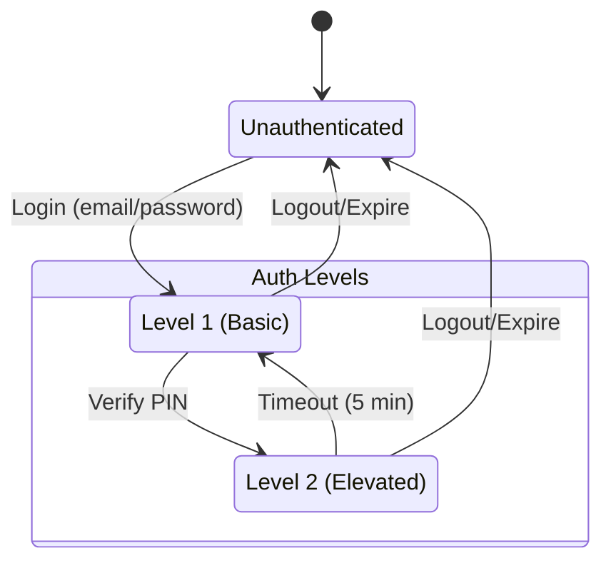
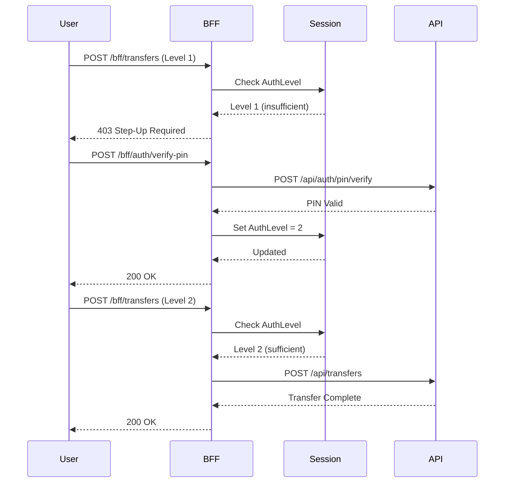

# ADR-0008: Step-Up Authentication with PIN

**Status**: Accepted

**Date**: 2026-01-15

**Decision Makers**: Vladislav Aleshaev

---

## Context

Financial applications require additional security for sensitive operations:
- Money transfers
- Account modifications
- Personal data changes

Standard JWT authentication provides identity verification but not recent user presence confirmation.

## Decision Drivers

- **Security**: High-risk operations need extra verification
- **User Experience**: Balance security with convenience
- **Compliance**: Financial regulations may require step-up auth
- **Session Binding**: Verification should be time-limited
- **Simplicity**: Users should understand the security model

## Considered Options

1. **PIN-based Step-Up**: 6-digit PIN verification before sensitive operations
2. **Re-authentication**: Full password re-entry
3. **TOTP/2FA**: Time-based one-time passwords
4. **Biometric**: Fingerprint/Face ID (mobile only)
5. **Email/SMS OTP**: One-time passwords via email/SMS

## Decision

Implement **PIN-based step-up authentication** with session-bound auth levels.

### Architecture



### Auth Levels

| Level | Access | How to Achieve |
|-------|--------|----------------|
| Level 1 | Read operations, deposits | Login with email/password |
| Level 2 | Transfers, withdrawals | Verify 6-digit PIN |

## Rationale

### Why PIN over Other Options?

| Method | UX | Security | Implementation |
|--------|-----|----------|----------------|
| PIN | ✅ Fast | ✅ Good | ✅ Simple |
| Re-auth | ❌ Slow | ✅ Good | ✅ Simple |
| TOTP | ⚠️ Requires app | ✅ Excellent | ⚠️ Complex |
| Biometric | ✅ Fast | ✅ Excellent | ❌ Platform-specific |
| Email OTP | ⚠️ Slow | ⚠️ Email security | ⚠️ External dependency |

### Security Considerations

1. **PIN Hashing**: PINs are hashed using Argon2id (same as passwords)
2. **Brute Force Protection**: Rate limiting on PIN attempts
3. **Session Binding**: Elevated auth expires after 5 minutes
4. **Audit Trail**: All step-up attempts logged
5. **No PIN Storage**: Only hash stored, never plaintext

### Why Not Full 2FA?

Full TOTP/2FA was considered but:
- Adds significant user friction for every sensitive operation
- Requires mobile app or authenticator setup
- PIN provides good security for banking operations
- TOTP can be added later as optional enhancement

## Consequences

### Positive

- Fast and familiar user experience (like ATM PIN)
- Strong protection for sensitive operations
- Session-bound elevated auth prevents replay
- Simple implementation without external dependencies
- Works across all platforms (web, mobile)

### Negative

- PIN is less secure than TOTP (6 digits vs 6 digits + time)
- Users must remember additional credential
- PIN reset flow adds complexity

### Neutral

- PIN is optional (transfers blocked until PIN is set)
- Auth level stored in session, not JWT

## Implementation

### Session State

```csharp
public class UserSession
{
    public Guid UserId { get; set; }
    public string Email { get; set; } = string.Empty;
    public AuthLevel AuthLevel { get; set; } = AuthLevel.Level1;
    public DateTime? PinVerifiedAt { get; set; }
    public DateTime LastActivity { get; set; }
}

public enum AuthLevel
{
    Level1 = 1,  // Basic authentication
    Level2 = 2   // Elevated (PIN verified)
}
```

### Middleware: AuthLevel Requirement

```csharp
public class RequireAuthLevelAttribute : Attribute, IAuthorizationFilter
{
    public AuthLevel RequiredLevel { get; }

    public RequireAuthLevelAttribute(AuthLevel level)
    {
        RequiredLevel = level;
    }

    public void OnAuthorization(AuthorizationFilterContext context)
    {
        var session = context.HttpContext.GetUserSession();

        if (session == null || session.AuthLevel < RequiredLevel)
        {
            context.Result = new ObjectResult(new ProblemDetails
            {
                Status = 403,
                Title = "Step-Up Authentication Required",
                Detail = "Please verify your PIN to access this resource"
            })
            {
                StatusCode = 403
            };
        }
    }
}
```

### Controller Usage

```csharp
[ApiController]
[Route("api/[controller]")]
[Authorize]
public class TransferController : ControllerBase
{
    [HttpPost]
    [RequireAuthLevel(AuthLevel.Level2)]  // Requires PIN verification
    public async Task<IActionResult> Transfer(TransferRequest request)
    {
        // Only accessible after PIN verification
    }

    [HttpPost("internal")]
    [RequireAuthLevel(AuthLevel.Level2)]  // Requires PIN verification
    public async Task<IActionResult> InternalTransfer(InternalTransferRequest request)
    {
        // Only accessible after PIN verification
    }
}
```

### PIN Verification Flow



### Timeout Handling

```csharp
public class AuthLevelTimeoutMiddleware
{
    private readonly TimeSpan _elevatedAuthTimeout = TimeSpan.FromMinutes(5);

    public async Task InvokeAsync(HttpContext context, RequestDelegate next)
    {
        var session = context.GetUserSession();

        if (session?.AuthLevel == AuthLevel.Level2 &&
            session.PinVerifiedAt.HasValue &&
            DateTime.UtcNow - session.PinVerifiedAt.Value > _elevatedAuthTimeout)
        {
            // Downgrade to Level 1
            session.AuthLevel = AuthLevel.Level1;
            session.PinVerifiedAt = null;
            await context.SaveSession(session);
        }

        await next(context);
    }
}
```

### PIN Hash Storage

```csharp
public class ApplicationUser : IdentityUser<Guid>
{
    [StringLength(128)]
    public string? PinHash { get; set; }  // Argon2id hash of 6-digit PIN
}
```

### Protected Operations

| Operation | Required Level | Reason |
|-----------|---------------|--------|
| View accounts | Level 1 | Read-only |
| View transactions | Level 1 | Read-only |
| Deposit | Level 1 | Money in (low risk) |
| Withdraw | Level 2 | Money out |
| Transfer | Level 2 | Money out |
| Internal transfer | Level 2 | Account modification |
| Update account | Level 1 | Non-financial |
| Delete account | Level 2 | Destructive |

## Validation

Success criteria:
- PIN can be set by authenticated users
- PIN verification elevates session to Level 2
- Level 2 expires after 5 minutes of inactivity
- Protected endpoints return 403 without Level 2
- PIN hash uses Argon2id
- Failed PIN attempts are rate-limited

## Related

- [ADR-0001: BFF Pattern](./0001-bff-pattern.md)
- [ADR-0003: Argon2id Password Hashing](./0003-argon2id-password-hashing.md)
- [AzureBank.Bff README](../../src/AzureBank.Bff/README.md)

---

## References

- [NIST Digital Identity Guidelines](https://pages.nist.gov/800-63-3/)
- [OWASP Session Management](https://cheatsheetseries.owasp.org/cheatsheets/Session_Management_Cheat_Sheet.html)
- [Step-Up Authentication Pattern](https://auth0.com/docs/secure/multi-factor-authentication/step-up-authentication)
