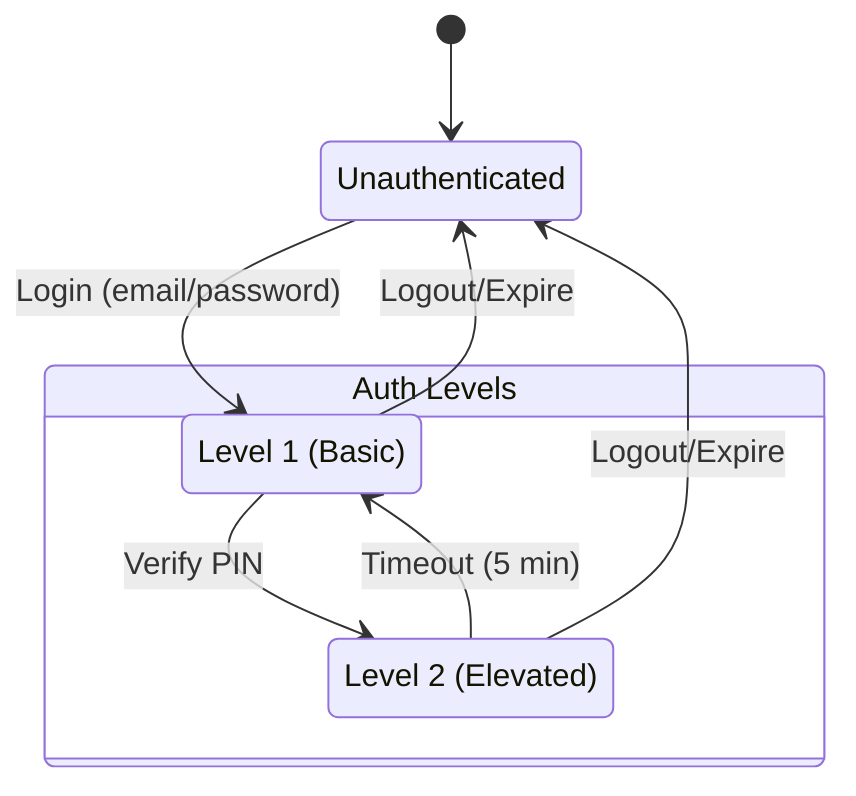
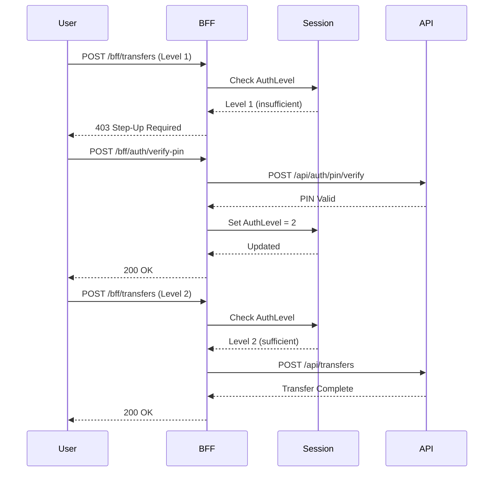

# ADR-0008: Step-Up Authentication with PIN

**Status**: Accepted

**Date**: 2026-01-15

**Decision Makers**: Vladislav Aleshaev

> **Implementation sketches corrected, 2026-08-12.** The decision itself is accepted and shipped —
> PIN step-up exists and works. But this ADR was written alongside the January build, and much of
> its illustration describes a design that was never adopted.
>
> **Of its five C# blocks, four diverge from the source.** *Session State* declares an
> `enum AuthLevel` that has **zero occurrences** anywhere (the real field is a plain
> `int AuthLevel`); *Middleware: AuthLevel Requirement* and *Controller Usage* both rest on a
> `RequireAuthLevelAttribute` that was **never built** (see the note above each); and *PIN Hash
> Storage* shows a `[StringLength(128)]` annotation the entity does not carry — the length is fluent,
> `HasMaxLength(PinHashMaxLength)` → `nvarchar(200)`. Only *Session State*'s surrounding
> `UserSession` shape is close to real.
>
> **Four tables and lists** also state things that are no longer true, and each carries a note.
>
> Corrections are **inline, and nothing below is deleted** — this repo's convention
> ([README](README.md)): *"the earlier keeps an inline supersession note at the affected clause
> rather than being rewritten."* What an ADR got wrong is part of what it records.

---

## Context

Financial applications require additional security for sensitive operations:
- Money transfers
- Account modifications
- Personal data changes

Standard JWT authentication provides identity verification but not recent user presence confirmation.

## Decision Drivers

- **Security**: High-risk operations need extra verification
- **User Experience**: Balance security with convenience
- **Compliance**: Financial regulations may require step-up auth
- **Session Binding**: Verification should be time-limited
- **Simplicity**: Users should understand the security model

## Considered Options

1. **PIN-based Step-Up**: 6-digit PIN verification before sensitive operations
2. **Re-authentication**: Full password re-entry
3. **TOTP/2FA**: Time-based one-time passwords
4. **Biometric**: Fingerprint/Face ID (mobile only)
5. **Email/SMS OTP**: One-time passwords via email/SMS

## Decision

Implement **PIN-based step-up authentication** with session-bound auth levels.

### Architecture


```mermaid
stateDiagram-v2
    [*] --> Unauthenticated
    Unauthenticated --> Level1: Login (email/password)
    Level1 --> Level2: Verify PIN
    Level2 --> Level1: Timeout (5 min)
    Level1 --> Unauthenticated: Logout/Expire
    Level2 --> Unauthenticated: Logout/Expire

    state "Auth Levels" as Levels {
        Level1: Level 1 (Basic)
        Level2: Level 2 (Elevated)
    }
```

*Correction (2026-08-12): the `Timeout (5 min)` edge is the **default** —
`SecurityOptions.PinValidityMinutes` is 5 unless overridden, and development overrides it to 10 — and the transition is
**lazy, not scheduled**: nothing fires it at the deadline. See the Timeout Handling correction below.*

### Auth Levels

| Level | Access | How to Achieve |
|-------|--------|----------------|
| Level 1 | Read operations, deposits | Login with email/password |
| Level 2 | Transfers, withdrawals | Verify 6-digit PIN |

> **Correction (2026-08-12): "Level 2" is two different mechanisms, not one.**
>
> **Transfers** are gated in the BFF: `AuthLevelMiddleware` refuses the request before it is proxied,
> so **the transfer request itself never carries a PIN** — `TransferRequest` has no `Pin` field. The
> PIN *does* reach the API, on a **separate** request: the BFF forwards it to
> `POST /api/auth/pin/verify` (`BffAuthController.cs:652`), and the API is the sole verifier. What the
> BFF keeps is not the PIN and not the boolean it got back, but the **outcome**: `AuthLevel = 2` and a
> `PinVerifiedAt` timestamp (`SessionService.SetPinVerified`). The timestamp is the part that matters
> — it is what makes expiry lazy rather than scheduled. **That one hop is drawn correctly** in the
> sequence diagram further down this ADR — but do not read the rest of that figure as verified: it
> routes transfers through `POST /bff/transfers`, a path that **exists nowhere** in the codebase (the
> real one is `/api/transfers`, proxied by the YARP catch-all; only `/bff/auth/*` is BFF-owned), and
> it ends a successful transfer at `200 OK` where the API returns **`201 Created`**.
>
> **Withdraw** works the other way round: the PIN travels **in the withdraw body**
> (`WithdrawRequest.Pin`, `[Required]`), and `TransactionService` verifies it through `IPinVerifier`
> before any money moves.
>
> **The API has no auth-level concept**, so on a call made straight to the API — bypassing the BFF
> entirely — the two diverge: **withdraw's PIN requirement still applies**, because it is in the body
> the API itself reads, while **a transfer has no second factor at all and succeeds**. Not a
> hypothesis: `TransferEndpointTests.Transfer_ToExistingUser_ReturnsCreated` sends a bearer JWT with
> no cookie and no PIN, and asserts `201 Created` with the balance moved. That is
> [ADR-0038](0038-bff-session-is-the-only-credential.md)'s open residual, and it is **not** confined
> to a docs UI or to Development — `AddJwtAuthentication` is registered unconditionally and
> `POST /api/auth/login` is `[AllowAnonymous]` in every environment, so a JWT is obtainable in any of
> them — wherever the API's own port is reachable.
>
> The single **"Level 2"** row above therefore covers two unrelated mechanisms — a transport-layer
> gate for transfers, an in-band credential for withdraw. The row is left exactly as the January
> decision recorded it; what changed is our knowledge of how it was built.

## Rationale

### Why PIN over Other Options?

| Method | UX | Security | Implementation |
|--------|-----|----------|----------------|
| PIN | ✅ Fast | ✅ Good | ✅ Simple |
| Re-auth | ❌ Slow | ✅ Good | ✅ Simple |
| TOTP | ⚠️ Requires app | ✅ Excellent | ⚠️ Complex |
| Biometric | ✅ Fast | ✅ Excellent | ❌ Platform-specific |
| Email OTP | ⚠️ Slow | ⚠️ Email security | ⚠️ External dependency |

### Security Considerations

1. **PIN Hashing**: PINs are hashed using Argon2id (same as passwords)
2. **Brute Force Protection**: Rate limiting on PIN attempts
3. **Session Binding**: Elevated auth expires after 5 minutes
4. **Audit Trail**: All step-up attempts logged
5. **No PIN Storage**: Only hash stored, never plaintext

> **Corrections (2026-08-12) to items 3 and 4.**
>
> **3 — five minutes is configuration, not a constant.** `SecurityOptions.PinValidityMinutes`
> **defaults to 5** (`appsettings.json:33`, and the same in code) and **development overrides it to
> 10** (`appsettings.Development.json:16`).
>
> **4 — "all step-up attempts logged" overstates what is there.** `AuthLevelMiddleware` logs only
> **refusals**, and there are three of them: `StepUpWithoutSession`, `StepUpRequired` and
> `RawRefreshBlocked`. A request that *passes* the gate emits
> nothing at the gate at all. The elevation itself is logged (`SessionService.SetPinVerified`,
> `BffAuthController`), but **with no correlation to the operation that triggered it**, so the log
> cannot answer "which transfer did this PIN entry authorise". And **no durable record of the event
> reaches the database** — the only *attempt* state persisted is `ApplicationUser.PinAccessFailedCount`
> and `PinLockoutEnd`, which are *current state, not history*: the counter is **reset to 0 the moment
> the lockout trips** (`PinService`), so not even the number of attempts survives. (`PinHash` is of
> course persisted too — the credential, not a record of its use.) The trail exists only as exported
> log lines, and the **transfer** ones deliberately omit the amount (`TransferService`); withdraw and
> deposit do log theirs, so "logs carry no money" is true of transfers and not of the system.

### Why Not Full 2FA?

Full TOTP/2FA was considered but:
- Adds significant user friction for every sensitive operation
- Requires mobile app or authenticator setup
- PIN provides good security for banking operations
- TOTP can be added later as optional enhancement

## Consequences

### Positive

- Fast and familiar user experience (like ATM PIN)
- Strong protection for sensitive operations
- Session-bound elevated auth prevents replay
- Simple implementation without external dependencies
- Works across all platforms (web, mobile)

### Negative

- PIN is less secure than TOTP (6 digits vs 6 digits + time)
- Users must remember additional credential
- PIN reset flow adds complexity

### Neutral

- PIN is optional (transfers blocked until PIN is set)
- Auth level stored in session, not JWT

## Implementation

### Session State

```csharp
public class UserSession
{
    public Guid UserId { get; set; }
    public string Email { get; set; } = string.Empty;
    public AuthLevel AuthLevel { get; set; } = AuthLevel.Level1;
    public DateTime? PinVerifiedAt { get; set; }
    public DateTime LastActivity { get; set; }
}

public enum AuthLevel
{
    Level1 = 1,  // Basic authentication
    Level2 = 2   // Elevated (PIN verified)
}
```

### Middleware: AuthLevel Requirement

> ⚠️ **This attribute was never built. Read the note before the code.** (2026-08-12)
>
> `grep -rn "RequireAuthLevel" backend/src backend/tests` returns **nothing**;
> `backend/src/AzureBank.Api/Attributes/` contains only `RequireIdempotencyAttribute.cs`.
>
> A **BFF-side namesake did exist** — `backend/src/AzureBank.Bff/Attributes/RequireAuthLevelAttribute.cs`,
> present from the initial import (`0799360`) and deleted in `01c0e31`, the commit that closed the
> step-up bypass. But it was **not this class**: it declared `: Attribute` only — no
> `IAuthorizationFilter`, no `OnAuthorization`, no behaviour beyond an `int MinimumLevel` property —
> and `git grep "\[RequireAuthLevel"` at that commit finds **zero usages**. It was an inert marker,
> dead from birth. The enforcing attribute shown below has never existed anywhere in this codebase.
>
> **The sketch is also self-contradictory**, which is the tell. It calls
> `context.HttpContext.GetUserSession()` — a BFF concept; the API is a stateless JWT bearer service
> with no session — yet applies the result to `TransferController`, an **API** controller. The
> Consequences section above already says *"Auth level stored in session, not JWT"*, so the ADR
> disagrees with itself across two adjacent sections.
>
> **What actually enforces step-up:** `AzureBank.Bff/Middleware/AuthLevelMiddleware.cs`. It is
> registered **globally** (`Bff/Program.cs` calls `UseAuthLevelEnforcement()`, whose extension is a
> plain `UseMiddleware` with no `UseWhen`), and does two
> unrelated jobs. First, on **every** request, it short-circuits a raw proxied
> `/api/auth/refresh` to 404 — nothing to do with PINs; only the BFF may rotate refresh tokens
> (ADR-0021). Second, it gates **three** paths behind level 2: `POST /api/transfers`,
> `POST /api/transfers/internal`, and any `*/full-number` under `/api/accounts/`. It answers **401**
> when there is no session at all and **403 + `X-Auth-Level-Required`** when the session exists at
> level 1 — see the Validation correction below. The API is not involved: a grep of `AzureBank.Api`
> for `authlevel|acr|amr` returns only comments.

```csharp
public class RequireAuthLevelAttribute : Attribute, IAuthorizationFilter
{
    public AuthLevel RequiredLevel { get; }

    public RequireAuthLevelAttribute(AuthLevel level)
    {
        RequiredLevel = level;
    }

    public void OnAuthorization(AuthorizationFilterContext context)
    {
        var session = context.HttpContext.GetUserSession();

        if (session == null || session.AuthLevel < RequiredLevel)
        {
            context.Result = new ObjectResult(new ProblemDetails
            {
                Status = 403,
                Title = "Step-Up Authentication Required",
                Detail = "Please verify your PIN to access this resource"
            })
            {
                StatusCode = 403
            };
        }
    }
}
```

### Controller Usage

> ⚠️ **Never built either — this is the previous block's attribute, shown in use.** (2026-08-12)
> `[RequireAuthLevel(AuthLevel.Level2)]` has **zero occurrences** in the codebase and in its whole
> history. The real `TransferController` carries `[Route("api/transfers")]`, `[Authorize]`,
> `[RequireIdempotency]` and `[RequestSizeLimit]` — note also that the `[Route("api/[controller]")]`
> below would resolve to `/api/Transfer`, not the `/api/transfers` every caller and the BFF gate
> actually use.

```csharp
[ApiController]
[Route("api/[controller]")]
[Authorize]
public class TransferController : ControllerBase
{
    [HttpPost]
    [RequireAuthLevel(AuthLevel.Level2)]  // Requires PIN verification
    public async Task<IActionResult> Transfer(TransferRequest request)
    {
        // Only accessible after PIN verification
    }

    [HttpPost("internal")]
    [RequireAuthLevel(AuthLevel.Level2)]  // Requires PIN verification
    public async Task<IActionResult> InternalTransfer(InternalTransferRequest request)
    {
        // Only accessible after PIN verification
    }
}
```

### PIN Verification Flow


```mermaid
sequenceDiagram
    participant User
    participant BFF
    participant Session
    participant API

    User->>BFF: POST /bff/transfers (Level 1)
    BFF->>Session: Check AuthLevel
    Session-->>BFF: Level 1 (insufficient)
    BFF-->>User: 403 Step-Up Required

    User->>BFF: POST /bff/auth/verify-pin
    BFF->>API: POST /api/auth/pin/verify
    API-->>BFF: PIN Valid
    BFF->>Session: Set AuthLevel = 2
    Session-->>BFF: Updated
    BFF-->>User: 200 OK

    User->>BFF: POST /bff/transfers (Level 2)
    BFF->>Session: Check AuthLevel
    Session-->>BFF: Level 2 (sufficient)
    BFF->>API: POST /api/transfers
    API-->>BFF: Transfer Complete
    BFF-->>User: 200 OK
```

### Timeout Handling

> ⚠️ **This middleware was never built either.** (2026-08-12) `AuthLevelTimeoutMiddleware` has
> **zero occurrences** anywhere in the source.
>
> The real mechanism is **lazy evaluation, not a timer**: `SessionService.GetAuthLevel` checks expiry
> **when something reads it** and downgrades the session in place at that moment. The downgrade is a
> side effect of the read, and there are only three readers — `AuthLevelMiddleware` on the three
> PIN-protected paths (and only when a session cookie is present), plus `GET /bff/auth/me` and
> `GET /bff/auth/session-status`.
>
> **No timer and no sweeper does this.** `SessionCleanupService` runs on a five-minute interval — the
> same number as `PinValidityMinutes` in production, which is a coincidence that invites exactly this
> confusion — and it never touches `AuthLevel` or `PinVerifiedAt`.
>
> The difference is not cosmetic: **an elevated session that nothing reads stays elevated in the
> store** until something does. So the ADR's "expires after 5 minutes" means *"is not honoured more
> than `PinValidityMinutes` after `PinVerifiedAt`"*, not *"is actively revoked at the deadline"*.
>
> And the window is configuration, not the hardcoded `TimeSpan.FromMinutes(5)` below —
> `SecurityOptions.PinValidityMinutes` **defaults to 5 and is overridden to 10 in development**, so
> every *elevation* window this ADR states as five minutes is the default, not a constant. (The
> `SessionCleanupService` interval two paragraphs up is a genuine hardcoded five minutes, which is
> exactly why the two are easy to confuse.)

```csharp
public class AuthLevelTimeoutMiddleware
{
    private readonly TimeSpan _elevatedAuthTimeout = TimeSpan.FromMinutes(5);

    public async Task InvokeAsync(HttpContext context, RequestDelegate next)
    {
        var session = context.GetUserSession();

        if (session?.AuthLevel == AuthLevel.Level2 &&
            session.PinVerifiedAt.HasValue &&
            DateTime.UtcNow - session.PinVerifiedAt.Value > _elevatedAuthTimeout)
        {
            // Downgrade to Level 1
            session.AuthLevel = AuthLevel.Level1;
            session.PinVerifiedAt = null;
            await context.SaveSession(session);
        }

        await next(context);
    }
}
```

### PIN Hash Storage

```csharp
public class ApplicationUser : IdentityUser<Guid>
{
    [StringLength(128)]
    public string? PinHash { get; set; }  // Argon2id hash of 6-digit PIN
}
```

### Protected Operations

| Operation | Required Level | Reason |
|-----------|---------------|--------|
| View accounts | Level 1 | Read-only |
| View transactions | Level 1 | Read-only |
| Deposit | Level 1 | Money in (low risk) |
| Withdraw | Level 2 | Money out |
| Transfer | Level 2 | Money out |
| Internal transfer | Level 2 | Account modification |
| Update account | Level 1 | Non-financial |
| Delete account | Level 2 | Destructive |

> **Correction (2026-08-12): this table is the decision, not the state. They diverge in three places.**
>
> | Operation | Enforced today? | By what |
> |---|---|---|
> | Transfer, Internal transfer | ✅ yes | `AuthLevelMiddleware` (BFF session flag) |
> | Withdraw | ✅ yes, **by a different mechanism** | PIN in the request body, verified by the API through `IPinVerifier` |
> | **Delete account** | ❌ **no step-up — nothing, anywhere** | still `[Authorize]`, just never gated at level 2 |
> | **Reveal full account number** — *absent from the table* | ✅ yes | `AuthLevelMiddleware`, added later by [ADR-0020](0020-account-number-reveal.md) |
>
> **1 — Withdraw reaches the same level by a different route**, so a withdraw survives a direct call
> to the API and a transfer does not. One decision, two implementations.
>
> **2 — Delete account is an open hole**, not a mechanism choice: the middleware gates three paths
> and deletion is not one of them, and the API has no auth-level concept to fall back on. Worth
> weighing when it is closed: deletion here is a *soft* delete (`Account.IsDeleted` behind a global
> query filter), so the operation is recoverable — an argument about how heavy the gate should be,
> not about whether there should be one.
>
> **3 — The table predates the reveal endpoint**, so this list of level-2 operations has been
> incomplete since ADR-0020 shipped.
>
> ---
>
> **Correction (2026-08-13) to the correction above — row 1 was stale within a day.**
>
> [ADR-0041](0041-the-api-verifies-the-transfer-pin.md) moved transfers off the level-2 gate the
> very next day, so *"Transfer, Internal transfer · enforced by `AuthLevelMiddleware` (BFF session
> flag)"* no longer describes anything. What is true now:
>
> | Operation | Enforced today? | By what |
> |---|---|---|
> | Transfer, Internal transfer | ✅ yes | **PIN in the request body, verified by the API** through `IPinVerifier` — the same mechanism withdraw uses. The BFF still requires a SESSION for these paths (`SessionRequiredPaths`) but no longer a PIN |
> | Reveal full account number | ✅ yes | `AuthLevelMiddleware`'s prefix/suffix rule — now the **only** thing left behind the level-2 gate. Note the mechanism: the exact-path set `PinRequiredPaths` is empty and plays no part here |
>
> So point 1 above inverted: the *"one decision, two implementations"* split is gone, and withdraw is
> no longer the odd one out. Point 2 (delete account) is unchanged and still open.
>
> Recorded rather than edited in place, per this file's own rule at the top. The lesson is worth
> keeping: a correction table is a snapshot of the code, and it decays exactly as fast as the code
> moves — this one lasted 24 hours.
>
> ---
>
> **Correction (2026-08-18): point 2's REASONING was wrong, and half of the hole is now closed.**
>
> Re-measured live against `main` @ `c146fe9`, a fresh user, token only — no PIN and no
> `Step-Up-Authorization` header sent anywhere:
>
> ```
> DELETE /api/accounts/{spare}    -> 200  "Account deleted successfully"
> DELETE /api/accounts/{primary}  -> 422  PRIMARY_ACCOUNT_DELETE
> DELETE /api/accounts/{funded}   -> 422  NON_ZERO_BALANCE
> GET    /api/accounts/{deleted}  -> 404  ACCOUNT_NOT_FOUND     ← asked by the OWNER
> ```
>
> The gate is still absent, exactly as recorded. What was wrong is the argument attached to it. The
> 2026-08-12 note said *"the operation is recoverable — an argument about how heavy the gate should
> be"*, and used that to soften the finding. Recoverable **by whom** is the question it skipped:
> `AzureBankDbContext` applies `HasQueryFilter(a => !a.IsDeleted)` globally, no endpoint lists or
> restores a deleted account, and the last row above is the owner asking for their own account by id
> and being told it does not exist. So it is recoverable by an operator with database access and by
> nobody else. From the account holder's side it is irreversible, and the softening does not hold.
>
> **And the loss is larger than one empty account.** `TransactionService` scopes the history to
> `Accounts.Where(a => a.UserId == userId && !a.IsDeleted)`, so the deleted account's transactions
> leave the owner's history with it. An account must be EMPTY to delete, but empty is not the same
> as historyless — a deposit and a matching withdrawal net to zero and leave two rows. Measured, same
> run: enrol a PIN, deposit 40, withdraw 40, then delete.
>
> ```
> GET /api/transactions  before the delete -> 2 rows
> DELETE /api/accounts/{spare}             -> 200
> GET /api/transactions  after  the delete -> 0 rows
> ```
>
> So "a nuisance: an empty account disappears from a list" understates it. What disappears is the
> account AND its record of what happened on it, from the only view its owner has.
>
> **What this PR changes: the detection half only.** The closure now emits
> `SecurityEvents.AccountDeleted` naming the acting user, where it was a plain
> `LogInformation("Soft deleted account {AccountId}")` that never reached the stream an operator
> alerts on — while `AccountNumberRevealed`, reading your own account number back, always did. That
> asymmetry is indefensible on its own terms and needed no decision to fix.
>
> **What it deliberately does NOT change: the level-2 gate.** Whether deletion should cost a PIN is a
> product call, and the case is genuinely two-sided. Against: the two 422 guards make the money case
> unreachable, so nothing here can lose funds — which is what A2/ADR-0042 exists to protect, and
> "add a PIN because withdraw has one" is cargo-culting when the risk differs. For: this table says
> Level 2, the owner cannot undo it, and closing an account at a real bank is not a level-1 act.
> Recorded as still open rather than decided in passing, and the mechanism is now cheap either way —
> `StepUpAuthorization` binds its fields inside an HMAC rather than in columns, and
> `ToAccountId`/`RecipientUserId`/`ConsumedByTransactionId` are already nullable, so a third
> `StepUpOperation` needs no migration.

## Validation

Success criteria:
- PIN can be set by authenticated users
- PIN verification elevates session to Level 2
- Level 2 expires after 5 minutes of inactivity
- Protected endpoints return 403 without Level 2
- PIN hash uses Argon2id
- Failed PIN attempts are rate-limited

> **Corrections (2026-08-12) to three of these six.**
>
> **"PIN can be set by authenticated users"** — true for *enrolment* only. **Changing** a PIN now
> requires proving the current one ([ADR-0040](0040-changing-a-credential-requires-the-current-one.md)).
> Until that shipped, a session alone could replace the PIN and then satisfy every gate the PIN
> protects — which made this ADR's gate and [ADR-0010](0010-pin-attempt-limiting.md)'s
> attempt-limiting both inoperative at once.
>
> **"expires after 5 minutes of **inactivity**"** — it is not inactivity. `UserSession.IsPinVerificationValid`
> is `PinVerifiedAt.HasValue && DateTime.UtcNow < PinVerifiedAt.Value.AddMinutes(validityMinutes)`: an
> **absolute** window from the moment of verification. Using the app does **not** extend it, and the
> value is configuration (default 5, overridden to 10 in development), not the constant this ADR shows.
>
> **"return 403 without Level 2"** — incomplete, and the missing half is deliberate.
> `AuthLevelMiddleware` answers **401 `AUTH_TOKEN_MISSING`** when `GetAuthLevel` returns 0 — which is
> a missing cookie *and* a present-but-unknown-or-expired one, so a user whose session lapsed
> mid-flow gets 401, not 403 — and **403 `STEP_UP_REQUIRED`** only when a live session sits at
> level 1. The two states are not the same
> thing and the SPA routes on the difference: 403 opens the PIN modal, 401 must send the user to
> login. Answering 403 to someone with no session would prompt for a PIN they cannot use. The 401
> body is byte-identical to the API's own, so a caller cannot tell whether the BFF short-circuited
> or the API replied. **That indistinguishability is the 401 branch only:** the 403 carries
> `X-Auth-Level-Required`, `X-Auth-Level-Current` and a `{"type":"STEP_UP_REQUIRED", ...}` body the
> API never emits, so a caller *holding a level-1 session* can map the gated paths exactly.

## Related

- [ADR-0001: BFF Pattern](./0001-bff-pattern.md)
- [ADR-0003: Argon2id Password Hashing](./0003-argon2id-password-hashing.md)
- [AzureBank.Bff README](../../backend/src/AzureBank.Bff/README.md)

Added 2026-08-12, because the step-up story is spread across six records and this one is the entry
point:

- [ADR-0010: PIN attempt-limiting](./0010-pin-attempt-limiting.md) — the lockout every PIN check
  shares, including the in-band one on withdraw.
- [ADR-0020: Account-number reveal](./0020-account-number-reveal.md) — the third level-2 surface,
  and the row missing from the Protected Operations table above.
- [ADR-0022: Client money-mutation protocol](./0022-client-money-mutation-protocol.md) — states the
  consequence of putting the auth level in the session rather than the JWT: step-up becomes a
  transport concern, which is what makes the client-side interceptor necessary.
- [ADR-0038: The BFF session is the only credential](./0038-bff-session-is-the-only-credential.md) —
  closed the bypass in which a caller supplying their own `Authorization` header walked past this
  gate entirely.
- [ADR-0040: Changing a credential requires proving the current one](./0040-changing-a-credential-requires-the-current-one.md)
  — closed the hole that made this gate and ADR-0010 inoperative together.

---

## References

- [NIST Digital Identity Guidelines](https://pages.nist.gov/800-63-3/)
- [OWASP Session Management](https://cheatsheetseries.owasp.org/cheatsheets/Session_Management_Cheat_Sheet.html)
- [Step-Up Authentication Pattern](https://auth0.com/docs/secure/multi-factor-authentication/step-up-authentication)
