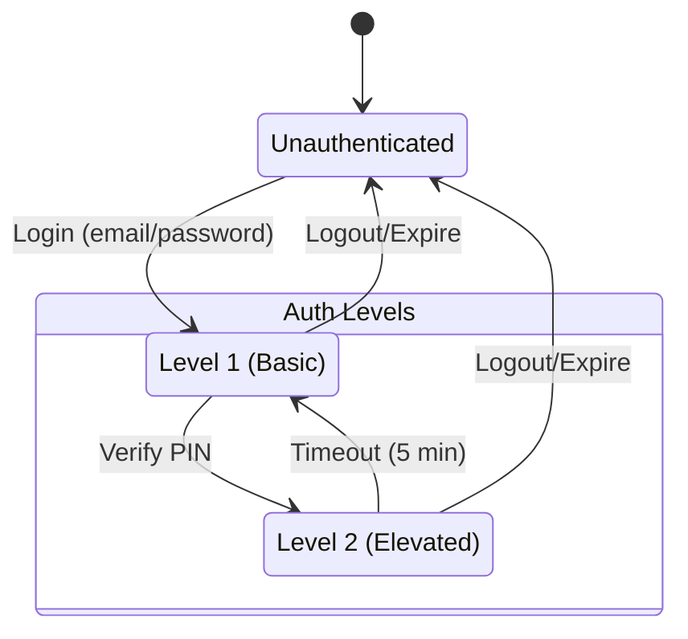
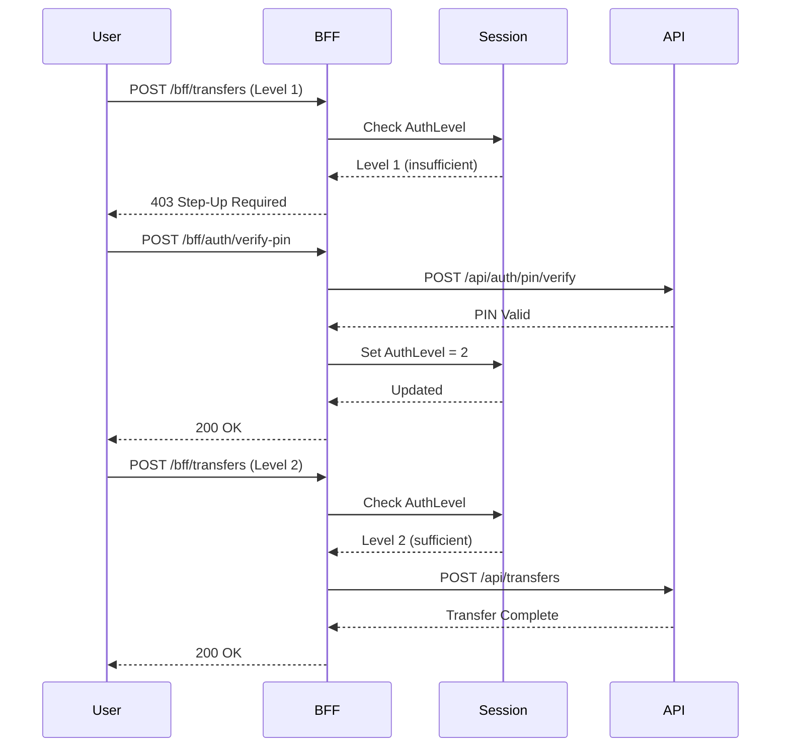

# ADR-0008: Step-Up Authentication with PIN

**Status**: Accepted

**Date**: 2026-01-15

**Decision Makers**: Vladislav Aleshaev

> **Implementation sketches corrected, 2026-08-12.** The decision itself is accepted and shipped —
> PIN step-up exists and works. But this ADR was written alongside the January build, and parts of
> it describe a design that was never adopted: **two of its C# blocks have no counterpart in the
> source**, and three of its tables and lists state things that are no longer true. Each affected
> clause now carries a note giving the measured reality and the file that holds it.
>
> Corrections are **inline, and nothing below is deleted** — this repo's convention
> ([README](README.md)): *"the earlier keeps an inline supersession note at the affected clause
> rather than being rewritten."* What an ADR got wrong is part of what it records.

---

## Context

Financial applications require additional security for sensitive operations:
- Money transfers
- Account modifications
- Personal data changes

Standard JWT authentication provides identity verification but not recent user presence confirmation.

## Decision Drivers

- **Security**: High-risk operations need extra verification
- **User Experience**: Balance security with convenience
- **Compliance**: Financial regulations may require step-up auth
- **Session Binding**: Verification should be time-limited
- **Simplicity**: Users should understand the security model

## Considered Options

1. **PIN-based Step-Up**: 6-digit PIN verification before sensitive operations
2. **Re-authentication**: Full password re-entry
3. **TOTP/2FA**: Time-based one-time passwords
4. **Biometric**: Fingerprint/Face ID (mobile only)
5. **Email/SMS OTP**: One-time passwords via email/SMS

## Decision

Implement **PIN-based step-up authentication** with session-bound auth levels.

### Architecture


```mermaid
stateDiagram-v2
    [*] --> Unauthenticated
    Unauthenticated --> Level1: Login (email/password)
    Level1 --> Level2: Verify PIN
    Level2 --> Level1: Timeout (5 min)
    Level1 --> Unauthenticated: Logout/Expire
    Level2 --> Unauthenticated: Logout/Expire

    state "Auth Levels" as Levels {
        Level1: Level 1 (Basic)
        Level2: Level 2 (Elevated)
    }
```

### Auth Levels

| Level | Access | How to Achieve |
|-------|--------|----------------|
| Level 1 | Read operations, deposits | Login with email/password |
| Level 2 | Transfers, withdrawals | Verify 6-digit PIN |

> **Correction (2026-08-12): "Level 2" is two different mechanisms, not one.**
> **Transfers** are gated by the BFF session flag — `AuthLevelMiddleware` refuses the request and
> the PIN never reaches the API. **Withdraw** is not: it carries the PIN in the request body and
> `TransactionService` verifies it through `IPinVerifier` before any money moves. The API has no
> auth-level concept at all, so a withdraw survives a direct API call and a transfer does not.
> One row of this table describes a transport-layer gate and the other an in-band credential.

## Rationale

### Why PIN over Other Options?

| Method | UX | Security | Implementation |
|--------|-----|----------|----------------|
| PIN | ✅ Fast | ✅ Good | ✅ Simple |
| Re-auth | ❌ Slow | ✅ Good | ✅ Simple |
| TOTP | ⚠️ Requires app | ✅ Excellent | ⚠️ Complex |
| Biometric | ✅ Fast | ✅ Excellent | ❌ Platform-specific |
| Email OTP | ⚠️ Slow | ⚠️ Email security | ⚠️ External dependency |

### Security Considerations

1. **PIN Hashing**: PINs are hashed using Argon2id (same as passwords)
2. **Brute Force Protection**: Rate limiting on PIN attempts
3. **Session Binding**: Elevated auth expires after 5 minutes
4. **Audit Trail**: All step-up attempts logged
5. **No PIN Storage**: Only hash stored, never plaintext

> **Corrections (2026-08-12) to items 3 and 4.**
>
> **3 — five minutes is configuration, not a constant.** `SecurityOptions.PinValidityMinutes` is
> **5 in production and 10 in development** (`appsettings.json:33`, `appsettings.Development.json:16`).
>
> **4 — "all step-up attempts logged" overstates what is there.** `AuthLevelMiddleware` logs only
> **refusals** — `StepUpWithoutSession` and `StepUpRequired`. A request that *passes* the gate emits
> nothing at the gate at all. The elevation itself is logged (`SessionService.SetPinVerified`,
> `BffAuthController`), but **with no correlation to the operation that triggered it**, so the log
> cannot answer "which transfer did this PIN entry authorise". Nothing about a step-up reaches the
> database: `ApplicationUser.PinAccessFailedCount` is *reset to 0 the moment the lockout trips*
> (`PinService`), so not even the number of attempts survives. The trail exists only as exported
> log lines, which by design carry no money amounts.

### Why Not Full 2FA?

Full TOTP/2FA was considered but:
- Adds significant user friction for every sensitive operation
- Requires mobile app or authenticator setup
- PIN provides good security for banking operations
- TOTP can be added later as optional enhancement

## Consequences

### Positive

- Fast and familiar user experience (like ATM PIN)
- Strong protection for sensitive operations
- Session-bound elevated auth prevents replay
- Simple implementation without external dependencies
- Works across all platforms (web, mobile)

### Negative

- PIN is less secure than TOTP (6 digits vs 6 digits + time)
- Users must remember additional credential
- PIN reset flow adds complexity

### Neutral

- PIN is optional (transfers blocked until PIN is set)
- Auth level stored in session, not JWT

## Implementation

### Session State

```csharp
public class UserSession
{
    public Guid UserId { get; set; }
    public string Email { get; set; } = string.Empty;
    public AuthLevel AuthLevel { get; set; } = AuthLevel.Level1;
    public DateTime? PinVerifiedAt { get; set; }
    public DateTime LastActivity { get; set; }
}

public enum AuthLevel
{
    Level1 = 1,  // Basic authentication
    Level2 = 2   // Elevated (PIN verified)
}
```

### Middleware: AuthLevel Requirement

> ⚠️ **This attribute was never built. Read the note before the code.** (2026-08-12)
>
> `grep -rn "RequireAuthLevel" backend/src backend/tests` returns **nothing**;
> `backend/src/AzureBank.Api/Attributes/` contains only `RequireIdempotencyAttribute.cs`.
>
> A **BFF-side namesake did exist** — `backend/src/AzureBank.Bff/Attributes/RequireAuthLevelAttribute.cs`,
> present from the initial import (`0799360`) and deleted in `01c0e31`, the commit that closed the
> step-up bypass. But it was **not this class**: it declared `: Attribute` only — no
> `IAuthorizationFilter`, no `OnAuthorization`, no behaviour beyond an `int MinimumLevel` property —
> and `git grep "\[RequireAuthLevel"` at that commit finds **zero usages**. It was an inert marker,
> dead from birth. The enforcing attribute shown below has never existed anywhere in this codebase.
>
> **The sketch is also self-contradictory**, which is the tell. It calls
> `context.HttpContext.GetUserSession()` — a BFF concept; the API is a stateless JWT bearer service
> with no session — yet applies the result to `TransferController`, an **API** controller. The
> Consequences section above already says *"Auth level stored in session, not JWT"*, so the ADR
> disagrees with itself two sections apart.
>
> **What actually enforces step-up:** `AzureBank.Bff/Middleware/AuthLevelMiddleware.cs`, a middleware
> matching three request paths (`POST /api/transfers`, `POST /api/transfers/internal`, and any
> `*/full-number` under `/api/accounts/`). It answers **401** when there is no session at all and
> **403 + `X-Auth-Level-Required`** when the session exists at level 1 — see the Validation
> correction below. The API is not involved: a grep of `AzureBank.Api` for `authlevel|acr|amr`
> returns only comments.

```csharp
public class RequireAuthLevelAttribute : Attribute, IAuthorizationFilter
{
    public AuthLevel RequiredLevel { get; }

    public RequireAuthLevelAttribute(AuthLevel level)
    {
        RequiredLevel = level;
    }

    public void OnAuthorization(AuthorizationFilterContext context)
    {
        var session = context.HttpContext.GetUserSession();

        if (session == null || session.AuthLevel < RequiredLevel)
        {
            context.Result = new ObjectResult(new ProblemDetails
            {
                Status = 403,
                Title = "Step-Up Authentication Required",
                Detail = "Please verify your PIN to access this resource"
            })
            {
                StatusCode = 403
            };
        }
    }
}
```

### Controller Usage

```csharp
[ApiController]
[Route("api/[controller]")]
[Authorize]
public class TransferController : ControllerBase
{
    [HttpPost]
    [RequireAuthLevel(AuthLevel.Level2)]  // Requires PIN verification
    public async Task<IActionResult> Transfer(TransferRequest request)
    {
        // Only accessible after PIN verification
    }

    [HttpPost("internal")]
    [RequireAuthLevel(AuthLevel.Level2)]  // Requires PIN verification
    public async Task<IActionResult> InternalTransfer(InternalTransferRequest request)
    {
        // Only accessible after PIN verification
    }
}
```

### PIN Verification Flow


```mermaid
sequenceDiagram
    participant User
    participant BFF
    participant Session
    participant API

    User->>BFF: POST /bff/transfers (Level 1)
    BFF->>Session: Check AuthLevel
    Session-->>BFF: Level 1 (insufficient)
    BFF-->>User: 403 Step-Up Required

    User->>BFF: POST /bff/auth/verify-pin
    BFF->>API: POST /api/auth/pin/verify
    API-->>BFF: PIN Valid
    BFF->>Session: Set AuthLevel = 2
    Session-->>BFF: Updated
    BFF-->>User: 200 OK

    User->>BFF: POST /bff/transfers (Level 2)
    BFF->>Session: Check AuthLevel
    Session-->>BFF: Level 2 (sufficient)
    BFF->>API: POST /api/transfers
    API-->>BFF: Transfer Complete
    BFF-->>User: 200 OK
```

### Timeout Handling

> ⚠️ **This middleware was never built either.** (2026-08-12) `AuthLevelTimeoutMiddleware` has
> **zero occurrences** anywhere in the source.
>
> The real mechanism is **lazy, not middleware**: `SessionService.GetAuthLevel` checks expiry
> **when someone asks** and downgrades the session in place at that moment. Nothing runs per
> request. The difference is not cosmetic — an elevated session that is never read is never
> downgraded, so "expires after 5 minutes" means *"is not honoured more than 5 minutes after
> `PinVerifiedAt`"*, not *"is actively revoked at the 5-minute mark"*.
>
> The window is also configuration rather than the hardcoded `TimeSpan.FromMinutes(5)` below —
> `SecurityOptions.PinValidityMinutes`, **5 in production, 10 in development**.

```csharp
public class AuthLevelTimeoutMiddleware
{
    private readonly TimeSpan _elevatedAuthTimeout = TimeSpan.FromMinutes(5);

    public async Task InvokeAsync(HttpContext context, RequestDelegate next)
    {
        var session = context.GetUserSession();

        if (session?.AuthLevel == AuthLevel.Level2 &&
            session.PinVerifiedAt.HasValue &&
            DateTime.UtcNow - session.PinVerifiedAt.Value > _elevatedAuthTimeout)
        {
            // Downgrade to Level 1
            session.AuthLevel = AuthLevel.Level1;
            session.PinVerifiedAt = null;
            await context.SaveSession(session);
        }

        await next(context);
    }
}
```

### PIN Hash Storage

```csharp
public class ApplicationUser : IdentityUser<Guid>
{
    [StringLength(128)]
    public string? PinHash { get; set; }  // Argon2id hash of 6-digit PIN
}
```

### Protected Operations

| Operation | Required Level | Reason |
|-----------|---------------|--------|
| View accounts | Level 1 | Read-only |
| View transactions | Level 1 | Read-only |
| Deposit | Level 1 | Money in (low risk) |
| Withdraw | Level 2 | Money out |
| Transfer | Level 2 | Money out |
| Internal transfer | Level 2 | Account modification |
| Update account | Level 1 | Non-financial |
| Delete account | Level 2 | Destructive |

> **Correction (2026-08-12): this table is the decision, not the state. They diverge in three places.**
>
> | Operation | Enforced today? | By what |
> |---|---|---|
> | Transfer, Internal transfer | ✅ yes | `AuthLevelMiddleware` (BFF session flag) |
> | Withdraw | ✅ yes, **by a different mechanism** | PIN in the request body, verified by the API through `IPinVerifier` |
> | **Delete account** | ❌ **no — nothing, anywhere** | — |
> | **Reveal full account number** — *absent from the table* | ✅ yes | `AuthLevelMiddleware`, added later by [ADR-0020](0020-account-number-reveal.md) |
>
> **1 — Withdraw reaches the same level by a different route**, so a withdraw survives a direct call
> to the API and a transfer does not. One decision, two implementations.
>
> **2 — Delete account is an open hole**, not a mechanism choice: the middleware gates three paths
> and deletion is not one of them, and the API has no auth-level concept to fall back on. Worth
> weighing when it is closed: deletion here is a *soft* delete (`Account.IsDeleted` behind a global
> query filter), so the operation is recoverable — an argument about how heavy the gate should be,
> not about whether there should be one.
>
> **3 — The table predates the reveal endpoint**, so this list of level-2 operations has been
> incomplete since ADR-0020 shipped.

## Validation

Success criteria:
- PIN can be set by authenticated users
- PIN verification elevates session to Level 2
- Level 2 expires after 5 minutes of inactivity
- Protected endpoints return 403 without Level 2
- PIN hash uses Argon2id
- Failed PIN attempts are rate-limited

> **Corrections (2026-08-12) to three of these six.**
>
> **"PIN can be set by authenticated users"** — true for *enrolment* only. **Changing** a PIN now
> requires proving the current one ([ADR-0040](0040-changing-a-credential-requires-the-current-one.md)).
> Until that shipped, a session alone could replace the PIN and then satisfy every gate the PIN
> protects — which made this ADR's gate and [ADR-0010](0010-pin-attempt-limiting.md)'s
> attempt-limiting both inoperative at once.
>
> **"expires after 5 minutes of **inactivity**"** — it is not inactivity. `UserSession.IsPinVerificationValid`
> is `DateTime.UtcNow < PinVerifiedAt.Value.AddMinutes(validityMinutes)`: an **absolute** window from
> the moment of verification. Using the app does **not** extend it, and the value is configuration
> (5 production / 10 development), not the constant this ADR shows.
>
> **"return 403 without Level 2"** — incomplete, and the missing half is deliberate.
> `AuthLevelMiddleware` answers **401 `AUTH_TOKEN_MISSING`** when there is *no session at all*, and
> **403 `STEP_UP_REQUIRED`** only when a session exists at level 1. The two states are not the same
> thing and the SPA routes on the difference: 403 opens the PIN modal, 401 must send the user to
> login. Answering 403 to someone with no session would prompt for a PIN they cannot use. The 401
> body is byte-identical to the API's own, so a caller cannot tell whether the BFF short-circuited
> or the API replied — probing does not reveal which paths carry the gate.

## Related

- [ADR-0001: BFF Pattern](./0001-bff-pattern.md)
- [ADR-0003: Argon2id Password Hashing](./0003-argon2id-password-hashing.md)
- [AzureBank.Bff README](../../backend/src/AzureBank.Bff/README.md)

Added 2026-08-12, because the step-up story is spread across six records and this one is the entry
point:

- [ADR-0010: PIN attempt-limiting](./0010-pin-attempt-limiting.md) — the lockout every PIN check
  shares, including the in-band one on withdraw.
- [ADR-0020: Account-number reveal](./0020-account-number-reveal.md) — the third level-2 surface,
  and the row missing from the Protected Operations table above.
- [ADR-0022: Client money-mutation protocol](./0022-client-money-mutation-protocol.md) — states the
  consequence of putting the auth level in the session rather than the JWT: step-up becomes a
  transport concern, which is what makes the client-side interceptor necessary.
- [ADR-0038: The BFF session is the only credential](./0038-bff-session-is-the-only-credential.md) —
  closed the bypass in which a caller supplying their own `Authorization` header walked past this
  gate entirely.
- [ADR-0040: Changing a credential requires proving the current one](./0040-changing-a-credential-requires-the-current-one.md)
  — closed the hole that made this gate and ADR-0010 inoperative together.

---

## References

- [NIST Digital Identity Guidelines](https://pages.nist.gov/800-63-3/)
- [OWASP Session Management](https://cheatsheetseries.owasp.org/cheatsheets/Session_Management_Cheat_Sheet.html)
- [Step-Up Authentication Pattern](https://auth0.com/docs/secure/multi-factor-authentication/step-up-authentication)
