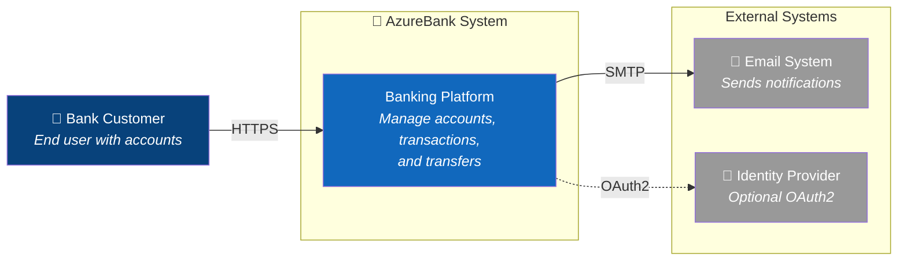
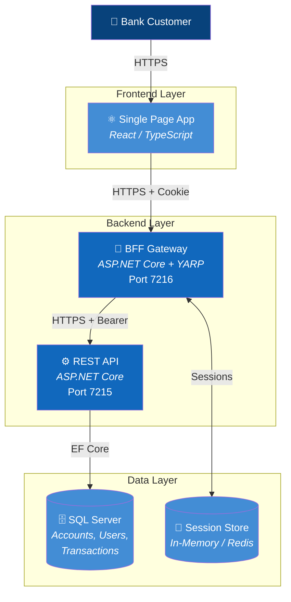
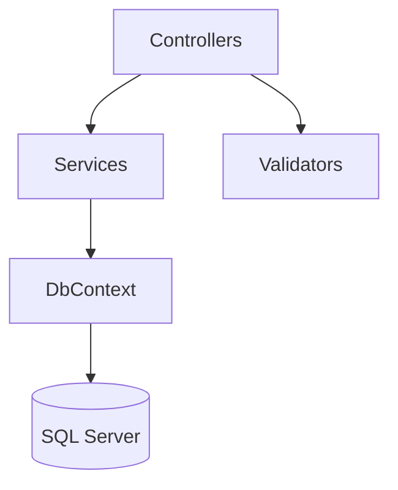
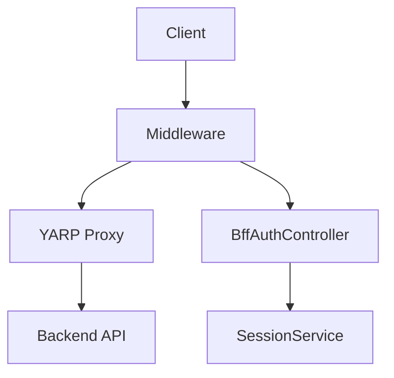
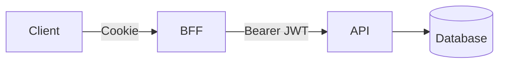
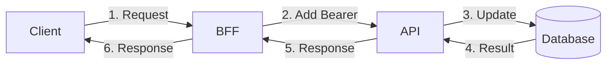
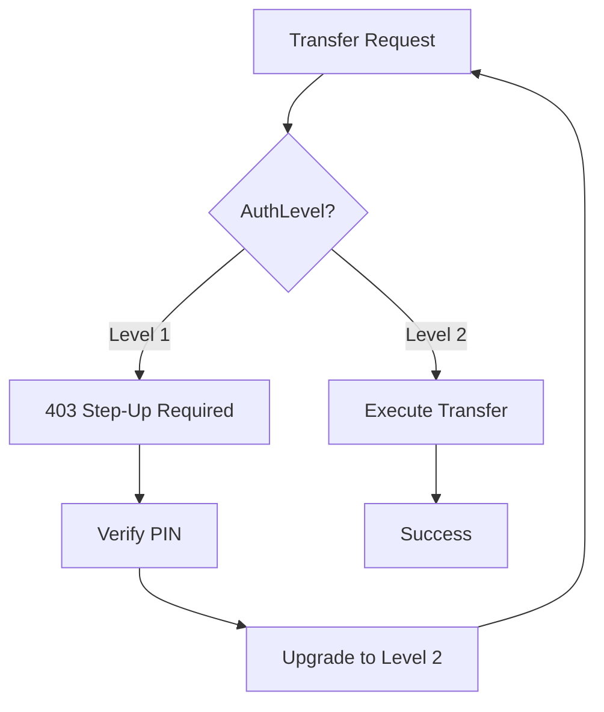
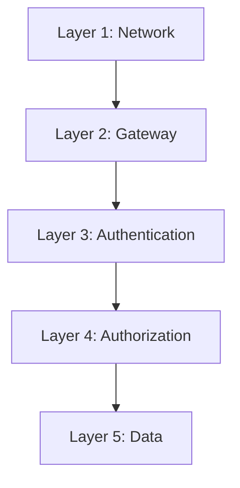
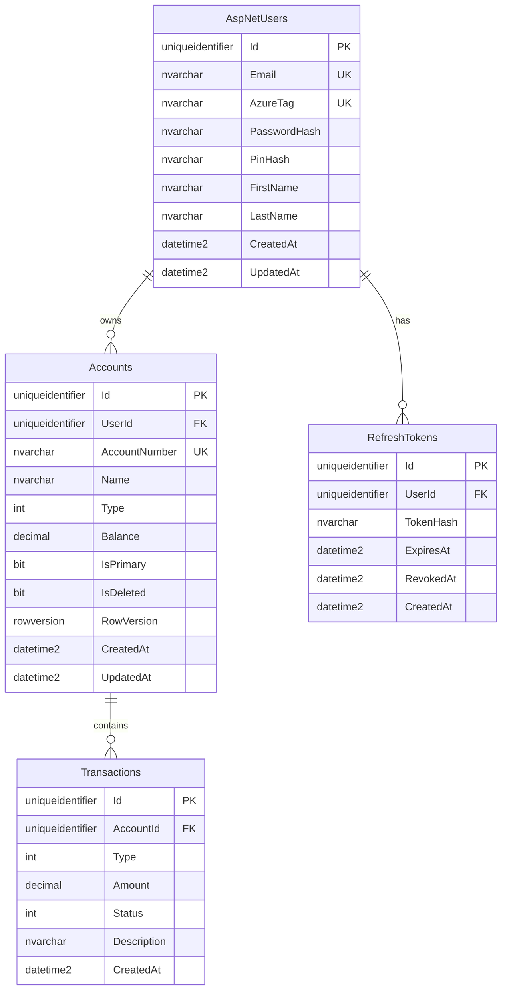

# AzureBank Architecture Overview

This document provides a comprehensive overview of the AzureBank backend architecture.

---

## Table of Contents

- [System Context](#system-context)
- [Container View](#container-view)
- [Component Views](#component-views)
- [Data Flow](#data-flow)
- [Security Architecture](#security-architecture)
- [Database Design](#database-design)

---

## System Context

The AzureBank system provides banking services to customers through web and mobile applications.

### External Actors

| Actor | Description |
|-------|-------------|
| **Bank Customer** | End user accessing banking services |
| **Email System** | External email provider for notifications |
| **Identity Provider** | Optional external authentication (future) |

---

## Container View

The system is composed of multiple containers (deployable units):

### Container Descriptions

| Container | Technology | Responsibility |
|-----------|------------|----------------|
| **SPA** | React, TypeScript | User interface (future) |
| **BFF Gateway** | ASP.NET Core, YARP 2.3.0 | Session management, rate limiting, security headers, reverse proxy |
| **REST API** | ASP.NET Core 10.0 | Business logic, validation, authentication, data access |
| **Database** | SQL Server 2022 | Persistent storage for all domain data |
| **Session Store** | In-Memory (Redis capable) | User session and token storage |

---

## Component Views

### API Components

| Layer | Components | Purpose |
|-------|------------|---------|
| **Controllers** | AuthController, AccountController, TransactionController, TransferController, UserController | HTTP endpoints |
| **Services** | AuthService, AccountService, TransactionService, TransferService, UserService, JwtService | Business logic |
| **Validation** | FluentValidation validators | Request validation |
| **Data Access** | AzureBankDbContext, Mapperly mappers | Database operations |

### BFF Components

| Layer | Components | Purpose |
|-------|------------|---------|
| **Middleware** | SecurityHeaders, RateLimiter, SessionActivity, AuthLevel | Request pipeline |
| **Controllers** | BffAuthController | Session endpoints |
| **Services** | SessionService, TokenStore, CleanupService | Session management |
| **Proxy** | YARP ReverseProxy, BearerTokenTransform | API forwarding |

---

## Data Flow

### Authentication Flow

**Registration:**
1. Client → BFF: `POST /bff/auth/register`
2. BFF → API: Forward request
3. API: Hash password (Argon2id), create user + account
4. API → BFF: Return token + user data
5. BFF: Store token in session
6. BFF → Client: Set-Cookie + user data

**Login:**
1. Client → BFF: `POST /bff/auth/login`
2. BFF → API: Forward credentials
3. API: Verify password, generate JWT
4. BFF: Create session, store token
5. BFF → Client: Set-Cookie + user data

### Transaction Flow

**Deposit/Withdraw:**
1. Client → BFF: `POST /api/transactions/deposit`
2. BFF: Get JWT from session, attach as Bearer
3. BFF → API: Forward with Bearer token
4. API: Validate, update balance, create record
5. API → BFF → Client: Transaction result

### Transfer Flow (with Step-Up Auth)

**Step 1: PIN Verification Required**
1. Client → BFF: `POST /api/transfers`
2. BFF: Check AuthLevel = 1 (insufficient)
3. BFF → Client: `403 STEP_UP_REQUIRED`

**Step 2: Verify PIN**
4. Client → BFF: `POST /bff/auth/verify-pin`
5. BFF → API: Verify PIN hash
6. BFF: Upgrade session to AuthLevel 2
7. BFF → Client: `{authLevel: 2}`

**Step 3: Execute Transfer**
8. Client → BFF: `POST /api/transfers` (retry)
9. BFF: AuthLevel = 2 ✓, forward with Bearer
10. API: Debit sender, credit recipient
11. API → BFF → Client: Transfer result

---

## Security Architecture

### Defense in Depth

| Layer | Features |
|-------|----------|
| **1. Network** | HTTPS/TLS 1.3, CORS Policy |
| **2. Gateway** | Rate Limiting (100 req/min), Security Headers, HTTP-Only Cookies |
| **3. Authentication** | JWT Validation, Session Management, Step-Up Auth (PIN) |
| **4. Authorization** | Role-Based Access, Resource Ownership, Auth Level Check |
| **5. Data** | Argon2id Passwords, Data Encryption, Immutable Audit Trail |

### Security Features by Layer

| Layer | Feature | Implementation |
|-------|---------|----------------|
| **Network** | TLS | HTTPS enforced |
| **Network** | CORS | Origin whitelist |
| **Gateway** | Rate Limiting | 100 req/min fixed window |
| **Gateway** | Security Headers | OWASP recommended |
| **Gateway** | Cookie Security | HTTP-only, Secure, SameSite=Strict |
| **Auth** | Token Management | JWT (15 min) + Refresh (60 min) |
| **Auth** | Session | Server-side with crypto ID |
| **Auth** | Step-Up | PIN for sensitive operations |
| **Authz** | Access Control | User owns resources |
| **Data** | Passwords | Argon2id hashing |
| **Data** | Audit | Immutable transactions |

---

## Database Design

### Entity Relationship Diagram

### Key Design Decisions

| Decision | Rationale |
|----------|-----------|
| **UUID v7 for IDs** | Time-ordered, globally unique, no coordination |
| **Soft Delete** | Preserve account history, regulatory compliance |
| **Optimistic Concurrency** | RowVersion prevents lost updates |
| **Immutable Transactions** | Audit trail integrity |
| **Decimal Precision** | Balance (19,4), Amount (18,2) for currency |

---

## Related Documentation

- [ADR-0001: BFF Pattern](../adr/0001-bff-pattern.md)
- [ADR-0002: YARP Proxy](../adr/0002-yarp-proxy.md)
- [ADR-0003: Argon2id Hashing](../adr/0003-argon2id-password-hashing.md)
- [Database Schema](./database-schema.md)
- [API Reference](https://localhost:7215/scalar/v1)
