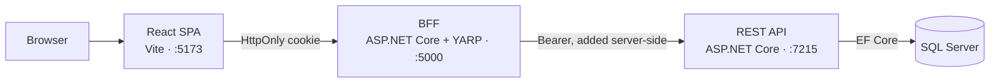

# How AzureBank works

**The one document to read.** It is complete on its own: every rule below is stated with its
reason, and the links are footnotes for depth, never detours you have to take. If a sentence here
only makes sense after following a link, that is a defect — report it.

---

## What it is

A personal banking application: accounts, deposits, withdrawals, transfers between your own
accounts, and transfers to another user by handle. Not a demo of CRUD — the interesting part is
everything that has to be true *because it moves money*.

Two halves, both real and wired to each other:

- **`backend/`** — .NET 10, ASP.NET Core. A REST API holding the domain, and a **BFF** in front of
  it that owns the browser session.
- **`frontend/`** — React 19, TypeScript, Fluent UI v9, Redux Toolkit Query. A full SPA talking to
  the real API through the BFF.

```mermaid
flowchart LR
    User["Browser"]
    SPA["React SPA<br/>Vite · :5173"]
    BFF["BFF<br/>ASP.NET Core + YARP · :5000"]
    API["REST API<br/>ASP.NET Core · :7215"]
    DB[("SQL Server")]

    User --> SPA
    SPA -->|"HttpOnly cookie"| BFF
    BFF -->|"Bearer, added server-side"| API
    API -->|"EF Core"| DB
```

The arrow labels are the whole security story: **the browser holds a cookie, never a token.**

## The one decision everything else follows from

The SPA never receives, stores or sends a JWT. It authenticates with an `HttpOnly`, `Secure`,
`SameSite=Strict` cookie prefixed `__Host-`; the BFF holds the access and refresh tokens
server-side and attaches the bearer header itself as it proxies. Nothing in the frontend
constructs an `Authorization` header, and there is nothing in web storage for a script to steal.

Everything downstream is a consequence:

- **No CORS anywhere.** Same-origin topology, so there is no cross-origin grant to misconfigure.
  Cross-site state-changing requests are rejected by Fetch-Metadata headers on top of
  `SameSite=Strict`.
- **The 15-minute access token is invisible.** When it expires, the BFF silently re-mints it from
  a rotating refresh token; the user's session is bounded by inactivity and absolute timeouts, not
  by token lifetime. Refresh tokens rotate on every use and a reuse is treated as theft — the
  whole family is revoked.
- **Session expiry is a data-loss event, so it is designed rather than accepted.** No unsubmitted
  financial intent is persisted anywhere; a draft transfer is lost on expiry rather than resumed
  against a session that may no longer be yours.

*Depth: ADR-0001 (BFF), ADR-0018 (origin hardening), ADR-0021 (refresh rotation), ADR-0019
(SPA/BFF contract).*

## Moving money exactly once

The hard problem in a bank is not writing a row; it is guaranteeing you wrote it **once** when the
network, the browser and the process are all free to fail halfway.

Every mutating money endpoint requires a client-generated `Idempotency-Key` and executes **at most
once** per user, endpoint and key. The server fingerprints the **raw request body bytes** with a
keyed HMAC — not the parsed JSON, so a re-serialisation with different key order is correctly seen
as a different payload.

Five outcomes, and each one tells the client something different:

| The server says | It means | The client |
|---|---|---|
| `2xx` with `Idempotency-Replayed: true` | This exact request already succeeded | Shows the stored result, byte-identical |
| `409 IDEMPOTENCY_IN_FLIGHT` | A duplicate is still running | Keeps the key, retries later |
| `409 IDEMPOTENCY_RESULT_UNKNOWN` | It executed but the response was lost | **Stops.** Asks the user to verify against their transactions |
| `422 IDEMPOTENCY_KEY_REUSE` | Same key, different payload | Rotates the key |
| Business `4xx` | Insufficient funds, wrong PIN | Releases the key; fix and retry |

The client half matters as much as the server half, because a client that mints a fresh key after
a timeout has manufactured a double-spend that the server cannot detect. So the rule is
inverted from the intuitive one: **a failure the server might have seen keeps the key; only a
definitive answer spends it.** `RESULT_UNKNOWN` is the one case where the correct behaviour is to
stop and involve the user rather than guess — there is no endpoint that answers "did key X land?",
and inventing a guess would be worse than asking.

There are **no optimistic updates on money**. Balances come from a refetch after invalidation. In
a bank a briefly-wrong balance is a correctness failure, not a UX blemish.

The guarantee is proven, not asserted: 24 byte-identical parallel requests with one key produce
exactly one execution, with mathematically exact balances, on both EF InMemory and real SQL
Server, three deterministic rounds per run, in CI.

*Depth: ADR-0009 (server protocol), ADR-0022 (client protocol), ADR-0024 (why not ETag).*

## A second factor that is actually a second factor

Sensitive operations need a PIN, and the PIN is verified by the API, never by the BFF alone. Money
moves carry their proof in the request: a withdrawal sends the PIN *inside* the body (it is part of
what gets hashed), and a transfer first turns the PIN into a **one-shot authorisation** — bound to
payer, payee and amount, valid two minutes, spent once — presented in a `Step-Up-Authorization`
header (ADR-0041, ADR-0042). Nothing in the session says "PIN entered"; one entry authorises one
payment.

The account-number reveal is the one route that still uses the **session** level: hit at level 1 it
returns `403` with `X-Auth-Level-Required`; the SPA opens the PIN modal, elevates the BFF session,
and the original request is **replayed byte-identically at the transport layer** — same bytes, same
idempotency key. The rule dates from when transfers rode the same path: rebuilding a request after
elevation would change the fingerprint and strand a payment.

PINs are hashed with Argon2id **plus a server-side pepper** held outside the database, so a
database dump alone cannot be brute-forced offline — six digits would otherwise fall instantly.
Three wrong attempts lock the PIN; the failure counter is incremented atomically in SQL so
parallel guesses cannot race past the limit.

*Depth: ADR-0008 (step-up), ADR-0011 (pepper), ADR-0010 (lockout).*

## Not telling attackers who exists

Registration returns an identical, enumeration-neutral `409` whether the email or the handle
collided; the specific reason is logged server-side only. Login is enumeration-safe and rate
limited per IP with `429` plus `Retry-After`.

There is **no user search**. Sending money to someone requires knowing their handle exactly — the
lookup is exact-match, rate-limited, and returns a masked display name. A substring search would
be a harvesting endpoint with extra steps.

The account number is masked by default and revealed only through a PIN-gated endpoint; the full
number never appears in a list response.

**Honest residual:** registration auto-logs-in, which means the account-existence oracle is
narrowed rather than closed. Closing it needs out-of-band email confirmation, which needs email
infrastructure this project does not have. That is a bounded, accepted risk, written down as a
decision rather than left as an oversight. *(Since ADR-0045 the operator tool can render a message
to the account's email into a pickup directory; nothing sends it, so the sentence still holds.)*

*Depth: ADR-0013, ADR-0014, ADR-0020, ADR-0012.*

## Keeping the two halves honest

The frontend and backend agree because agreement is **mechanically enforced**, not because someone
remembered:

- The API's OpenAPI spec generates the frontend's TypeScript types, and CI regenerates them and
  fails on any diff. A contract change that skips the frontend is a red build.
- The same spec generates **Zod schemas**, so the shapes are checked at runtime too, not just at
  compile time. Money responses are validated fail-closed in production; everything else validates
  in development and test only, where a mismatch should be loud and in production it should not
  take the page down. The whole `/bff/auth/*` surface is fail-closed everywhere, because it has no
  spec behind it and it gates authentication.
- Errors arrive as RFC 9457 ProblemDetails on one channel, carrying a `traceId` that pastes
  straight into the trace search.

That last point is not decoration. A user reporting "it failed" can hand over a 32-character
identifier that resolves to the exact request across the SPA, the BFF, the API and SQL — one
trace, because the trace context propagates through the proxy hop.

*Depth: ADR-0023 (validation), ADR-0016 (observability), ADR-0017 (PII-safe logs).*

## What proves it

- **618 backend tests** passing, plus 33 held behind a SQL Server flag that run in CI against a
  real database — those are the concurrency proofs, and they are skipped locally rather than
  faked.
- **188 frontend tests**, against MSW mocks that are themselves validated against the real
  contract, so a mock that drifts fails the suite instead of passing quietly.
- **Architecture tests** that fail the build on a layer-dependency violation.
- **Schemathesis** contract tests driving the API from its own spec.
- Every pull request runs the full suite, CodeQL on three languages, and an AI review, and a
  human merges.

## Where to go next

`docs/adr/` holds the decisions with their alternatives and residuals — the index names four to
start with. `docs/engineering-traps.md` collects the things that fail silently. `SECURITY.md` has
the security posture in one place, and `docs/engineering-practices.md` explains how to run and
change the project. `docs/audit-trail-against-real-practice.md` sets the audit trail against what a
real deployment would have and names the gap in each direction — read it if you want the limits
before the design.
